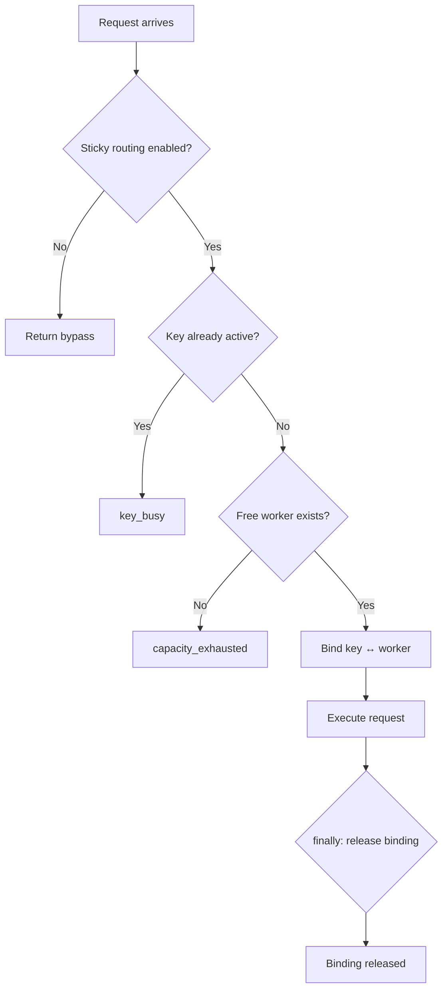

# API Key Sticky Routing — Design

## Architecture Overview

The design replaces `sessionKey`-based IP allocation with `apiKey`-based worker assignment. The core invariant is:

```
One API key ↔ One worker ↔ One active request
```

The existing `ipPoolCapacity.ts` service is extended with a new allocation model. The `ipIndex` returned by allocation functions is a capacity slot index (0-based), not a routing destination — routing is handled by the Cloudflare Workers service binding in the router.

## Data Model

### Authoritative State

```typescript
// apiKey → ipIndex (for "is this key active?" lookups)
const apiKeyToWorker = new Map<string, number>();

// ipIndex → apiKey (for "is this worker available?" lookups)
const workerToApiKey = new Map<number, string>();
```

Both maps are maintained in sync. A worker is available iff `workerToApiKey` has no entry for it.

**Note on worker identity**: The `ipIndex` is a slot index (0 to workerCount-1), not a routing destination. The topology provides worker names (`llm-proxy-00`, `llm-proxy-01`, etc.) which are used by the Cloudflare Workers service binding for routing. The capacity service only tracks availability, not routing paths.

### API Key Identity

The API key is obtained from the request's `Authorization: Bearer <key>` header. The key is used directly as the map key. For logging, `SHA-256(apiKey).slice(0, 12)` is used (see REQ-KS12).

## Allocation Result

The allocation function returns a discriminated union to preserve the failure reason atomically and distinguish bypass from real allocation:

```typescript
type AllocationResult =
  | { kind: 'allocated'; ipIndex: number }
  | { kind: 'bypass' }
  | { kind: 'key_busy' }
  | { kind: 'capacity_exhausted' };
```

This prevents bugs where `ipIndex === 0` is mistaken for worker 0 being allocated. The `bypass` kind indicates sticky routing is disabled and the request should proceed without worker tracking.

## Allocation Algorithm



### Step-by-Step

1. **Sticky routing check**: If `!isStickyRoutingEnabled()`, return `{ kind: 'bypass' }`.
2. **Key active check**: If `apiKeyToWorker.has(apiKey)`, return `{ kind: 'key_busy' }`.
3. **Worker availability check**: Scan `workerToApiKey` for entries where the worker is not assigned. If none found, return `{ kind: 'capacity_exhausted' }`.
4. **Atomic binding**: Assign the first available worker to the key. Update both maps in the same synchronous operation. Return `{ kind: 'allocated', ipIndex }`.
5. **Request execution**: Proceed with the request.
6. **Guaranteed release**: In a `finally` block, remove both map entries.

## Atomicity

The allocation algorithm performs all checks and bindings using **synchronous map operations without awaiting**. Therefore acquisition executes atomically within a single event-loop turn.

JavaScript's single-threaded event loop cannot interleave between synchronous operations. Two concurrent requests are never processed simultaneously within the same synchronous block. The map state is always consistent after each synchronous operation.

No mutex or lock is needed for the allocation itself. The `await` points in request handling (network I/O, streaming) occur **after** the allocation is complete, so they cannot cause race conditions in the map state.

## Worker Selection Strategy

**First free worker**: The first worker found without an active assignment is selected.

The available workers are derived from the topology's `proxies` array (length = `workerCount`). The scan iterates over `[0, workerCount)` looking for workers not in `workerToApiKey`.

Rationale:
- Workers are interchangeable (no affinity required)
- Capacity equals worker count, so load distribution is naturally even
- Simplicity: no state needed beyond availability tracking

## Disabled Mode

Sticky routing is disabled when **both** conditions are true:
1. Dynamic topology is unavailable (`!isDynamicTopologyAvailable()`)
2. `PROXY_IP_COUNT` env var is not set or invalid

This means:
- `workerCount = 0` from topology is **not** disabled mode — it's a valid topology with zero capacity (all requests get `capacity_exhausted`)
- `PROXY_IP_COUNT = 0` is **not** disabled mode — it's explicit zero capacity (all requests get `capacity_exhausted`)
- Only the absence of both topology and env var triggers disabled mode

### isStickyRoutingEnabled() Helper

```typescript
export function isStickyRoutingEnabled(): boolean {
  const raw = process.env.PROXY_IP_COUNT;
  if (raw === undefined || raw.trim() === '') {
    return isDynamicTopologyAvailable();
  }
  const envCount = Number(raw);
  return Number.isInteger(envCount) && envCount >= 0;
}
```

**Validation rules for `PROXY_IP_COUNT`**:
- Unset → disabled
- Empty string → disabled
- Non-numeric string (e.g., `abc`) → disabled
- Negative number → disabled
- Zero → enabled (zero capacity, 503 on all requests)
- Positive integer → enabled

This helper is used in the allocation function and must be the single source of truth for the disabled-mode check.

When disabled:
- No map entries are created or checked
- No sticky routing is applied
- Requests proceed through existing routing (pre-sticky-routing behavior)

## Deployment Behavior

Topology changes affect only future allocations. Existing active assignments continue until released. There is no runtime reconciliation of active assignments when topology changes.

If a worker is removed from the topology while a request is active:
- The active assignment continues until the request completes
- Future allocations will not use the removed worker
- No error is raised for in-flight requests

## Router Integration

### Current Flow (Pre-Change)

```
Request → authenticate → route → execute → response
```

### New Flow (Post-Change)

```
Request → authenticate → acquire worker → route → execute → finally: release → response
```

### Integration Points

The integration is in `server/src/routes/proxy.ts` at the two request handling points:

1. **Streaming** (`/responses`): Around the streaming execution block
2. **Non-streaming** (`/chat/completions`): Around the non-streaming execution block

Both paths currently call `allocateIp(sessionKey, platform, keyId)`. The change is:

1. Extract the API key from the request (already available via `getUnifiedApiKey()`)
2. Replace `allocateIp(sessionKey, ...)` with `allocateIpForKey(apiKey)`
3. Replace `releaseIp(sessionKey)` with `releaseIpForKey(apiKey)`
4. Wrap execution in try/finally to guarantee release

### Code Pattern

```typescript
// Before (sessionKey-based)
const ipIndex = allocateIp(sessionKey, platform, keyId);
if (ipIndex === -1) {
  clearStickyModel(...);
  return res.status(503).json({ ... });
}
try {
  // execute request
} finally {
  releaseIp(sessionKey);
}

// After (apiKey-based)
const apiKey = getUnifiedApiKey(); // already available
const result = allocateIpForKey(apiKey);

// Track whether we need to release to avoid unnecessary lookups on bypass
const shouldRelease = result.kind === 'allocated';

if (result.kind === 'bypass') {
  // proceed without sticky routing
} else if (result.kind === 'key_busy') {
  return res.status(409).json({
    error: { message: 'An active request already exists for this API key.', type: 'key_busy' },
  });
} else if (result.kind === 'capacity_exhausted') {
  return res.status(503)
    .set('Retry-After', '5')
    .json({
      error: { message: 'No proxy workers available. All slots are occupied.', type: 'capacity_exhausted' },
    });
}

try {
  // execute request
} finally {
  if (shouldRelease) {
    releaseIpForKey(apiKey);
  }
}
```

## API

### New Functions

```typescript
/**
 * Check if sticky routing is enabled.
 * Returns true when either dynamic topology is available or PROXY_IP_COUNT is a valid non-negative integer.
 */
export function isStickyRoutingEnabled(): boolean;

/**
 * Acquire a worker for an API key.
 * Returns a discriminated union to preserve the result kind atomically.
 */
export function allocateIpForKey(apiKey: string): AllocationResult;

/**
 * Release the worker held by an API key.
 * No-op if the key has no active assignment.
 */
export function releaseIpForKey(apiKey: string): void;

/**
 * Check if an API key has an active worker assignment.
 */
export function isKeyActive(apiKey: string): boolean;

/**
 * Check if a specific worker is currently assigned.
 */
export function isWorkerAssigned(ipIndex: number): boolean;
```

### Removed Functions

The `allocateIp(sessionKey, platform, keyId)` and `releaseIp(sessionKey)` functions are **removed**. Call sites are updated to use the new `apiKey`-based functions.

**Note**: The `ipPool` map and `IpAllocation` interface are **not** removed wholesale. Only the sessionKey-based allocation logic is removed. Any structures still used by capacity reporting APIs (`getIpCapacityStatus`, `hasIpCapacity`, etc.) are retained.

### Preserved Functions (Capacity Reporting)

```typescript
export function getWorkerCount(): number;
export function isIpCapacityEnabled(): boolean;
export function hasIpCapacity(sessionKey?: string): boolean;
export function getIpCapacityStatus(platform: string): { used: number; max: number };
export function cleanupExpired(): void;
```

These functions report capacity state and are independent of the allocation key.

## Error Responses

### Capacity Exhausted (503)

```typescript
res.status(503)
  .set('Retry-After', '5')
  .json({
    error: {
      message: 'No proxy workers available. All slots are occupied.',
      type: 'capacity_exhausted',
    },
  });
```

### Key Already Active (409)

```typescript
res.status(409).json({
  error: {
    message: 'An active request already exists for this API key.',
    type: 'key_busy',
  },
});
```

## Logging

All logs use `SHA-256(apiKey).slice(0, 12)` for the key identifier.

```typescript
import crypto from 'crypto';

function shortHashKey(key: string): string {
  return crypto.createHash('sha256').update(key).digest('hex').slice(0, 12);
}
```

Log events:
- `Worker ${ipIndex} assigned to key ${shortHashKey(apiKey)}` — INFO
- `Worker ${ipIndex} released by key ${shortHashKey(apiKey)}` — INFO
- `Request rejected: capacity exhausted (all ${workerCount} workers occupied)` — WARN
- `Request rejected: key ${shortHashKey(apiKey)} already has active worker` — WARN

## Test Matrix

### Service-Level Tests

| Scenario | Precondition | Action | Expected Result |
| |---|---|---|---|
| | First request | Clean state | Send request | Worker allocated, 200 response |
| | Same key concurrent | Key has active worker | Send second request | 409 response, no worker leak |
| | Different keys, capacity available | N workers free | Send N requests | All allocated, 200 responses |
| | Different keys, capacity exhausted | All workers occupied | Send additional request | 503 response |
| | Request throws | Worker allocated | Request throws | Worker released in finally |
| | Capacity disabled | No topology, no env | Send request | Existing routing, no sticky |
| | Topology unavailable + env fallback | `PROXY_IP_COUNT` set | Send request | Works with env value |
| | workerCount = 0 | Valid topology, zero capacity | Send request | 503 (not bypass) |
| | Re-entrant same key | Key has active worker | Retry same request | 409 (not re-allocated) |
| | Release then acquire | Worker was allocated | Release, then new request | New worker allocated |

### Router Integration Tests

| Scenario | Precondition | Action | Expected Result |
| |---|---|---|---|
| | Same key concurrent | Key has active worker | Send second request | HTTP 409, `type: 'key_busy'` |
| | Pool exhausted | All workers occupied | Send new key request | HTTP 503, `Retry-After: 5`, `type: 'capacity_exhausted'` |
| | Exception releases slot | Worker allocated | Request throws | Worker released, slot available for next request |

## File Changes

| File | Change |
|---|---|
| `server/src/services/ipPoolCapacity.ts` | Add `apiKeyToWorker`/`workerToApiKey` maps, `AllocationResult` type, `isStickyRoutingEnabled()`, new functions, remove sessionKey-based allocation |
| `server/src/routes/proxy.ts` | Extract apiKey, call new allocation functions, add try/finally, update error responses |
| `server/src/__tests__/services/ipPoolCapacity.test.ts` | Rewrite tests for apiKey-based allocation, 409/503 responses, crash-safety |
| `server/src/__tests__/routes/proxy.test.ts` | Add integration tests for 409/503 responses, exception cleanup |

## Dependencies

No new external dependencies. Uses existing:
- `crypto` (Node.js built-in) for SHA-256 hashing
- Existing `proxyTopology.ts` for worker count
- Existing `getUnifiedApiKey()` for API key extraction