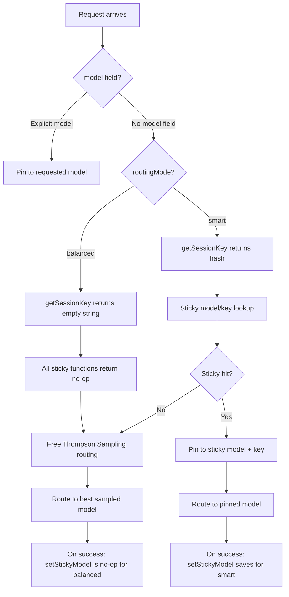

# Design: Disable Sticky Threads on Auto Endpoint

## Design Approach

**Single-point guard in `getSessionKey()`** — modify [`getSessionKey()`](server/src/routes/proxy.ts:25) to return an empty string when `routingMode === 'balanced'`. This cascades through all sticky session functions because every one of them calls `getSessionKey()` first and returns early when the key is empty.

## Why This Approach

Every sticky session function in [`proxy.ts`](server/src/routes/proxy.ts) follows the same pattern:

```
function stickyOp(messages, routingMode, ...) {
  const key = getSessionKey(messages, routingMode);
  if (!key) return <no-op value>;   // undefined, false, or early return
  ...operate on stickySessionMap using key...
}
```

By making `getSessionKey()` return `''` for balanced mode, all downstream functions automatically become no-ops:

| Function | No-op return when key is empty | Effect for balanced mode |
|---|---|---|
| [`getStickyModel()`](server/src/routes/proxy.ts:35) | `undefined` | No model pinning → free routing every request |
| [`getStickyKey()`](server/src/routes/proxy.ts:55) | `undefined` | No key pinning → round-robin key selection |
| [`setStickyModel()`](server/src/routes/proxy.ts:199) | early return | No sticky entries ever created |
| [`clearStickyModel()`](server/src/routes/proxy.ts:180) | early return | No-op — nothing to clear |
| [`clearStickyKey()`](server/src/routes/proxy.ts:188) | early return | No-op — nothing to clear |
| [`isSessionBannedFromPlatform()`](server/src/routes/proxy.ts:92) | `false` | No platform bans checked |
| [`banPlatformFromSession()`](server/src/routes/proxy.ts:108) | early return | No platform bans recorded |

Direct `stickySessionMap` accesses in [`handleChatCompletion()`](server/src/routes/proxy.ts:1057) also use `getSessionKey()` and guard on the result being truthy, so they are automatically skipped:

- **Session ban skipModels** (lines 1176–1189): `if (sessionKey)` guard → skipped when key is `''`
- **LongCat sticky cooldown** (lines 1205–1217): `cooldownSessionKey ? ... : undefined` → skipped when key is `''`

## Changes Required

### 1. Modify `getSessionKey()` in `server/src/routes/proxy.ts`

```typescript
function getSessionKey(messages: ChatMessage[], routingMode: RoutingMode): string {
  // Sticky sessions only apply to smart/auto-smart routing.
  // Balanced/auto uses free routing on every request.
  if (routingMode === 'balanced') return '';

  const firstUser = messages.find(m => m.role === 'user');
  if (!firstUser || typeof firstUser.content !== 'string') return '';
  return crypto.createHash('sha1').update(`${routingMode}:${firstUser.content}`).digest('hex');
}
```

This is the **only code change** needed. All other functions and call sites remain untouched.

### 2. Update tests in `server/src/__tests__/routes/provider-session-ban.test.ts`

Add test cases verifying that balanced mode skips sticky operations:
- `getStickyModel()` returns `undefined` for balanced mode even when a sticky entry exists for the same messages under smart mode
- `isSessionBannedFromPlatform()` returns `false` for balanced mode
- `banPlatformFromSession()` does not create entries for balanced mode
- `setStickyModel()` does not create entries for balanced mode

### 3. No changes to `server/src/services/router.ts`

The router itself does not interact with sticky sessions — it only receives `preferredModel` and `preferredKeyId` as optional parameters. When those are `undefined` (which they will be for balanced mode), the router already does free routing.

## Flow Diagram



## Edge Cases

- **Mode switch mid-conversation**: Session keys include `routingMode` in the hash, so balanced and smart entries for the same messages are distinct. No cross-contamination.
- **`stickySessionMap` size cleanup**: Since balanced mode never creates entries, the map only grows from smart-mode sessions. Existing eviction logic remains sufficient.
- **`responseSessionMap`**: Separate from sticky sessions — used for the Responses API `previous_response_id` feature. Unaffected by this change.
- **Per-request `skipModels`/`skipKeys`**: These are intra-request retry state, not sticky state. They remain active for both modes.

## Risks

- **Low risk**: The change is a single early-return in one function. All downstream behavior is already designed to handle empty keys gracefully.
- **No backward compatibility concern**: Existing smart-mode sessions continue working identically. Balanced-mode sessions simply stop being created — there is no data to migrate or lose.