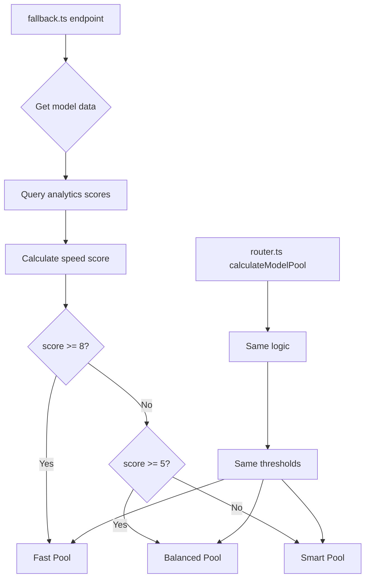

# Dynamic Pool Routing Design

## Overview

This document describes the design for updating `fallback.ts` to use dynamic pool calculation instead of static classification.

## Architecture



## Changes

### 1. Remove Static getModelPool from fallback.ts

**Current code** (lines 12-22):
```typescript
export function getModelPool(platform: string, modelId: string): ModelPool {
  // Fast pool: models explicitly marked as fast via naming convention
  if (modelId.endsWith('-fast') || modelId === 'openai-fast') {
    return ModelPool.Fast;
  }
  // Smart pool: models that should be routed for highest intelligence
  if (platform === 'longcat') return ModelPool.Smart;
  if (platform === 'openrouter' && modelId === 'owl-alpha') return ModelPool.Smart;
  // Default to Balanced pool
  return ModelPool.Balanced;
}
```

**New approach**: Import and use `calculateModelPool` from router.ts

### 2. Import calculateModelPool

Add import at the top of fallback.ts:
```typescript
import { getAllPenalties, getAnalyticsScores, getAnalyticsScore, getSmartAnalyticsScore, refreshStatsCache, PENALTY_SCORE_WEIGHT, calculateModelPool } from '../services/router.js';
```

### 3. Create Dynamic Pool Assignment

The fallback.ts needs to calculate pool for each model based on its analytics. Since `calculateModelPool` in router.ts takes a `ChainRow`, we need to adapt it for fallback.ts usage.

**Option A**: Export a standalone function that takes metrics directly
**Option B**: Create a similar function in fallback.ts that uses the same formula

**Recommended**: Option A - export a standalone function from router.ts

```typescript
// In router.ts, export this function:
export function calculatePoolFromMetrics(tokPerSec: number, avgTtfbMs: number | null): ModelPool {
  const speedScore = tokPerSec > 0 ? Math.log(tokPerSec) : 0;
  const ttfbPenalty = avgTtfbMs !== null ? Math.log(avgTtfbMs + 1) * 0.1 : 0;
  const effectiveSpeedScore = speedScore - ttfbPenalty;

  if (effectiveSpeedScore >= FAST_THRESHOLD) return ModelPool.Fast;
  if (effectiveSpeedScore >= BALANCED_THRESHOLD) return ModelPool.Balanced;
  return ModelPool.Smart;
}
```

### 4. Update Pool Assignment in fallback.ts

In the result mapping (around line 67), change:
```typescript
// Current:
const pool = getModelPool(r.platform, r.model_id);

// New:
const analytics = analyticsMap.get(`${r.platform}:${r.model_id}`);
const tokPerSec = analytics?.tokPerSec ?? 0;
const avgTtfbMs = analytics?.avgTtfbMs ?? null;
const pool = calculatePoolFromMetrics(tokPerSec, avgTtfbMs);
```

## Pool Classification Thresholds

| Threshold | Score Range | Pool | Description |
|-----------|-------------|------|-------------|
| >= 8 | High speed | Fast | Very fast models (e.g., ~3000 tok/s with low TTFB) |
| >= 5 | Medium speed | Balanced | Good speed (e.g., ~150 tok/s with low TTFB) |
| < 5 | Lower speed | Smart | Higher intelligence focus, slower speed |

## Speed Score Formula

```
speedScore = log(tokPerSec) - log(avgTtfbMs + 1) * 0.1
```

- `log(tokPerSec)`: Natural log of tokens per second (rewards high throughput)
- `log(avgTtfbMs + 1) * 0.1`: Penalty for high time-to-first-byte (reduces score for slow-starting models)

## Default Behavior

When a model has no analytics data:
- `tokPerSec = 0` → `speedScore = 0`
- `avgTtfbMs = null` → no TTFB penalty
- `effectiveSpeedScore = 0`

This results in **Balanced pool** (0 < 5), which is the appropriate default for new/unmeasured models.

## Testing Strategy

### Unit Tests (fallback-pool.test.ts)

Update existing tests to verify dynamic classification:

1. **Test with high speed metrics** → Fast pool
2. **Test with medium speed metrics** → Balanced pool
3. **Test with low speed metrics** → Smart pool
4. **Test with no metrics** → Balanced pool (default)
5. **Test threshold boundaries** (score = 5, score = 8)

### Mock Analytics Data

```typescript
const mockAnalytics = [
  { platform: 'openai', modelId: 'gpt-4o-mini', tokPerSec: 5000, avgTtfbMs: 200 }, // Fast
  { platform: 'anthropic', modelId: 'claude-3-5-sonnet', tokPerSec: 100, avgTtfbMs: 800 }, // Balanced
  { platform: 'longcat', modelId: 'longcat-v2', tokPerSec: 20, avgTtfbMs: 2000 }, // Smart
  { platform: 'new', modelId: 'new-model', tokPerSec: 0, avgTtfbMs: null }, // Default to Balanced
];
```

## Implementation Order

1. Export `calculatePoolFromMetrics` from router.ts
2. Update fallback.ts imports
3. Update pool assignment logic in fallback.ts
4. Update tests in fallback-pool.test.ts
5. Run all tests to verify