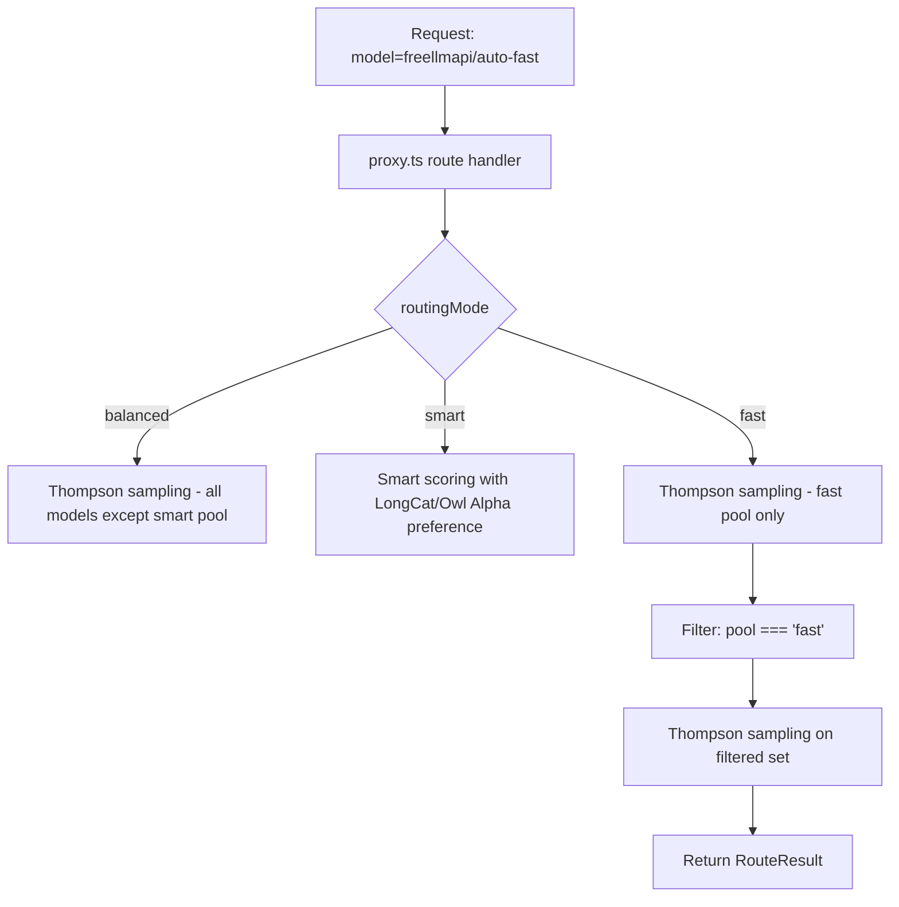

# Fast Routing Mode Design

## Overview

This document describes the design for adding a `fast` routing mode and `freellmapi/auto-fast` endpoint to the FreeLLM API router.

## Architecture



## Changes

### 1. Type Definition (router.ts)

```typescript
// Current
export type RoutingMode = 'balanced' | 'smart';

// New
export type RoutingMode = 'balanced' | 'smart' | 'fast';
```

### 2. Fast Pool Filtering (router.ts)

Add filtering logic in `routeRequest()`:

```typescript
const filteredChain = routingMode === 'balanced'
  ? chain.filter(entry => {
      // existing balanced exclusions
    })
  : routingMode === 'fast'
  ? chain.filter(entry => getModelPool(entry.platform, entry.model_id) === ModelPool.Fast)
  : chain;
```

### 3. API Endpoint (proxy.ts)

```typescript
const AUTO_FAST_MODEL_ID = 'freellmapi/auto-fast';

// In /models endpoint:
{
  id: AUTO_FAST_MODEL_ID,
  object: 'model',
  created: 0,
  owned_by: 'freellmapi',
  name: 'Auto Fast (Speed Router)',
  context_window: 128000,
}

// In /models/:id handler:
if (id === AUTO_FAST_MODEL_ID) {
  res.json({ id, object: 'model', created: 0, owned_by: 'freellmapi' });
  return;
}
```

### 4. Model Pool Classification (fallback.ts)

The `getModelPool()` function already exists and correctly classifies:
- Fast pool: models ending with `-fast` or `openai-fast`
- Smart pool: LongCat platform, Owl Alpha model
- Balanced pool: all others

This function can be reused for fast mode filtering.

## Implementation Order

1. Update `RoutingMode` type
2. Add fast pool filtering in `routeRequest()`
3. Add `AUTO_FAST_MODEL_ID` constant
4. Update `/models` endpoint
5. Update `/models/:id` handler
6. Add tests for fast mode
7. Update AGENTS.md documentation

## Testing Strategy

### Unit Tests (router-fast-mode.test.ts)

1. Test that fast mode only includes fast pool models
2. Test that non-fast models are excluded
3. Test Thompson sampling works on fast pool
4. Test rate limit handling for fast pool
5. Test penalty system for fast pool

### Integration Tests

1. Test `freellmapi/auto-fast` endpoint returns correct metadata
2. Test actual routing to fast pool models
3. Test fallback through fast pool when first is unavailable