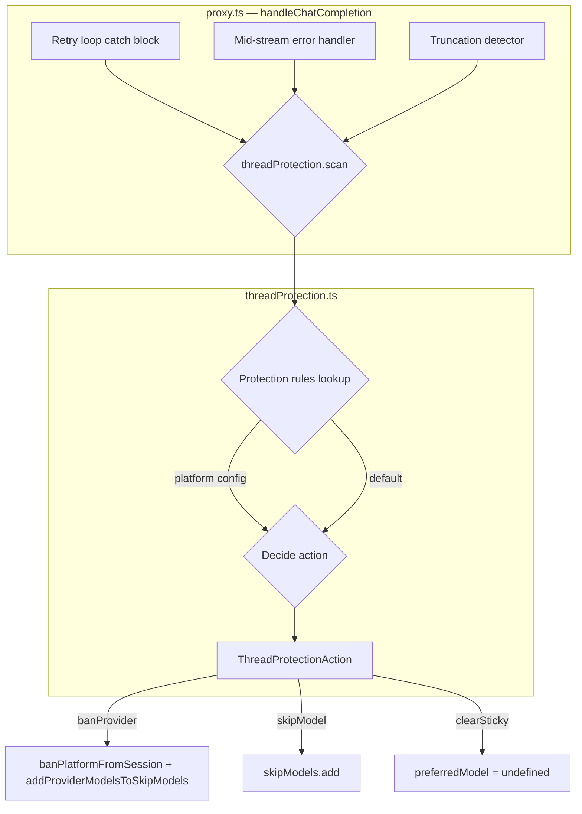

# Design: Generalized Thread Protection Scanner

## Architecture Overview

The thread protection scanner replaces all hardcoded `route.platform === 'longcat'` branches in `handleChatCompletion()` with a dynamic, provider-agnostic decision engine. The scanner evaluates error context against configurable per-platform protection rules to determine whether to ban an entire provider or just a single model.

The scanner lives in a new module `server/src/services/threadProtection.ts` and is called from the retry loop in `proxy.ts`. It returns a `ThreadProtectionAction` that tells the caller exactly what to do.



## Protection Rules

Each platform can be configured with a protection level that determines how aggressively the scanner responds to errors:

| Level | Behavior on 5xx | Behavior on truncation | Behavior on retryable error |
|-------|----------------|----------------------|---------------------------|
| `provider-ban` | Ban entire provider | Ban entire provider | Ban entire provider |
| `model-skip` | Skip single model | Skip single model | Skip single model |
| `off` | No protection action | No protection action | No protection action |

### Configuration

The `THREAD_PROTECTION_PLATFORMS` env var is a comma-separated list of `platform:level` pairs:

```
THREAD_PROTECTION_PLATFORMS="longcat:provider-ban,groq:model-skip"
```

When unset, the scanner uses a **default protection map** hardcoded in the module that preserves the existing LongCat behavior (`longcat → provider-ban`) and applies `model-skip` to all other platforms. This ensures full backward compatibility — existing deployments see zero behavior change without any env var configuration.

## Scanner API

```typescript
// server/src/services/threadProtection.ts

export type ProtectionLevel = 'provider-ban' | 'model-skip' | 'off';

export type ErrorContextKind = '5xx' | 'truncation' | 'retryable';

export interface ErrorContext {
  platform: string;
  kind: ErrorContextKind;
  /** Whether the error occurred mid-stream (after SSE headers sent) */
  midStream: boolean;
  /** The model DB ID — always available */
  modelDbId: number;
  /** The error object, for logging */
  error?: unknown;
}

export interface ThreadProtectionAction {
  /** Ban the entire platform for this session */
  banProvider: boolean;
  /** Skip just this model */
  skipModel: boolean;
  /** Clear sticky model/key if pinned to this platform */
  clearStickyIfPinned: boolean;
  /** Human-readable reason for logging */
  reason: string;
}

export function evaluateThreadProtection(ctx: ErrorContext): ThreadProtectionAction;
```

## Decision Matrix

The `evaluateThreadProtection` function implements this decision matrix:

| Protection Level | `5xx` | `truncation` | `retryable` |
|------------------|-------|--------------|-------------|
| `provider-ban` | `banProvider=true, skipModel=false, clearStickyIfPinned=true` | `banProvider=true, skipModel=false, clearStickyIfPinned=true` | `banProvider=true, skipModel=false, clearStickyIfPinned=true` |
| `model-skip` | `banProvider=false, skipModel=true, clearStickyIfPinned=false` | `banProvider=false, skipModel=true, clearStickyIfPinned=false` | `banProvider=false, skipModel=true, clearStickyIfPinned=false` |
| `off` | All false | All false | All false |

## Integration Points in proxy.ts

The scanner replaces 6 hardcoded `longcat` blocks:

### 1. Stream truncation detection (line ~1394)
```typescript
// BEFORE:
if (route.platform === 'longcat') {
  banPlatformFromSession(..., 'longcat', ...);
  addProviderModelsToSkipModels(skipModels, 'longcat');
} else {
  skipModels.add(route.modelDbId);
}

// AFTER:
const action = evaluateThreadProtection({
  platform: route.platform, kind: 'truncation', midStream: false, modelDbId: route.modelDbId,
});
if (action.banProvider) {
  banPlatformFromSession(normalizedMessages, routingMode, route.platform, route.modelDbId);
  addProviderModelsToSkipModels(skipModels, route.platform);
}
if (action.skipModel) skipModels.add(route.modelDbId);
if (action.clearStickyIfPinned) { /* clear sticky if pinned to this platform */ }
```

### 2. Mid-stream 5xx (line ~1467)
### 3. Mid-stream truncation error (line ~1492)
### 4. Mid-stream retryable error (line ~1523)
### 5. Non-stream 5xx (line ~1624)
### 6. Non-stream retryable error (line ~1645)

All 6 blocks follow the same pattern: replace the `if (route.platform === 'longcat') { ... } else { ... }` with a single `evaluateThreadProtection()` call.

## Sticky Cooldown Generalization

The LongCat sticky cooldown check (line ~1210-1222) is also generalized. Instead of checking `prefRow?.platform === 'longcat'`, it checks whether the sticky platform has `provider-ban` protection level:

```typescript
// BEFORE:
if (prefRow?.platform === 'longcat') { ... addProviderModelsToSkipModels(skipModels, 'longcat'); ... }

// AFTER:
const stickyProtection = getProtectionLevel(prefRow?.platform ?? '');
if (stickyProtection === 'provider-ban') {
  // Apply cooldown exclusion for provider-ban platforms
  addProviderModelsToSkipModels(skipModels, prefRow!.platform);
}
```

This ensures that any future platform configured with `provider-ban` automatically gets the same cooldown protection.

## Files to Modify

| # | File | Change |
|---|------|--------|
| 1 | `server/src/services/threadProtection.ts` | **Create** — new scanner module |
| 2 | `server/src/routes/proxy.ts` | Replace 6 hardcoded `longcat` blocks + cooldown block with scanner calls |
| 3 | `server/src/__tests__/services/threadProtection.test.ts` | **Create** — unit tests for the scanner |
| 4 | `server/src/__tests__/routes/proxy-tools.test.ts` | Update test assertions to use generic protection log messages |
