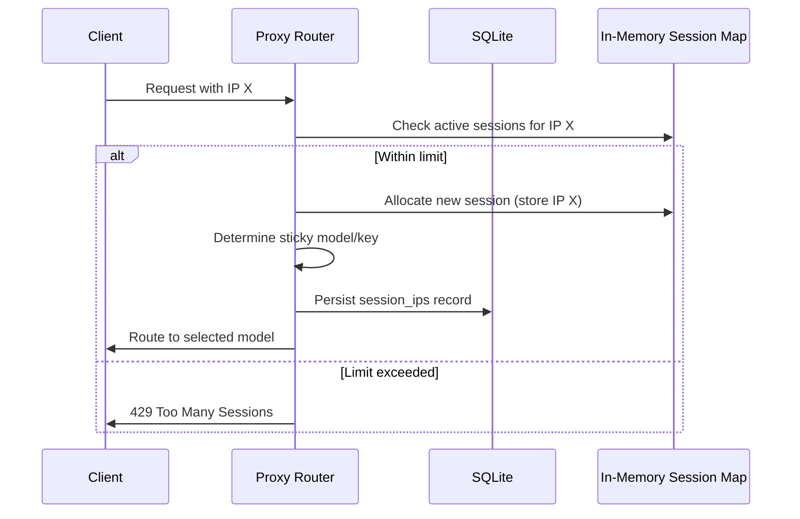
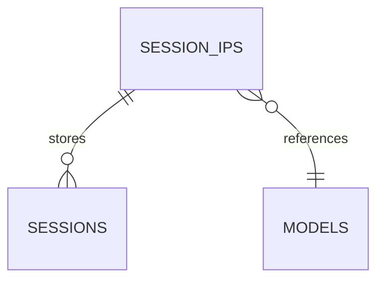

# Design Specification: IP‑Based Sticky Session Protection

## 1. Architecture Overview
The design extends the existing sticky session mechanism in freellmapi-alpha to enforce a per‑IP concurrent session limit based on the size of the rotation pool. The core components affected are:

- **router.ts** – Core routing engine that determines model selection and session affinity.
- **proxy.ts** – Handles session map storage and IP association logic.
- **threadProtection.ts** – May need adjustments to respect IP limits when evaluating protection levels.
- **fallback.ts** – May need to expose pool size for configuration.
- **SQLite database** – Additional table to persist IP‑session mappings across restarts.

## 2. Data Structures

### 2.1 Session Entry
```ts
interface StickySession {
  modelDbId: number;          // Preferred model for sticky session
  keyId?: number;             // Preferred API key (optional)
  ipAddress: string;          // IP address that owns this session
  bannedPlatforms?: Set<string>;
  lastUsed: number;           // Timestamp of last activity
}
```

### 2.2 Rotation Pool Configuration
- **Environment Variable**: `ROTATION_POOL_IPS` – comma‑separated list of IP addresses.
- **Fallback**: If not set, the system defaults to treating all reachable interfaces as a pool of size 1.

### 2.3 Database Schema Extension
Add a new table `session_ips`:

| Column | Type | Description |
|--------|------|-------------|
| `session_id` | TEXT | Unique identifier for the sticky session (hash of user identifier). |
| `ip_address` | TEXT | IP address associated with the session. |
| `model_db_id` | INTEGER | Model ID assigned to the session. |
| `key_id` | INTEGER (nullable) | API key ID if sticky key is used. |
| `banned_platforms` | TEXT (JSON) | Set of banned platforms for this session. |
| `last_used` | INTEGER | Timestamp of last activity. |

## 3. Core Logic Changes

### 3.1 IP Pool Discovery
- At server startup, read `ROTATION_POOL_IPS` from environment or config file.
- Parse into an array and store the count (`poolSize`).
- Optionally refresh the pool on configuration reload (e.g., SIGHUP).

### 3.2 Session Allocation with IP Enforcement
1. **Determine Candidate IP** – Extract the source IP of the incoming request (`req.ip`).
2. **Check Concurrent Sessions** – Query the in‑memory map and database to count active sessions for that IP.
3. **Enforce Limit** – If the count equals the configured `MAX_SESSIONS_PER_IP` (default 1), either:
   - Reject with HTTP 429 and a “Too Many Sessions” message, or
   - Fall back to non‑sticky routing (treat as a new session).
4. **Allocate Session** – If within limit, proceed with normal sticky model/key selection.

### 3.3 Modified Functions
- **`getSessionKey(messages, routingMode)`** – Return a hash that includes the IP address to make it unique per IP.
- **`setStickyModel` / `setStickyKey`** – Store the associated `ipAddress` alongside `modelDbId` and `keyId`.
- **`banPlatformFromSession`** – Also record the banned platform with the IP context.
- **`clearStickyModel` / `clearStickyKey`** – Remove IP association when the session ends.

### 3.4 LongCat Special Handling
- LongCat sessions still respect the per‑IP limit of 1.
- Provider‑ban cooldown (`PROVIDER_BAN_STICKY_COOLDOWN_MS`) and smart pool logic remain unchanged but are evaluated after IP limit validation.
- The IP address is stored and checked in the same way as other platforms.

### 3.5 Cleanup and Eviction
- **TTL**: Sessions older than `STICKY_TTL_MS` (30 min) are automatically evicted from the in‑memory map.
- **Graceful Shutdown**: On server stop, persist the session map to SQLite; on restart, reload into memory.
- **Active‑Request Safeguard**: When checking for provider‑ban conflicts, also verify that the IP does not already have a concurrent session.

## 4. Configuration

| Variable | Default | Description |
|----------|---------|-------------|
| `MAX_SESSIONS_PER_IP` | `1` | Maximum concurrent sessions allowed per IP address. |
| `ROTATION_POOL_IPS` | *none* | Comma‑separated list of IPs that constitute the rotation pool. |
| `SESSION_TTL_MS` | `30 * 60 * 1000` | Time‑to‑live for sticky sessions. |
| `PROVIDER_BAN_STICKY_COOLDOWN_MS` | `3 * 60 * 1000` | Cool‑down period for LongCat provider‑ban sticky sessions. |

Configuration can be overridden via environment variables or a dedicated JSON config file.

## 5. Database Migration

A migration script will add the `session_ips` table. The migration version number must be incremented according to the project's migration policy.

```sql
CREATE TABLE session_ips (
  session_id TEXT PRIMARY KEY,
  ip_address TEXT NOT NULL,
  model_db_id INTEGER NOT NULL,
  key_id INTEGER,
  banned_platforms TEXT,
  last_used INTEGER NOT NULL
);
```

## 6. Error Handling

- **IP Limit Exceeded**: Return HTTP 429 with a descriptive error message.
- **Database Errors**: Log and fallback to in‑memory only (if feasible) to avoid service disruption.
- **Configuration Errors**: Fail fast at startup if `ROTATION_POOL_IPS` is malformed.

## 7. Testing Strategy

1. **Unit Tests** – Validate IP counting logic, session allocation, and rejection scenarios.
2. **Integration Tests** – Simulate multiple requests from the same IP to ensure only one sticky session is granted.
3. **LongCat Scenarios** – Verify provider‑ban and smart pool logic still work under IP limits.
4. **Regression Tests** – Ensure existing sticky model/key behavior remains unchanged.

## 8. Diagrams

### 8.1 Session Flow Diagram


### 8.2 Database Schema Diagram


## 9. Implementation Roadmap

| Phase | Tasks |
|-------|-------|
| **Phase 1** | - Add configuration parsing for `ROTATION_POOL_IPS` and `MAX_SESSIONS_PER_IP`.<br>- Extend `StickySession` interface with `ipAddress`.<br>- Modify session map to store IP associations. |
| **Phase 2** | - Implement IP pool discovery and validation.<br>- Add database migration for `session_ips` table.<br>- Update `setSticky*` functions to persist IP data. |
| **Phase 3** | - Enforce IP limit during session allocation.<br>- Handle rejection responses (429).<br>- Integrate with LongCat special handling. |
| **Phase 4** | - Write unit and integration tests.<br>- Update documentation and configuration examples.<br>- Deploy and monitor in staging. |

## 10. Open Questions
- Should the IP limit be configurable per‑platform (e.g., different limits for LongCat vs. other platforms)?
- How should we handle IPv6 addresses in the pool?
- Should we support dynamic scaling of the rotation pool (e.g., adding IPs at runtime)?
