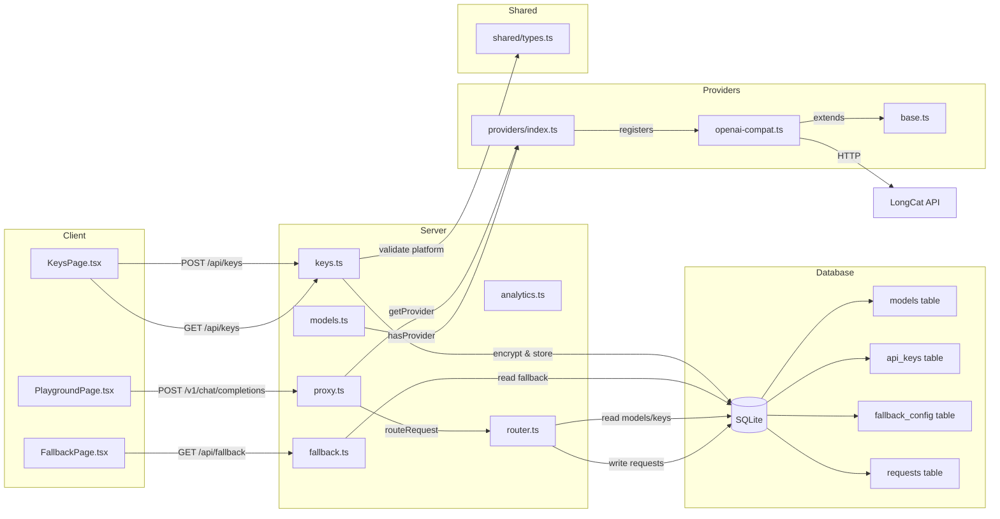
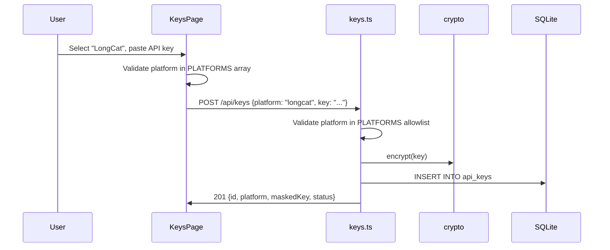
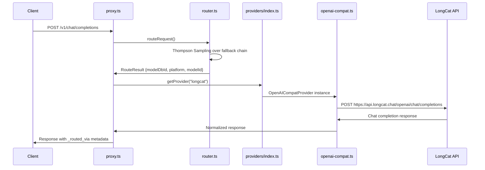

# Design: LongCat LLM Provider Integration

## Architecture Overview

The LongCat provider follows the existing OpenAI-compatible provider pattern. No new abstractions are needed — the `OpenAICompatProvider` class handles all the HTTP communication, streaming, and key validation.



## Data Flow: Adding a LongCat Key



## Data Flow: Routing a Request Through LongCat



## Component Changes

### 1. Shared Types (`shared/types.ts`)

Add `'longcat'` to the `Platform` union type at line 23. This is the foundational change — all other files reference this type.

```typescript
export type Platform =
  | 'google' | 'groq' | 'cerebras' | 'sambanova' | 'nvidia'
  | 'mistral' | 'openrouter' | 'github' | 'cohere' | 'cloudflare'
  | 'zhipu' | 'ollama' | 'kilo' | 'pollinations' | 'llm7'
  | 'inceptionlabs' | 'longcat';
```

### 2. Provider Registration (`server/src/providers/index.ts`)

Register a new `OpenAICompatProvider` instance after the InceptionLabs entry (line 145). The pattern matches Groq, Cerebras, and other simple OpenAI-compatible providers — no extra headers or custom timeout.

```typescript
// LongCat — OpenAI-compatible. Free tier model (longcat-2.0-preview).
register(new OpenAICompatProvider({
  platform: 'longcat',
  name: 'LongCat',
  baseUrl: 'https://api.longcat.chat/openai',
}));
```

The `OpenAICompatProvider` class in [`openai-compat.ts`](server/src/providers/openai-compat.ts:14-148) handles:
- `chatCompletion()` — non-streaming requests to `${baseUrl}/chat/completions`
- `streamChatCompletion()` — streaming requests with SSE parsing
- `validateKey()` — lightweight validation probe

No changes to `openai-compat.ts` are needed.

### 3. Key Management Allowlist (`server/src/routes/keys.ts`)

Add `'longcat'` to the `PLATFORMS` array at line 15. This array is used by `z.enum(PLATFORMS)` for runtime validation of key creation requests.

```typescript
const PLATFORMS = [
  'google', 'groq', 'cerebras', 'sambanova', 'nvidia', 'mistral',
  'openrouter', 'github', 'cohere', 'cloudflare', 'zhipu', 'ollama',
  'kilo', 'pollinations', 'llm7', 'inceptionlabs', 'longcat',
] as const;
```

### 4. Database Migration (`server/src/db/index.ts`)

Add a new `migrateModelsV16` function following the exact pattern of `migrateModelsV15` (lines 1034-1058). Two changes are needed:

**A. New migration function** — add after `migrateModelsV15`:

```typescript
function migrateModelsV16(db: Database.Database) {
  const insert = db.prepare(`
    INSERT OR IGNORE INTO models (platform, model_id, display_name, intelligence_rank, speed_rank, size_label, rpm_limit, rpd_limit, tpm_limit, tpd_limit, monthly_token_budget, context_window)
    VALUES (?, ?, ?, ?, ?, ?, ?, ?, ?, ?, ?, ?)
  `);
  // longcat-2.0-preview: LongCat's free frontier model, same architecture as Owl Alpha.
  // 1M+ context, strong agentic capabilities.
  const additions: Array<[string, string, string, number, number, string, number | null, number | null, number | null, number | null, string, number | null]> = [
    ['longcat', 'longcat/longcat-2.0-preview', 'LongCat 2.0 Preview (free)', 6, 7, 'Frontier', 20, 200, null, null, '~6M', 1048756],
  ];
  const apply = db.transaction(() => {
    for (const a of additions) insert.run(...a);
    const missing = db.prepare(`
      SELECT m.id FROM models m
      LEFT JOIN fallback_config f ON m.id = f.model_db_id
      WHERE f.id IS NULL ORDER BY m.intelligence_rank ASC
    `).all() as { id: number }[];
    if (missing.length > 0) {
      const maxPriority = (db.prepare('SELECT COALESCE(MAX(priority), 0) AS mx FROM fallback_config').get() as { mx: number }).mx;
      const addFb = db.prepare('INSERT INTO fallback_config (model_db_id, priority, enabled) VALUES (?, ?, 1)');
      for (let i = 0; i < missing.length; i++) addFb.run(missing[i].id, maxPriority + i + 1);
    }
  });
  apply();
}
```

**B. Call in `initDb()`** — add after `migrateModelsV15(db)` at line 52:

```typescript
migrateModelsV15(db);
migrateModelsV16(db);
ensureUnifiedKey(db);
```

The migration:
- Uses `INSERT OR IGNORE` for idempotency (safe to run multiple times)
- Auto-populates `fallback_config` for any model missing an entry (including the new LongCat model)
- Assigns priority after existing entries, enabled by default

### 5. Client Key Management UI (`client/src/pages/KeysPage.tsx`)

Add LongCat to the `PLATFORMS` array at line 27 (after InceptionLabs):

```typescript
{ value: 'longcat', label: 'LongCat', keyUrl: 'https://longcat.chat' },
```

This enables:
- LongCat in the platform dropdown on the Keys page
- A "Get Key" link pointing to LongCat's key management page
- API key creation with `platform: 'longcat'`

### 6. Client Fallback UI (`client/src/pages/FallbackPage.tsx`)

Add a color entry to the `platformColors` map at line 107:

```typescript
longcat:     '#ff6b35',
```

This provides a distinct orange color for LongCat in:
- Token usage bar segments
- Model platform badges in the fallback chain view

## Database Schema Impact

No schema changes. The existing `models` table columns are:

| Column | Type | LongCat Value |
|---|---|---|
| `platform` | TEXT | `longcat` |
| `model_id` | TEXT | `longcat/longcat-2.0-preview` |
| `display_name` | TEXT | `LongCat 2.0 Preview (free)` |
| `intelligence_rank` | INTEGER | `6` |
| `speed_rank` | INTEGER | `7` |
| `size_label` | TEXT | `Frontier` |
| `rpm_limit` | INTEGER | `20` |
| `rpd_limit` | INTEGER | `200` |
| `tpm_limit` | INTEGER | `null` |
| `tpd_limit` | INTEGER | `null` |
| `monthly_token_budget` | TEXT | `~6M` |
| `context_window` | INTEGER | `1048756` |

The `fallback_config` table will get one new row auto-populated by the migration:
- `model_db_id` → the `id` from the new `models` row
- `priority` → `MAX(existing priorities) + 1`
- `enabled` → `1`

## Thompson Sampling Router Impact

No changes needed. The router in [`router.ts`](server/src/services/router.ts) dynamically reads from the `models`, `api_keys`, `fallback_config`, and `requests` tables. Once the LongCat model and a user-provided API key exist in the database, the router will automatically include LongCat in the fallback chain and consider it during Thompson Sampling.

The router scores models on four signals:
1. **Success rate** — from `requests` table (starts neutral, converges with data)
2. **Speed** — tokens/second from completed requests
3. **TTFB** — time to first byte
4. **Intelligence rank** — static value from `models` table (LongCat = 6)

## Error Handling

LongCat inherits the existing error handling from `OpenAICompatProvider`:
- **401/403** → `isAuthError()` → marks key as `invalid`
- **429** → `isRateLimitError()` → marks key as `rate_limited`, triggers penalty in router
- **5xx/timeout** → `isRetryableError()` → triggers fallback to next model
- All errors are logged to the `requests` table for analytics
