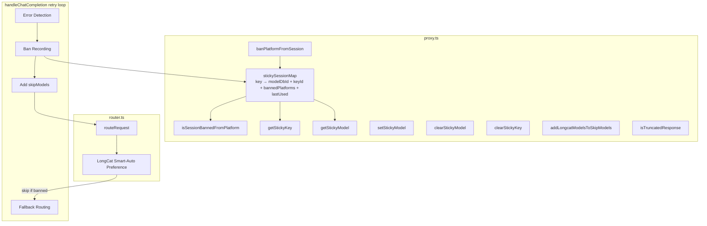
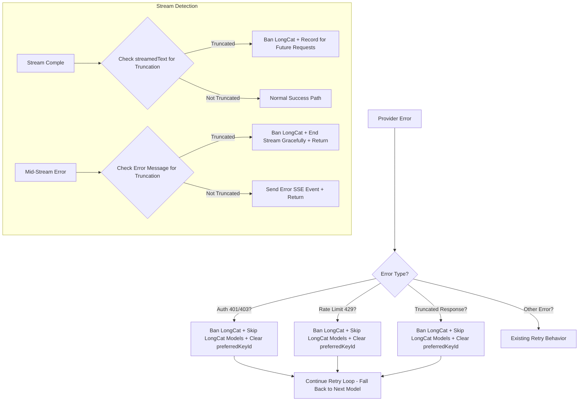
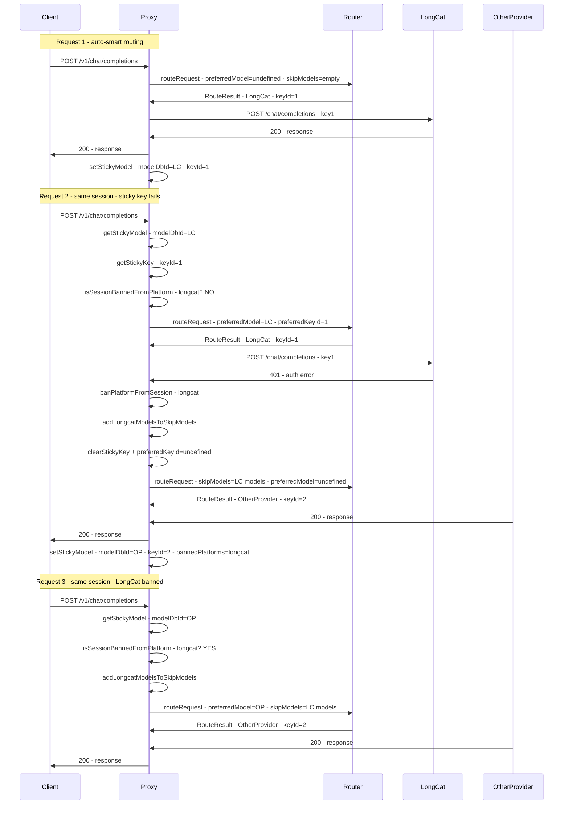

# Design: LongCat Session Ban & Fallback

## Architecture Overview

The ban mechanism extends the existing sticky session infrastructure in `proxy.ts` and integrates with the retry loop in `handleChatCompletion()`. **No changes to `router.ts` are required.** All ban detection and session management is implemented in `proxy.ts` and integrated into `handleChatCompletion()`. The LongCat smart-auto preference in the router is unaffected — the `skipModels` set passed from the proxy effectively suppresses LongCat routing, and the existing boost logic is harmless when LongCat entries are skipped in the main loop.



## Data Model Changes

### Sticky Session Map Value Type

Current value type at [`proxy.ts:16`](server/src/routes/proxy.ts:16):
```typescript
{ modelDbId: number; keyId?: number; lastUsed: number }
```

Extended to:
```typescript
{ modelDbId: number; keyId?: number; bannedPlatforms?: Set<string>; lastUsed: number }
```

The `bannedPlatforms` field is optional for backward compatibility. Existing entries without it default to `undefined` (no bans). Non-LongCat sessions never have bans.

## New Functions

### 1. `isSessionBannedFromPlatform()` — [`proxy.ts`](server/src/routes/proxy.ts)

Checks whether a sticky session is banned from a specific platform. Used before passing `preferredKeyId` to the router and before deciding whether to skip LongCat models.

```typescript
function isSessionBannedFromPlatform(
  messages: ChatMessage[],
  routingMode: RoutingMode,
  platform: string,
): boolean {
  const key = getSessionKey(messages, routingMode);
  if (!key) return false;
  const entry = stickySessionMap.get(key);
  if (!entry) return false;
  if (Date.now() - entry.lastUsed > STICKY_TTL_MS) return false; // expired = no ban
  return entry.bannedPlatforms?.has(platform) ?? false;
}
```

### 2. `banPlatformFromSession()` — [`proxy.ts`](server/src/routes/proxy.ts)

Records a platform ban in the sticky session. Called when truncation, auth, or rate-limit errors are detected on LongCat.

```typescript
function banPlatformFromSession(
  messages: ChatMessage[],
  routingMode: RoutingMode,
  platform: string,
): void {
  const key = getSessionKey(messages, routingMode);
  if (!key) return;
  const entry = stickySessionMap.get(key);
  if (!entry) return;
  if (!entry.bannedPlatforms) entry.bannedPlatforms = new Set();
  entry.bannedPlatforms.add(platform);
  entry.lastUsed = Date.now(); // refresh TTL so the ban persists
  stickySessionMap.set(key, entry);
  console.log(`[Sticky] banned platform=${platform} for session=${key.slice(0, 8)} | bannedPlatforms=${Array.from(entry.bannedPlatforms).join(',')}`);
}
```

### 3. `addLongcatModelsToSkipModels()` — [`proxy.ts`](server/src/routes/proxy.ts)

Helper that queries the DB for all LongCat model_db_ids and adds them to the `skipModels` set. Called when a session is banned from LongCat.

```typescript
function addLongcatModelsToSkipModels(skipModels: Set<number>): void {
  const db = getDb();
  const longcatModels = db.prepare(
    'SELECT id FROM models WHERE platform = ? AND enabled = 1'
  ).all('longcat') as Array<{ id: number }>;
  for (const m of longcatModels) {
    skipModels.add(m.id);
  }
  console.log(`[Sticky] added ${longcatModels.length} longcat model(s) to skipModels: [${longcatModels.map(m => m.id).join(',')}]`);
}
```

### 4. `isTruncatedResponse()` — [`proxy.ts`](server/src/routes/proxy.ts)

Detects whether a response (streamed text or error message) indicates truncation by the LongCat provider. Checks for known truncation keywords in error messages and response content.

```typescript
function isTruncatedResponse(errOrContent: any): boolean {
  if (!errOrContent) return false;
  const str = String(errOrContent).toLowerCase();
  // Truncation indicators from LongCat and similar providers
  return str.includes('truncated')
    || str.includes('truncation')
```

## Component Changes

### 1. Sticky Session Map Type — [`proxy.ts:16`](server/src/routes/proxy.ts:16)

```typescript
const stickySessionMap = new Map<string, {
  modelDbId: number;
  keyId?: number;
  bannedPlatforms?: Set<string>;
  lastUsed: number;
}>();
```

### 2. `getStickyKey()` Update — [`proxy.ts:54-79`](server/src/routes/proxy.ts:54-79)

Add a check: if the session is banned from the model's platform, return `undefined` instead of the sticky key. This prevents the proxy from passing a `preferredKeyId` for a banned session.

```typescript
function getStickyKey(messages: ChatMessage[], routingMode: RoutingMode): number | undefined {
  const key = getSessionKey(messages, routingMode);
  if (!key) { ... return undefined; }

  const entry = stickySessionMap.get(key);
  if (!entry) { ... return undefined; }

  // TTL check (existing)

  // NEW: If session is banned from the sticky model's platform, don't return sticky key
  if (entry.bannedPlatforms) {
    const db = getDb();
    const modelRow = db.prepare('SELECT platform FROM models WHERE id = ?').get(entry.modelDbId) as { platform: string } | undefined;
    if (modelRow && entry.bannedPlatforms.has(modelRow.platform)) {
      console.log(`[Sticky] key skipped session=${key.slice(0, 8)} | model platform=${modelRow.platform} is banned`);
      return undefined;
    }
  }

  // Existing keyId return logic
  if (entry.keyId !== undefined) { ... }
  return entry.keyId;
}
```

### 3. `clearStickyModel()` Update — [`proxy.ts:81-87`](server/src/routes/proxy.ts:81-87)

When clearing a sticky model, also clear `bannedPlatforms` since the entire session entry is being removed. No change needed — `clearStickyModel()` deletes the entire map entry, which naturally clears `bannedPlatforms` too.

### 4. `setStickyModel()` Update — [`proxy.ts:100-112`](server/src/routes/proxy.ts:100-112)

When setting a new sticky model after successful fallback, preserve the `bannedPlatforms` set from the previous entry (if any). This ensures the LongCat ban persists even when the sticky model changes.

```typescript
function setStickyModel(messages: ChatMessage[], modelDbId: number, routingMode: RoutingMode, keyId?: number) {
  const key = getSessionKey(messages, routingMode);
  if (!key) return;

  // Preserve bannedPlatforms from existing entry (if session was previously banned)
  const existing = stickySessionMap.get(key);
  const bannedPlatforms = existing?.bannedPlatforms;

  stickySessionMap.set(key, { modelDbId, keyId, bannedPlatforms, lastUsed: Date.now() });
  console.log(`[Sticky] set key=${key.slice(0, 8)} | msgs=${messages.length} → modelDbId=${modelDbId}${keyId !== undefined ? ` keyId=${keyId}` : ''}${bannedPlatforms && bannedPlatforms.size > 0 ? ` banned=${Array.from(bannedPlatforms).join(',')}` : ''}`);

  // Existing eviction logic unchanged
}
```

### 5. `handleChatCompletion()` Retry Loop — [`proxy.ts:1035-1282`](server/src/routes/proxy.ts:1035-1282)

The retry loop needs several changes:

#### A. Pre-routing: Check session bans and [`proxy.ts:1035-1053`](server/src/routes/proxy.ts:1035-1053)

After determining `preferredModel` and `preferredKeyId`, check if the session is banned from LongCat. If banned:
- Skip LongCat models in routing
- Don't pass `preferredKeyId` for LongCat

```typescript
// Existing: determine preferredModel and preferredKeyId
let preferredKeyId: number | undefined;
if (preferredModel && !requestedModel) {
  const stickyKeyId = getStickyKey(normalizedMessages, routingMode);
  if (stickyKeyId !== undefined) {
    const db = getDb();
    const row = db.prepare('SELECT platform FROM models WHERE id = ?').get(preferredModel) as { platform: string } | undefined;
    if (row?.platform === 'longcat') {
      preferredKeyId = stickyKeyId;
      console.log(`[Sticky] key preferred modelDbId=${preferredModel} keyId=${preferredKeyId} (longcat)`);
    }
  }
}

// NEW: Check if session is banned from LongCat
const skipModels = new Set<number>();
if (isSessionBannedFromPlatform(normalizedMessages, routingMode, 'longcat')) {
  addLongcatModelsToSkipModels(skipModels);
  // Also clear preferredModel if it points to a LongCat model
  if (preferredModel) {
    const db = getDb();
    const row = db.prepare('SELECT platform FROM models WHERE id = ?').get(preferredModel) as { platform: string } | undefined;
    if (row?.platform === 'longcat') {
      console.log(`[Sticky] skipping preferredModel=${preferredModel} (longcat banned for session)`);
      preferredModel = undefined;
      preferredKeyId = undefined;
    }
  }
}
```

#### B. Error handling in retry loop  [`proxy.ts:1245-1282`](server/src/routes/proxy.ts:1245-1282)

When an error occurs on a LongCat route, detect truncation and auth, and rate-limit errors and ban LongCat for the session:

```typescript
} catch (err: any) {
  const latency = Date.now() - start;
  logRequest(route.platform, route.modelId, 'error', estimatedInputTokens, 0, latency, null, err.message);

  // NEW: Detect LongCat multiple-key-use errors and ban the platform
  if (route.platform === 'longcat') {
    // Auth error: different key used for same session
    if (isAuthError(err)) {
      console.warn(`[Proxy] LongCat auth error — banning longcat for session (multiple key use detected)`);
      banPlatformFromSession(normalizedMessages, routingMode, 'longcat');
      addLongcatModelsToSkipModels(skipModels);
      preferredKeyId = undefined;
      // Don't clear the entire sticky model — just ban LongCat specifically
      // The sticky model will be updated on next successful fallback
    }
    // Rate-limit error: also indicates key rotation
    if (isRateLimitError(err)) {
      console.warn(`[Proxy] LongCat rate-limit error — banning longcat for session (key rotation detected)`);
      banPlatformFromSession(normalizedMessages, routingMode, 'longcat');
      addLongcatModelsToSkipModels(skipModels);
      preferredKeyId = undefined;
    }
    // Truncated response: provider cut off the session
    if (isTruncatedResponse(err.message) || isTruncatedResponse(err?.responseBody)) {
      console.warn(`[Proxy] LongCat truncated response — banning longcat for session`);
      banPlatformFromSession(normalizedMessages, routingMode, 'longcat');
      addLongcatModelsToSkipModels(skipModels);
      preferredKeyId = undefined;
    }
  }

  // Existing: clear sticky key on auth error (for non-LongCat too)
  if (isAuthError(err) && route.platform !== 'longcat') {
    clearStickyKey(normalizedMessages, routingMode);
    preferredKeyId = undefined;
  }

  if (isRetryableError(err)) {
    const skipId = `${route.platform}:${route.modelId}:${route.keyId}`;
    skipKeys.add(skipId);
    if (shouldSkipModelOnRetry(err)) {
      skipModels.add(route.modelDbId);
    }
    if (isRateLimitError(err)) {
      setCooldown(route.platform, route.modelId, route.keyId, 120_000);
    }
    lastError = err;
    console.warn(`[Proxy] retryable ${summarizeProviderError(err)} from ${route.displayName}/${route.modelId}, fallback (attempt ${attempt + 1}/${MAX_RETRIES})`);
    continue;
  }

  // Non-retryable error
 clearStickyModel(normalizedMessages, routingMode);
  res.status(502).json({ ... });
  return;
}
```

### 6. Streaming Truncation Detection — [`proxy.ts:1094-1184`](server/src/routes/proxy.ts:1094-1184)

After the streaming `for await` loop completes, check the accumulated `streamedText` for truncation indicators. If detected, ban LongCat for the session. The stream has already been sent to the client — no retry within the same request.

```typescript
// After the for-await loop completes (after line 1133)
// ... existing stream completion logic ...

// NEW: Check for truncated response content after stream completes
if (route.platform === 'longcat' && isTruncatedResponse(streamedText)) {
  console.warn(`[Proxy] LongCat truncated stream content detected — banning longcat for session`);
  banPlatformFromSession(normalizedMessages, routingMode, 'longcat');
  // Note: the stream has already been sent to the client
  // The truncated response stands as-is — the client received it, just incomplete
  // Future requests in this session will route to non-LongCat models
}

// Continue with existing success path (recordTokens, setStickyModel, etc.)
```

For the Responses API streaming path, check `responseStreamContext.outputText` instead of `streamedText`.

### 7. Mid-Stream Error Handling — [`proxy.ts:1185-1214`](server/src/routes/proxy.ts:1185-1214)

When a mid-stream error occurs on LongCat, check if it's a truncation-related error. If yes, end the stream gracefully and record the ban, and return. The client receives the truncated response. If not it's not a truncation error, keep existing behavior (send error SSE event and return).

```typescript
} catch (streamErr: any) {
  if (streamStarted) {
    // NEW: Check for LongCat truncation error mid-stream
    if (route.platform === 'longcat' && isTruncatedResponse(streamErr.message)) {
      console.warn(`[Proxy] LongCat truncation error mid-stream — banning longcat for session, ending stream gracefully`);
      banPlatformFromSession(normalizedMessages, routingMode, 'longcat');
      // End the stream gracefully — client receives truncated response
      // Don't send error SSE event — just end the stream
      try {
        if (responseStreamContext) {
          writeResponseStreamEvent(res, { type: 'response.completed', response: { ... status: 'completed' ... } });
        } else {
          res.write('data: [DONE]\n\n');
        }
        res.end();
      } catch { /* socket gone */ }
      logRequest(route.platform, route.modelId, 'error', estimatedInputTokens, totalOutputTokens, Date.now() - start, ttfbMs, streamErr.message);
      return; // Stream ended gracefully, client got truncated response
    }

    // Existing mid-stream error handling for non-truncation errors
    console.error(`[Proxy] Mid-stream error from ${route.displayName}:`, streamErr.message);
    const payload = { error: { message: `Provider error (${route.displayName}): stream interrupted`, type: 'stream_error' } };
    try {
      if (responseStreamContext) {
        writeResponseStreamEvent(res, { ... });
      } else {
        res.write(`data: ${JSON.stringify(payload)}\n\n`);
        res.write('data: [DONE]\n\n');
      }
      res.end();
    } catch { /* socket gone */ }
    logRequest(...);
    return;
  }
  // Pre-stream error — bubble to outer retry/502 handler.
  throw streamErr;
}
```

### 8. Router LongCat Smart-Auto Preference — [`router.ts:498-527`](server/src/services/router.ts:498-527)

The LongCat smart-auto preference in `routeRequest()` should skip boosting LongCat entries for sessions that are banned from LongCat. The proxy passes `skipModels` containing all LongCat model IDs, so the router naturally skips them. However, the LongCat boost logic at lines 498-527 should also be suppressed when all LongCat entries are in `skipModels`, to avoid unnecessary DB queries.

No change needed — the existing boost logic already checks `hasCapacity` by querying LongCat keys. If all LongCat models are in `skipModels`, the `for (const entry of sorted)` loop at line 538 will skip them via `if (skipModels?.has(entry.model_db_id)) continue;`. The boost logic at lines 498-527 moves LongCat entries to the front, but they'll be skipped in the main loop anyway. The only optimization would be to skip the boost entirely when LongCat is banned, but this is a minor performance concern, not a functional one.

**Decision: No router changes needed.** The `skipModels` set passed from the proxy effectively suppresses LongCat routing. The boost logic is harmless when LongCat is banned because the boosted entries are skipped in the main loop.

## Error Detection Flow



## Session Lifecycle



## Edge Cases

### EC-1: Session Expires
When a sticky session expires via TTL (30 min), the `bannedPlatforms` set is also cleared. This is natural — expired sessions are evicted from `stickySessionMap` entirely, including all associated data.

### EC-2: No Sticky Session Exists
For a new session with no sticky entry, `isSessionBannedFromPlatform()` returns `false`. No LongCat models are skipped. The request is routed normally via Thompson Sampling or smart-auto preference.

### EC-3: Non-LongCat Session
A session that was never routed to LongCat has no `bannedPlatforms` entry (or an empty set). `isSessionBannedFromPlatform('longcat')` returns `false`. No changes to existing behavior.

### EC-4: All LongCat Keys Disabled/Invalid
If all LongCat API keys are disabled or marked invalid, the router skips LongCat naturally via the existing key availability check. No ban is recorded because the session was never routed to LongCat in the first place.

### EC-5: Server Restart
Sticky sessions are in-memory only. On server restart, all session data (including bans) is lost. This is existing behavior — sticky sessions don't persist across restarts.

### EC-6: Multiple LongCat Models
If multiple LongCat models exist in the catalog (e.g., `longcat-2.0-preview` and `longcat-3.0`), `addLongcatModelsToSkipModels()` adds ALL enabled LongCat model IDs to `skipModels`. This ensures the session is banned from ALL LongCat models, not just the one that failed.

### EC-7: Truncated Response After Stream Ends
After a stream completes successfully, the proxy checks `streamedText` for truncation indicators. If detected, the ban is recorded for future requests. The current request's response is already sent — the client receives the truncated response as-is. No retry within the same HTTP request.

### EC-8: Mixed Model Chunks in Mid-Stream Retry
Mid-stream truncation detection ends the current stream gracefully and returns. No retry within the same HTTP request. The client receives the truncated response. Future requests route to non-LongCat models.