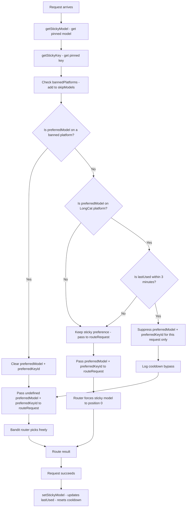

# Design: LongCat Sticky Session Cooldown Safeguard

## Architecture

This feature is a **single-point insertion** into the existing request flow in [`handleChatCompletion()`](server/src/routes/proxy.ts:1098). No new data structures, no new modules, no new functions — just a conditional check that temporarily suppresses sticky preference when the cooldown is active.

## Decision Flow

The cooldown check is inserted **after** the sticky model/key lookup and **after** the ban check, but **before** the values are passed to [`routeRequest()`](server/src/services/router.ts:458). This ordering ensures:

1. Sticky session lookups happen first (establishing `preferredModel` and `preferredKeyId`)
2. Ban checks happen next (clearing preferences if the platform is banned — bans take precedence)
3. Cooldown check happens last (suppressing preferences only if no ban is active)
4. The final `preferredModel` / `preferredKeyId` values are passed to the router



## Implementation Details

### 1. New Constant

Add alongside existing constants at the top of [`proxy.ts`](server/src/routes/proxy.ts:17):

```typescript
const LONGCAT_STICKY_COOLDOWN_MS = 3 * 60 * 1000; // 3 min — bypass sticky preference for LongCat if session was used within this window
```

### 2. Cooldown Check Insertion Point

The check is inserted in [`handleChatCompletion()`](server/src/routes/proxy.ts:1098) at the point where `preferredModel` and `preferredKeyId` have been fully resolved (after sticky lookups and ban checks), right before the retry loop that calls [`routeRequest()`](server/src/services/router.ts:458).

Current code flow (lines ~1198-1244):

```
1. preferredModel = getStickyModel(...)        // line 1199
2. preferredKeyId = getStickyKey(...)          // line 1207-1212
3. skipModels from bannedPlatforms              // line 1216-1230
4. Clear preferredModel if on banned platform  // line 1232-1240
5. ← INSERT COOLDOWN CHECK HERE
6. Retry loop with routeRequest(...)           // line 1247+
```

### 3. Cooldown Check Logic

```typescript
// LongCat sticky cooldown: if the sticky model is on LongCat and was used
// within the last 3 minutes, bypass sticky preference for this request only.
// The bandit router picks freely — it may still route to LongCat organically.
if (preferredModel) {
  const db = getDb();
  const prefRow = db.prepare('SELECT platform FROM models WHERE id = ?').get(preferredModel) as { platform: string } | undefined;
  if (prefRow?.platform === 'longcat') {
    const sessionKey = getSessionKey(normalizedMessages, routingMode);
    const entry = sessionKey ? stickySessionMap.get(sessionKey) : undefined;
    if (entry && Date.now() - entry.lastUsed < LONGCAT_STICKY_COOLDOWN_MS) {
      const ageMs = Date.now() - entry.lastUsed;
      console.log(`[Sticky] LongCat cooldown active — bypassing sticky preference for session=${sessionKey?.slice(0, 8)} | lastUsed=${ageMs}ms ago`);
      preferredModel = undefined;
      preferredKeyId = undefined;
    }
  }
}
```

**Key design decisions in this logic:**

- **DB lookup for platform**: We already do a `SELECT platform FROM models WHERE id = ?` query at line 1234 for the ban check. The cooldown check needs the same data. We can reuse the `prefRow` from the ban check if we restructure slightly, or do a separate query. Since this is a lightweight in-memory SQLite query and the ban check may have already cleared `preferredModel`, a separate query after the ban check is cleaner and more self-contained.
- **Reads `lastUsed` directly from the map**: No new function needed. The `stickySessionMap` entry is already accessible via `getSessionKey()` + `stickySessionMap.get()`.
- **Only suppresses, never deletes**: `preferredModel` and `preferredKeyId` are local variables in the handler function. Setting them to `undefined` for this request has no effect on the `stickySessionMap` entry. The next request will re-read from the map and make a fresh cooldown decision.
- **Defensive `entry` check**: If `sessionKey` is empty or the entry doesn't exist (shouldn't happen since `preferredModel` was found, but defensive), the cooldown is skipped.

### 4. Interaction with Smart-Mode LongCat Boost

When the cooldown suppresses `preferredModel`, the router's [`routeRequest()`](server/src/services/router.ts:458) receives no sticky preference. In smart mode, the LongCat boost (lines 499-527) still applies — it moves LongCat entries to the front of the Thompson-sampled sorted list. This means:

- **Without cooldown**: LongCat is forced to position 0 via sticky pin + boosted to front via smart mode → guaranteed LongCat
- **With cooldown**: LongCat is NOT forced to position 0, but still boosted to front via smart mode → very likely LongCat, but other models with high sampled scores can win

This is the intended behavior. The cooldown prevents *guaranteed* pinning while still giving LongCat a strong probability via the boost.

### 5. Cooldown Reset on Success

When a request succeeds, [`setStickyModel()`](server/src/routes/proxy.ts:253) is called (line 1379 for streaming, line 1470 for non-streaming), which sets `lastUsed = Date.now()`. This naturally resets the cooldown window. No additional code is needed — the existing behavior already handles this.

### 6. Edge Cases

| Edge Case | Behavior |
|---|---|
| Session has no `lastUsed` (defensive) | Cooldown check skips — `entry.lastUsed` is always set by `setStickyModel()`, but if missing, treat as no cooldown |
| `preferredModel` already cleared by ban | Cooldown check's `if (preferredModel)` guard skips — ban takes precedence |
| Explicit model request (`requestedModel` is set) | `preferredModel` comes from DB lookup, not sticky session — cooldown doesn't apply because the user explicitly chose a model |
| First request in a new session | No sticky entry exists → `preferredModel` is `undefined` → cooldown check skips |
| Server restart | `stickySessionMap` is in-memory and empty after restart → no sticky sessions → cooldown irrelevant until sessions are established |
| Multiple concurrent requests for same session | Each request independently reads `lastUsed` and makes its own cooldown decision. Node.js is single-threaded so no race conditions on the read |

## Test Strategy

Tests should be added to [`server/src/__tests__/routes/proxy-tools.test.ts`](server/src/__tests__/routes/proxy-tools.test.ts) covering:

1. **Cooldown active**: Sticky session on LongCat with `lastUsed` < 3 min ago → `preferredModel` and `preferredKeyId` should be suppressed
2. **Cooldown expired**: Sticky session on LongCat with `lastUsed` > 3 min ago → sticky preference preserved
3. **Non-LongCat provider**: Sticky session on Groq with `lastUsed` < 3 min ago → sticky preference preserved (no cooldown)
4. **Ban takes precedence**: Sticky session on LongCat with `lastUsed` < 3 min ago AND LongCat is banned → ban clears preference first, cooldown check is skipped
5. **No sticky session**: No entry in `stickySessionMap` → cooldown check skipped, no effect
6. **Explicit model request**: User requests a specific LongCat model → cooldown doesn't apply

## Files Requiring Modification

| # | File | Change | Lines Affected |
|---|---|---|---|
| 1 | [`server/src/routes/proxy.ts`](server/src/routes/proxy.ts:17) | Add `LONGCAT_STICKY_COOLDOWN_MS` constant | After line 17 |
| 2 | [`server/src/routes/proxy.ts`](server/src/routes/proxy.ts:1240) | Add cooldown check after ban check, before retry loop | After line 1240 |
| 3 | [`server/src/__tests__/routes/proxy-tools.test.ts`](server/src/__tests__/routes/proxy-tools.test.ts) | Add unit tests for cooldown logic | New test section |