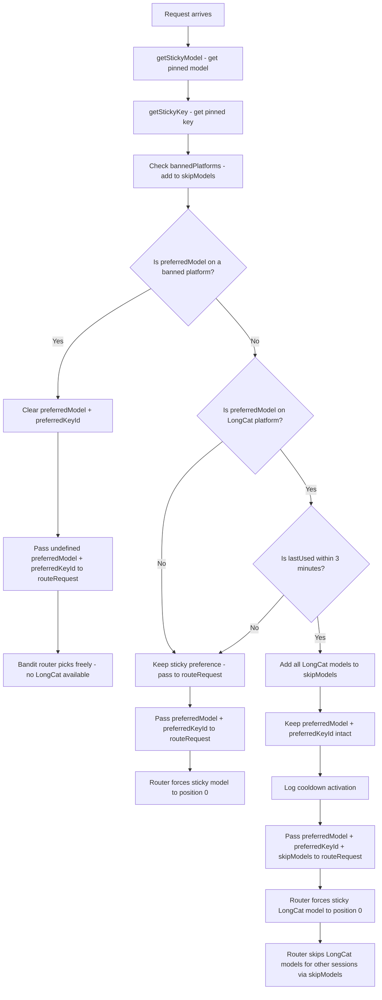

# Design: LongCat Sticky Session Cooldown Safeguard

## Architecture

This feature is a **single-point modification** to the existing cooldown check in [`handleChatCompletion()`](server/src/routes/proxy.ts:1098). Instead of clearing `preferredModel`/`preferredKeyId` (old behavior), the cooldown now adds all LongCat models to `skipModels` while keeping the sticky session pinned.

## Decision Flow



## Implementation Details

### 1. New Constant

Add alongside existing constants at the top of [`proxy.ts`](server/src/routes/proxy.ts:17):

```typescript
const LONGCAT_STICKY_COOLDOWN_MS = 3 * 60 * 1000; // 3 min — exclude LongCat from bandit routing for other sessions
```

### 2. Cooldown Check — Modified Logic

Replace the existing cooldown check (lines ~1243-1259) with:

```typescript
// LongCat sticky cooldown: if the sticky model is on LongCat and was used
// within the last 3 minutes, exclude LongCat from the bandit router for all
// other sessions. The current sticky session keeps its pinned LongCat route.
// This prevents LongCat from seeing multiple sessions/keys from the same IP.
if (preferredModel) {
  const db = getDb();
  const prefRow = db.prepare('SELECT platform FROM models WHERE id = ?').get(preferredModel) as { platform: string } | undefined;
  if (prefRow?.platform === 'longcat') {
    const cooldownSessionKey = getSessionKey(normalizedMessages, routingMode);
    const cooldownEntry = cooldownSessionKey ? stickySessionMap.get(cooldownSessionKey) : undefined;
    if (cooldownEntry && Date.now() - cooldownEntry.lastUsed < LONGCAT_STICKY_COOLDOWN_MS) {
      const ageMs = Date.now() - cooldownEntry.lastUsed;
      addProviderModelsToSkipModels(skipModels, 'longcat');
      console.log(`[Sticky] LongCat cooldown active — excluding LongCat from bandit routing for other sessions | session=${cooldownSessionKey?.slice(0, 8)} | lastUsed=${ageMs}ms ago`);
    }
  }
}
```

**Key design decisions:**

- **`preferredModel` and `preferredKeyId` are NOT cleared** — the sticky session keeps its LongCat pin
- **`addProviderModelsToSkipModels(skipModels, 'longcat')`** adds all LongCat model IDs to the skip set — the router's existing `skipModels` check (line 539) skips these models for any session that doesn't have them as `preferredModel`
- **The sticky session bypasses skipModels** — in `routeRequest()`, the sticky model is forced to position 0 (line 530-536) before the skipModels check (line 539), so the sticky session always reaches its pinned LongCat model
- **Reuses existing `addProviderModelsToSkipModels()` helper** — no new functions needed

### 3. How skipModels Protects the Sticky Session

In [`routeRequest()`](server/src/services/router.ts:538-539):

```typescript
for (const entry of sorted) {
    if (skipModels?.has(entry.model_db_id)) continue;
```

The sticky model is forced to position 0 via `sorted.unshift(preferred)` at line 534. When the loop iterates, the sticky LongCat model is first in the array. The `skipModels` check skips it... **but wait** — this means the sticky session's LongCat model would also be skipped!

This is a problem. The `skipModels` check applies to ALL entries including the sticky model. We need to ensure the sticky model is NOT skipped even when LongCat is in `skipModels`.

**Solution**: The `skipModels` check should be: skip the model ONLY if it's not the preferred (sticky) model. We need to modify the router's skip check:

```typescript
if (skipModels?.has(entry.model_db_id) && entry.model_db_id !== preferredModelDbId) continue;
```

This ensures the sticky session's LongCat model is never skipped, while all other LongCat models (and LongCat models for other sessions) are skipped.

### 4. Cooldown Reset on Success

When a request succeeds, [`setStickyModel()`](server/src/routes/proxy.ts:253) updates `Date.now()`, resetting the cooldown window. Next request re-evaluates.

### 5. Edge Cases

| Edge Case | Behavior |
|---|---|
| Session has no `lastUsed` (defensive) | Cooldown check skips — no exclusion |
| `preferredModel` already cleared by ban | Cooldown check's `if (preferredModel)` guard skips |
| LongCat already in `skipModels` from ban | `addProviderModelsToSkipModels` adds duplicate IDs to Set — no-op, no harm |
| Explicit model request (`requestedModel` is set) | `preferredModel` comes from DB lookup, not sticky — cooldown doesn't apply |
| First request in a new session | No sticky entry → `preferredModel` is `undefined` → cooldown skips |
| Server restart | `stickySessionMap` empty → no cooldown until sessions established |
| Only LongCat models available during cooldown | Non-sticky sessions fail with 429/502 (all models exhausted). Sticky session still routes to its pinned LongCat model. |

## Files Requiring Modification

| # | File | Change | Lines Affected |
|---|---|---|---|
| 1 | [`server/src/routes/proxy.ts`](server/src/routes/proxy.ts:17) | Add `LONGCAT_STICKY_COOLDOWN_MS` constant | After line 17 |
| 2 | [`server/src/routes/proxy.ts`](server/src/routes/proxy.ts:1243) | Replace cooldown logic: add LongCat to `skipModels` instead of clearing `preferredModel`/`preferredKeyId` | Lines ~1243-1259 |
| 3 | [`server/src/services/router.ts`](server/src/services/router.ts:539) | Modify `skipModels` check to exclude the sticky model: `&& entry.model_db_id !== preferredModelDbId` | Line 539 |
| 4 | [`server/src/__tests__/routes/proxy-tools.test.ts`](server/src/__tests__/routes/proxy-tools.test.ts) | Update unit tests to match new behavior | Test section |