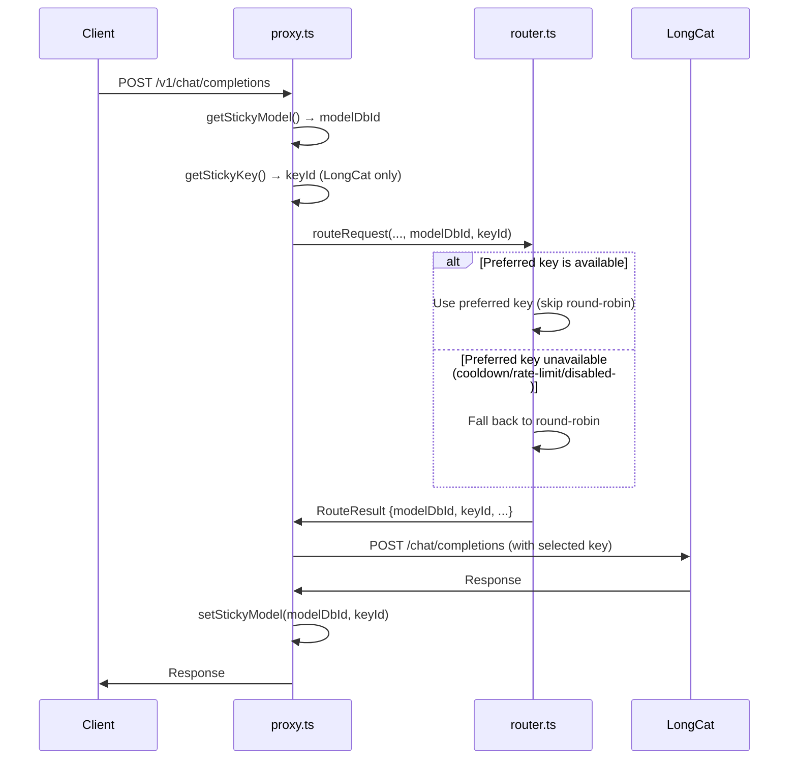
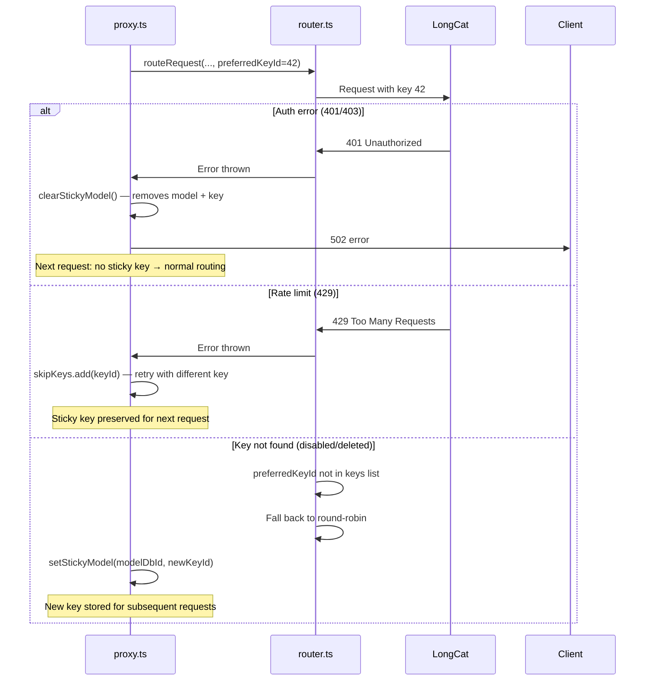

# Design: LongCat Sticky Key Sessions

## Architecture Overview

The sticky key feature extends the existing sticky session mechanism in `proxy.ts` and adds a `preferredKeyId` parameter to the router's `routeRequest()` function. The proxy layer is responsible for determining *whether* to request a sticky key (only for LongCat), while the router handles *how* to prefer a specific key.

```mermaid
graph TD
    subgraph Proxy [proxy.ts]
        GM[getStickyModel] --> GK[getStickyKey]
        GK --> |keyId| RR
        SM[setStickyModel] --> |keyId| Map
        CM[clearStickyModel] --> Map
        Map[stickySessionMap<br/>key → {modelDbId, keyId, lastUsed}]
    end

    subgraph Router [router.ts]
        RR[routeRequest] --> |preferredKeyId| KS[Key Selection Loop]
        KS --> |key available?| Use[Use Preferred Key]
        KS --> |key unavailable?| RR2[Round-Robin Fallback]
    end

    subgraph Error Handling
        AuthErr[Auth/Retryable Error] --> CM
        NonRetryErr[Non-Retryable Error] --> CM
    end
```

## Data Model Changes

### Sticky Session Map Value Type

The current value type is:
```typescript
{ modelDbId: number; lastUsed: number }
```

Extended to:
```typescript
{ modelDbId: number; keyId?: number; lastUsed: number }
```

The `keyId` is optional to maintain backward compatibility with existing entries and with non-LongCat sessions that never store a key.

## Component Changes

### 1. Sticky Session Map Type (`proxy.ts` line 16)

```typescript
const stickySessionMap = new Map<string, { modelDbId: number; keyId?: number; lastUsed: number }>();
```

### 2. New `getStickyKey()` Function (`proxy.ts`)

Added alongside `getStickyModel()`, following the same pattern:

```typescript
function getStickyKey(messages: ChatMessage[], routingMode: RoutingMode): number | undefined {
  const key = getSessionKey(messages, routingMode);
  if (!key) return undefined;

  const entry = stickySessionMap.get(key);
  if (!entry) return undefined;

  if (Date.now() - entry.lastUsed > STICKY_TTL_MS) {
    stickySessionMap.delete(key);
    return undefined;
  }

  return entry.keyId;
}
```

### 3. Updated `setStickyModel()` Function (`proxy.ts` line 62)

Extended to accept and store `keyId`:

```typescript
function setStickyModel(messages: ChatMessage[], modelDbId: number, routingMode: RoutingMode, keyId?: number) {
  const key = getSessionKey(messages, routingMode);
  if (!key) return;
  stickySessionMap.set(key, { modelDbId, keyId, lastUsed: Date.now() });
  // ... existing eviction logic unchanged
}
```

### 4. Updated Retry Loop in `handleChatCompletion()` (`proxy.ts` ~line 1007)

The retry loop currently builds `skipKeys` and `skipModels` sets. We add a `preferredKeyId` variable:

```typescript
const preferredModel = /* existing logic */;
const preferredKeyId = preferredModel ? getStickyKey(normalizedMessages, routingMode) : undefined;

// In the routeRequest call:
route = routeRequest(
  estimatedTotal,
  skipKeys.size > 0 ? skipKeys : undefined,
  preferredModel,
  routingMode,
  skipModels.size > 0 ? skipModels : undefined,
  preferredKeyId,
);
```

### 5. Updated `setStickyModel()` Call on Success (`proxy.ts` ~line 1127)

After a successful response, pass the `keyId` from the route result:

```typescript
setStickyModel(normalizedMessages, route.modelDbId, routingMode, route.keyId);
```

This is called in both the streaming and non-streaming success paths.

### 6. Router `routeRequest()` Signature (`router.ts` line 457)

Add `preferredKeyId` as an optional parameter:

```typescript
export function routeRequest(
  estimatedTokens = 1000,
  skipKeys?: Set<string>,
  preferredModelDbId?: number,
  routingMode: RoutingMode = 'balanced',
  skipModels?: Set<number>,
  preferredKeyId?: number,
): RouteResult {
```

### 7. Key Selection Loop (`router.ts` ~line 528)

Inside the key selection loop for a given model entry, check if the preferred key is available before falling through to round-robin:

```typescript
for (let attempt = 0; attempt < keys.length; attempt++) {
  const key = keys[idx % keys.length];
  idx++;

  const skipId = `${entry.platform}:${entry.model_id}:${key.id}`;
  if (skipKeys?.has(skipId)) {
    exhaustedBy429 = true;
    continue;
  }
  if (isOnCooldown(entry.platform, entry.model_id, key.id)) continue;
  if (!canMakeRequest(entry.platform, entry.model_id, key.id, limits)) continue;
  if (!canUseTokens(entry.platform, entry.model_id, key.id, estimatedTokens, limits)) continue;

  // If this is the preferred key, use it immediately (skip round-robin position)
  if (preferredKeyId !== undefined && key.id === preferredKeyId) {
    roundRobinIndex.set(rrKey, idx);
    const decryptedKey = decrypt(key.encrypted_key, key.iv, key.auth_tag);
    return { /* ... RouteResult ... */ };
  }

  // Normal round-robin: use the first eligible key
  // ... existing return logic
}
```

**Refined approach**: Rather than checking inside the loop, we can check if the preferred key exists in the keys array and is eligible *before* entering the round-robin loop. This is cleaner:

```typescript
// If a preferred key is specified, try it first
if (preferredKeyId !== undefined) {
  const preferredKey = keys.find(k => k.id === preferredKeyId);
  if (preferredKey) {
    const skipId = `${entry.platform}:${entry.model_id}:${preferredKey.id}`;
    if (!skipKeys?.has(skipId)
        && !isOnCooldown(entry.platform, entry.model_id, preferredKey.id)
        && canMakeRequest(entry.platform, entry.model_id, preferredKey.id, limits)
        && canUseTokens(entry.platform, entry.model_id, preferredKey.id, estimatedTokens, limits)) {
      const decryptedKey = decrypt(preferredKey.encrypted_key, preferredKey.iv, preferredKey.auth_tag);
      return {
        provider,
        modelId: entry.model_id,
        modelDbId: entry.model_db_id,
        apiKey: decryptedKey,
        keyId: preferredKey.id,
        platform: entry.platform,
        displayName: entry.display_name,
      };
    }
  }
}

// Fall through to normal round-robin
for (let attempt = 0; attempt < keys.length; attempt++) {
  // ... existing round-robin logic unchanged
}
```

## Request Flow



## Error Handling Flow



## Provider-Specific Gating

The sticky key is only passed to the router when the sticky session's model belongs to LongCat. This is determined in the proxy layer:

```typescript
// In handleChatCompletion, after getting preferredModel:
const preferredKeyId = (preferredModel && isLongCatModel(preferredModel))
  ? getStickyKey(normalizedMessages, routingMode)
  : undefined;
```

Where `isLongCatModel()` checks if the model DB ID maps to the LongCat platform. This can be done by looking up the model in the database, or more simply by checking the `route.platform` after routing. However, since we need the key *before* routing (to pass it to `routeRequest`), we need a DB lookup or a simpler approach.

**Simpler approach**: Always call `getStickyKey()` when there's a sticky model, but only pass it to `routeRequest()` if the routed result is LongCat. If the routed result is not LongCat, we simply don't use the preferred key. This avoids the pre-routing DB lookup:

```typescript
// Always get sticky key if session exists
const preferredKeyId = preferredModel ? getStickyKey(normalizedMessages, routingMode) : undefined;

// Pass to router — router will only use it if the model matches
route = routeRequest(..., preferredKeyId);
```

Actually, the cleanest approach is to always pass `preferredKeyId` to the router. The router doesn't need to know about providers — it just tries to use the key if it's available for the selected model. If the selected model is not LongCat, the key ID won't match any key in the model's key list (since keys are per-platform), so it naturally falls through to round-robin. **No provider-specific gating needed in the router.**

Wait — that's not quite right. The key ID is a global ID from the `api_keys` table. A LongCat key ID could coincidentally match a key ID from a different platform. To be safe, we should only pass `preferredKeyId` when we know the sticky model is LongCat.

**Final approach**: Look up the platform for the `preferredModel` from the database, and only pass `preferredKeyId` if the platform is `longcat`:

```typescript
let preferredKeyId: number | undefined;
if (preferredModel) {
  const stickyKey = getStickyKey(normalizedMessages, routingMode);
  if (stickyKey !== undefined) {
    const modelRow = db.prepare('SELECT platform FROM models WHERE id = ?').get(preferredModel) as { platform: string } | undefined;
    if (modelRow?.platform === 'longcat') {
      preferredKeyId = stickyKey;
    }
  }
}
```

This adds one DB lookup per request with a sticky session. Since this only happens when there's already a sticky session hit (not on every request), and the query is a simple primary key lookup, the performance impact is negligible.

## Logging

Add logging to make sticky key behavior visible:

- In `getStickyKey()`: log hit/miss/expired (mirrors `getStickyModel()` logging)
- In router: log when preferred key is used vs. when falling back to round-robin
- In `setStickyModel()`: include key ID in the log message

Example log lines:
```
[Sticky] key=abc123 | hit → modelDbId=42 keyId=7 (longcat)
[Router] preferred key 7 selected for longcat/LongCat-2.0-Preview
[Router] preferred key 7 unavailable, falling back to round-robin for longcat/LongCat-2.0-Preview
```

## Edge Cases

| Scenario | Behavior |
|---|---|
| First request (no sticky session) | No preferred key → normal routing. On success, stores model + key. |
| Second request (sticky session exists) | Passes preferred key → router uses it if available. |
| Key disabled/deleted | Router can't find key → round-robin fallback. New key stored on success. |
| Key on cooldown (429) | Router skips key → round-robin fallback. Sticky key preserved for next request. |
| Key auth error (401/403) | `clearStickyModel()` removes entry. No sticky key on next request. |
| Session expires (30 min TTL) | Entry deleted on next lookup → normal routing. New entry created on success. |
| Non-LongCat model sticky session | `preferredKeyId` is `undefined` → normal round-robin. Key ID stored but never used. |
| Map size exceeds 500 | Existing eviction logic removes expired entries. Same as before. |
| Multiple LongCat keys, sticky key succeeds | Same key used consistently across requests in the session. |
| All LongCat keys exhausted | `skipKeys` set causes fallback to next model in chain. Sticky session cleared on non-retryable error. |
