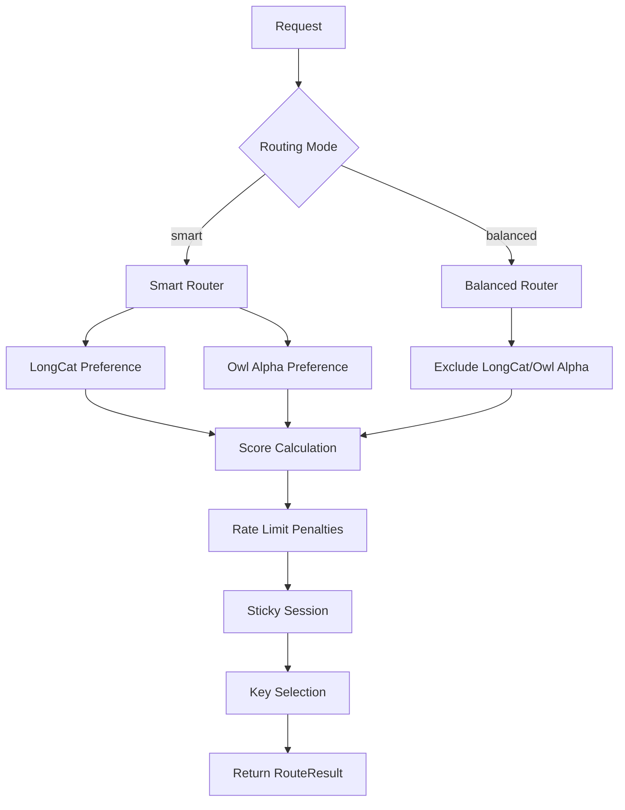

# Model Pool-Based Routing Test Design

## Architecture Overview



## Test Structure

### 1. Unit Tests for `getModelPool` Function

**File**: `server/src/__tests__/routes/fallback-pool.test.ts`

Tests the pool classification logic in isolation:
- LongCat platform → Smart pool
- Owl Alpha model → Smart pool
- `-fast` suffix models → Fast pool
- `openai-fast` model → Fast pool
- All other models → Balanced pool

### 2. Unit Tests for Smart Mode Routing

**File**: `server/src/__tests__/services/router-smart-mode.test.ts`

Tests the smart mode routing behavior:
- LongCat preference with valid keys
- LongCat skipped when no valid keys
- Owl Alpha preference with valid keys
- Owl Alpha skipped when no valid keys
- Combined LongCat + Owl Alpha preference
- Smart score calculation verification

### 3. Unit Tests for Balanced Mode Exclusions

**File**: `server/src/__tests__/services/router-balanced-mode.test.ts`

Tests the balanced mode exclusion logic:
- LongCat exclusion
- Owl Alpha exclusion
- Sticky session override for exclusions
- Balanced score calculation

### 4. Unit Tests for Rate Limit Penalties

**File**: `server/src/__tests__/services/router-penalties.test.ts`

Tests the penalty system:
- Penalty application when all keys exhausted
- Penalty decay over time
- Penalty cap enforcement
- Success reduces penalty
- Penalty impact on effective score

### 5. Unit Tests for Sticky Sessions

**File**: `server/src/__tests__/services/router-sticky.test.ts`

Tests sticky session behavior:
- Preferred model pinning
- Preferred key selection
- Sticky session with excluded models

### 6. Integration Tests for Pool-Based Routing

**File**: `server/src/__tests__/services/router-pools.test.ts`

Integration tests combining all pool behaviors:
- Mixed pool scenarios
- All keys exhausted in one pool
- Cross-pool fallback
- Full flow with pool assignments

## Test Implementation Details

### Mocking Strategy

```typescript
// Mock ratelimit to control key availability
vi.mock('../../services/ratelimit.js', async () => {
  const actual = await vi.importActual('../../services/ratelimit.js');
  return {
    ...actual,
    canMakeRequest: vi.fn(),
    canUseTokens: vi.fn(),
    isOnCooldown: vi.fn(() => false),
  };
});

// Mock crypto to avoid IV errors
vi.mock('../../lib/crypto.js', async () => {
  const actual = await vi.importActual('../../lib/crypto.js');
  return {
    ...actual,
    decrypt: vi.fn(() => 'mocked-api-key'),
  };
});
```

### Test Database Setup

Each test file will:
1. Initialize in-memory database
2. Set up test models with specific platforms
3. Set up test API keys
4. Configure fallback chain
5. Clean up between tests

### Test Categories

#### Category 1: Pool Classification Tests
```typescript
describe('getModelPool', () => {
  it('returns Smart for LongCat platform', () => {
    expect(getModelPool('longcat', 'any-model')).toBe(ModelPool.Smart);
  });
  
  it('returns Smart for Owl Alpha model', () => {
    expect(getModelPool('openrouter', 'owl-alpha')).toBe(ModelPool.Smart);
  });
  
  it('returns Fast for -fast suffix models', () => {
    expect(getModelPool('openrouter', 'some-model-fast')).toBe(ModelPool.Fast);
  });
  
  it('returns Fast for openai-fast model', () => {
    expect(getModelPool('openai', 'openai-fast')).toBe(ModelPool.Fast);
  });
  
  it('returns Balanced for other models', () => {
    expect(getModelPool('google', 'gemini-pro')).toBe(ModelPool.Balanced);
  });
});
```

#### Category 2: Smart Mode Routing Tests
```typescript
describe('Smart Mode Routing', () => {
  it('prioritizes LongCat when keys available', () => {
    // Setup LongCat model with valid keys
    // Call routeRequest with routingMode: 'smart'
    // Verify LongCat is selected
  });
  
  it('skips LongCat when no valid keys', () => {
    // Setup LongCat model with no valid keys
    // Call routeRequest with routingMode: 'smart'
    // Verify other model is selected
  });
  
  it('prioritizes Owl Alpha when keys available', () => {
    // Setup Owl Alpha model with valid keys
    // Call routeRequest with routingMode: 'smart'
    // Verify Owl Alpha is selected
  });
  
  it('positions Owl Alpha after LongCat when both available', () => {
    // Setup both LongCat and Owl Alpha with valid keys
    // Call routeRequest with routingMode: 'smart'
    // Verify LongCat is first, Owl Alpha is second
  });
});
```

#### Category 3: Balanced Mode Exclusion Tests
```typescript
describe('Balanced Mode Exclusions', () => {
  it('excludes LongCat platform', () => {
    // Setup LongCat model with valid keys
    // Call routeRequest with routingMode: 'balanced'
    // Verify LongCat is NOT selected
  });
  
  it('excludes Owl Alpha model', () => {
    // Setup Owl Alpha model with valid keys
    // Call routeRequest with routingMode: 'balanced'
    // Verify Owl Alpha is NOT selected
  });
  
  it('allows LongCat via sticky session', () => {
    // Setup LongCat model with valid keys
    // Call routeRequest with routingMode: 'balanced' and preferredModelDbId
    // Verify LongCat IS selected
  });
});
```

#### Category 4: Rate Limit Penalty Tests
```typescript
describe('Rate Limit Penalties', () => {
  it('applies penalty when all keys exhausted', () => {
    // Setup model with keys
    // Mock all keys to return false for canMakeRequest
    // Call routeRequest
    // Verify penalty is recorded
  });
  
  it('decays penalty over time', () => {
    // Apply penalty
    // Mock time to advance
    // Verify penalty is reduced
  });
  
  it('caps penalty at MAX_PENALTY', () => {
    // Apply multiple penalties
    // Verify penalty does not exceed 10
  });
  
  it('reduces penalty on success', () => {
    // Apply penalty
    // Call recordSuccess
    // Verify penalty is reduced
  });
});
```

## Test Data Requirements

### Models Needed
- LongCat model (platform: 'longcat')
- Owl Alpha model (platform: 'openrouter', model_id: 'owl-alpha')
- Fast model (model_id ending with '-fast')
- Regular models (google, groq, etc.)

### API Keys Needed
- Valid keys for each model
- Exhausted keys (mocked)
- Disabled keys
- Invalid keys

## Test Execution Order

1. Pool classification tests (fastest, no routing logic)
2. Smart mode routing tests
3. Balanced mode exclusion tests
4. Rate limit penalty tests
5. Sticky session tests
6. Integration tests

## Success Criteria

- All pool-based routing paths are tested
- Both happy paths and error scenarios covered
- Tests are deterministic (no flaky tests)
- Test coverage > 90% for router.ts
- All tests pass in CI environment