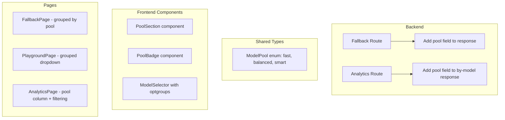
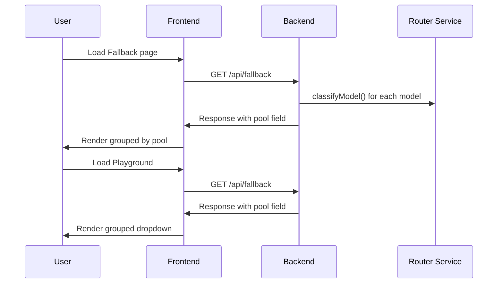

# Design: Model Pools Display

## Overview

Redesign the frontend to display models organized by their pool classification (Fast, Balanced, Smart) instead of a single flat list. The backend already classifies models into pools via the `classifyModel()` function in `server/src/services/router.ts` using the `ModelPool` enum from `shared/types.ts`.

## Architecture

### Current State

- **Backend**: Models are classified into pools via `classifyModel()` but this info is not exposed in API responses
- **Frontend**: All pages show models in a single flat list
  - `FallbackPage.tsx`: Shows all models in one table sorted by various criteria
  - `PlaygroundPage.tsx`: Shows models in a single dropdown selector
  - `AnalyticsPage.tsx`: Shows per-model breakdown in one table

### Target State



## Backend Changes

### 1. Add pool classification to fallback route response

**File**: `server/src/routes/fallback.ts`

Import `classifyModel` and `ModelPool` from the router service, then add a `pool` field to each entry in the response:

```typescript
import { classifyModel, getAllPenalties, ... } from '../services/router.js';
import { ModelPool } from '@freellmapi/shared/types.js';
```

Calculate pool for each model based on its `speed_rank` and `intelligence_rank` relative to the min/max across all models.

### 2. Add pool classification to analytics by-model response

**File**: `server/src/routes/analytics.ts`

Add `pool` field to each model in the `by-model` response using the same `classifyModel()` logic.

## Frontend Changes

### New Components

#### 1. `PoolBadge` Component

**File**: `client/src/components/pool-badge.tsx`

A small badge component that displays the pool name with appropriate color coding:
- Fast: Green/blue color
- Balanced: Neutral/gray color  
- Smart: Purple color

```typescript
interface PoolBadgeProps {
  pool: 'fast' | 'balanced' | 'smart'
}
```

#### 2. `PoolSection` Component

**File**: `client/src/components/pool-section.tsx`

A collapsible section component that groups models by pool:

```typescript
interface PoolSectionProps {
  pool: ModelPool
  models: FallbackEntry[]
  children: (entry: FallbackEntry, index: number) => ReactNode
}
```

### Page Updates

#### 1. FallbackPage (`client/src/pages/FallbackPage.tsx`)

**Changes**:
- Group models by their `pool` field
- Render three separate sections: Fast, Balanced, Smart
- Each section shows a count of models in that pool
- Sections are collapsible
- Sort order within each pool remains the same (by selected sort key)

**Layout**:
```
┌─────────────────────────────────────────────────────────┐
│ Bandit routing                                          │
├─────────────────────────────────────────────────────────┤
│ ⚡ Fast (3 models)                                      │
│ ┌─────────────────────────────────────────────────────┐ │
│ │ Model 1 ...                                    [ON] │ │
│ │ Model 2 ...                                    [ON] │ │
│ │ Model 3 ...                                    [ON] │ │
│ └─────────────────────────────────────────────────────┘ │
│                                                         │
│ ⚖️ Balanced (5 models)                                  │
│ ┌─────────────────────────────────────────────────────┐ │
│ │ Model 4 ...                                    [ON] │ │
│ │ ...                                                 │ │
│ └─────────────────────────────────────────────────────┘ │
│                                                         │
│ 🧠 Smart (2 models)                                     │
│ ┌─────────────────────────────────────────────────────┐ │
│ │ Model 9 ...                                    [ON] │ │
│ │ Model 10 ...                                   [ON] │ │
│ └─────────────────────────────────────────────────────┘ │
└─────────────────────────────────────────────────────────┘
```

#### 2. PlaygroundPage (`client/src/pages/PlaygroundPage.tsx`)

**Changes**:
- Update model selector to use `<optgroup>` or equivalent grouping
- Groups: "Auto", "Fast Pool", "Balanced Pool", "Smart Pool"
- Keep "Auto (fallback chain)" and "Auto Smart" at top level

**Layout**:
```
┌─────────────────────────────────────────────────────────┐
│ Model Selector                                          │
├─────────────────────────────────────────────────────────┤
│ Auto (fallback chain)                                   │
│ Auto Smart (intelligence router)                        │
│ ── Fast Pool ──                                         │
│   Model 1 (platform)                                    │
│   Model 2 (platform)                                    │
│ ── Balanced Pool ──                                     │
│   Model 3 (platform)                                    │
│   ...                                                   │
│ ── Smart Pool ──                                        │
│   Model 9 (platform)                                    │
│   Model 10 (platform)                                   │
└─────────────────────────────────────────────────────────┘
```

#### 3. AnalyticsPage (`client/src/pages/AnalyticsPage.tsx`)

**Changes**:
- Add "Pool" column to per-model breakdown table
- Add pool filter buttons above the table (All, Fast, Balanced, Smart)
- Color-code pool badges in the table

**Layout**:
```
┌─────────────────────────────────────────────────────────┐
│ Per-model breakdown                    [All|Fast|Bal|Smart]│
├─────────────────────────────────────────────────────────┤
│ Model    │ Pool     │ Requests │ Success │ ...          │
│ Model 1  │ ⚡ Fast   │ 1234     │ 99%     │ ...          │
│ Model 4  │ ⚖️ Balanced│ 567     │ 95%     │ ...          │
│ Model 9  │ 🧠 Smart  │ 890      │ 98%     │ ...          │
└─────────────────────────────────────────────────────────┘
```

## Data Flow



## Type Updates

### Shared Types (`shared/types.ts`)

Add pool field to `FallbackEntry` interface:

```typescript
export interface FallbackEntry {
  // ... existing fields
  pool: ModelPool
}
```

### API Response Types

Update the frontend interfaces to include the new `pool` field:

```typescript
// In FallbackPage.tsx
interface FallbackEntry {
  // ... existing fields
  pool: 'fast' | 'balanced' | 'smart'
}
```

## Styling

### Pool Colors

| Pool | Background | Text | Icon |
|------|------------|------|------|
| Fast | `bg-emerald-100 dark:bg-emerald-900/30` | `text-emerald-700 dark:text-emerald-300` | ⚡ |
| Balanced | `bg-slate-100 dark:bg-slate-800/30` | `text-slate-700 dark:text-slate-300` | ⚖️ |
| Smart | `bg-purple-100 dark:bg-purple-900/30` | `text-purple-700 dark:text-purple-300` | 🧠 |

## Accessibility

- Pool sections have proper ARIA labels
- Collapsible sections are keyboard navigable
- Pool badges have sufficient color contrast
- Screen readers announce pool names when navigating model lists
