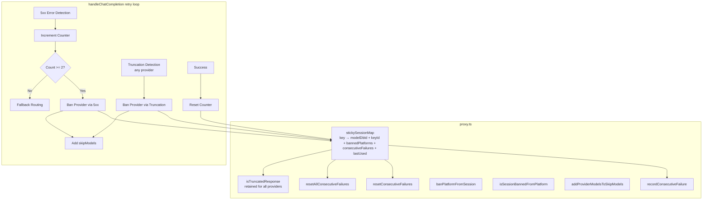
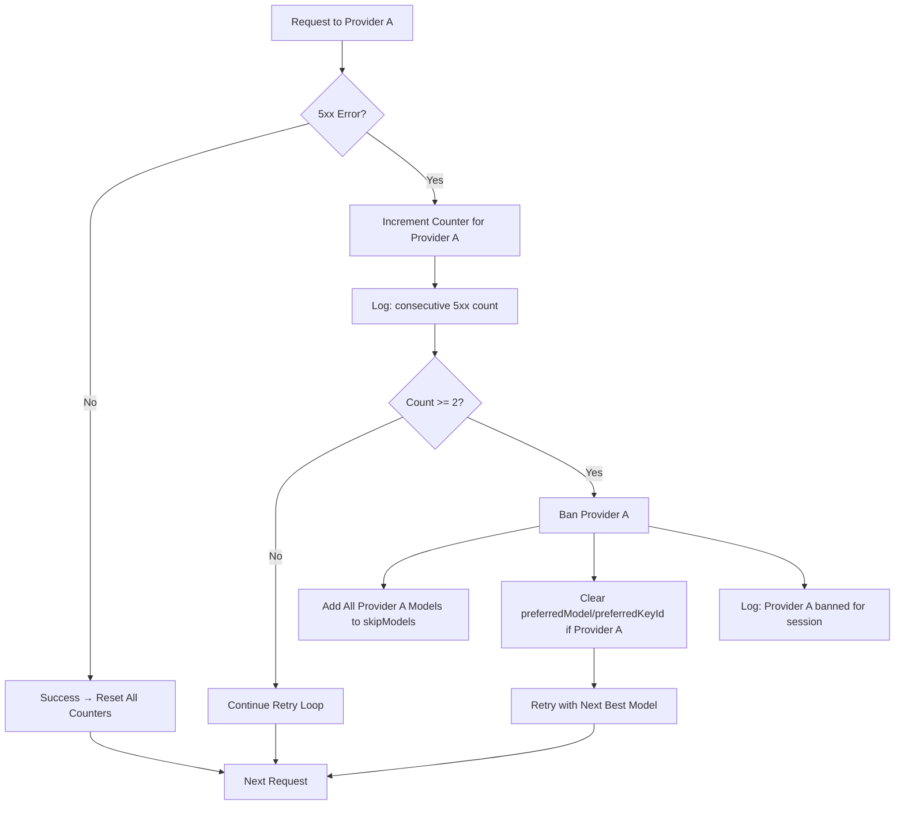
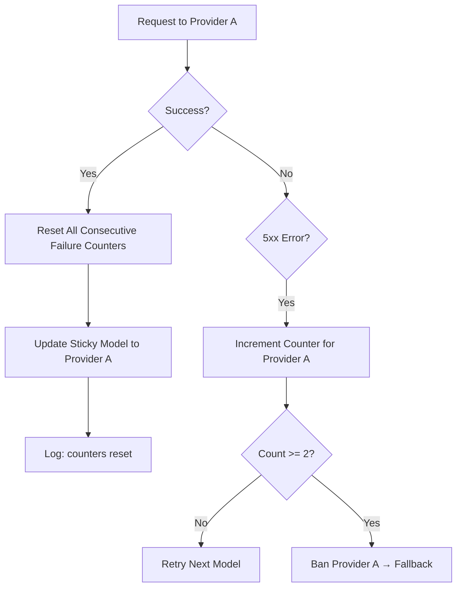
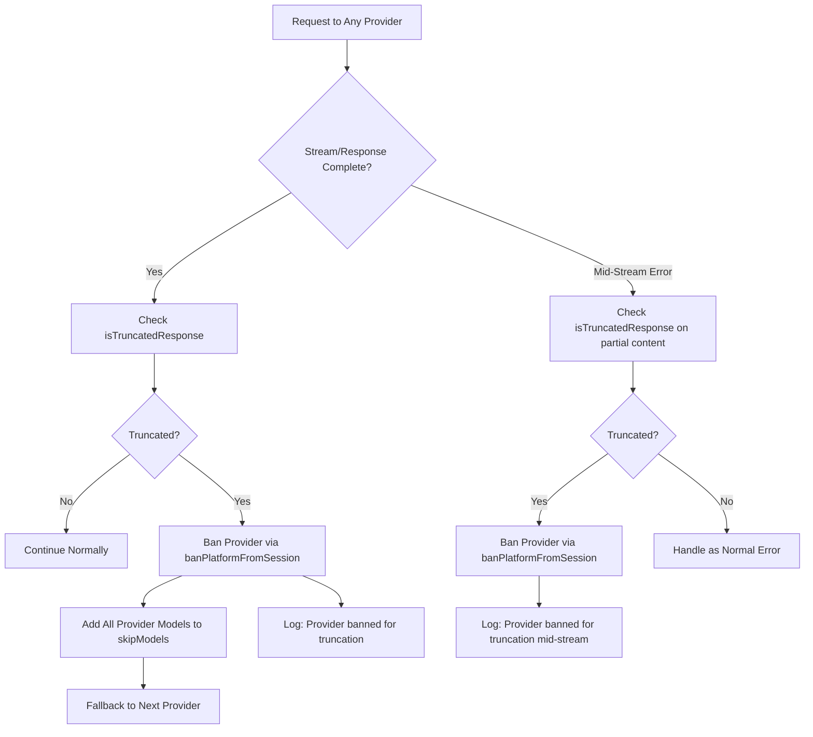
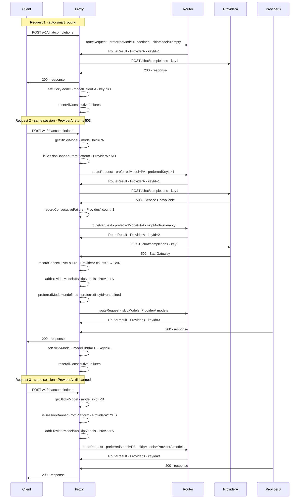

# Design: Provider 5xx Session Ban

## Architecture Overview

The ban mechanism extends the existing sticky session infrastructure in `proxy.ts`. The router (`router.ts`) requires **no changes** — the existing `skipModels` mechanism handles routing around banned providers. All ban detection, consecutive failure tracking, and session management happens in the proxy layer.

There are **two independent ban triggers** that both use the same `bannedPlatforms` infrastructure:
1. **5xx consecutive failure ban** — 2 consecutive 5xx errors from the same provider
2. **Truncation detection ban** — a truncated response from any provider (200 with incomplete content)



## Data Model Changes

### Sticky Session Map Value Type

Current value type at [`proxy.ts:16`](../server/src/routes/proxy.ts:16):
```typescript
{
  modelDbId: number;
  keyId?: number;
  bannedPlatforms?: Set<string>;
  lastUsed: number;
}
```

Extended to:
```typescript
{
  modelDbId: number;
  keyId?: number;
  bannedPlatforms?: Set<string>;
  consecutiveFailures?: Map<string, number>; // provider → count
  lastUsed: number;
}
```

The `consecutiveFailures` field is optional for backward compatibility. Existing entries without it default to `undefined` (no tracked failures). The map is keyed by provider name (e.g. `'longcat'`, `'groq'`, `'openrouter'`).

## New Functions

### 1. `recordConsecutiveFailure()` — [`proxy.ts`](../server/src/routes/proxy.ts)

Increments the consecutive failure counter for a provider within a sticky session. If the threshold (2) is reached, bans the provider and adds all its models to `skipModels`.

```typescript
function recordConsecutiveFailure(
  messages: ChatMessage[],
  routingMode: RoutingMode,
  provider: string,
  skipModels: Set<number>,
  modelDbId?: number,
): void {
  const key = getSessionKey(messages, routingMode);
  if (!key) return;
  let entry = stickySessionMap.get(key);
  if (!entry) {
    if (modelDbId === undefined) return;
    entry = { modelDbId, lastUsed: Date.now() };
    stickySessionMap.set(key, entry);
  }
  if (!entry.consecutiveFailures) entry.consecutiveFailures = new Map();
  const current = entry.consecutiveFailures.get(provider) ?? 0;
  const count = current + 1;
  entry.consecutiveFailures.set(provider, count);
  entry.lastUsed = Date.now();
  console.log(`[Sticky] consecutive 5xx for ${provider}: ${count}/2 session=${key.slice(0, 8)}`);

  if (count >= 2) {
    // Ban the provider
    if (!entry.bannedPlatforms) entry.bannedPlatforms = new Set();
    entry.bannedPlatforms.add(provider);
    console.log(`[Sticky] banned platform=${provider} for session=${key.slice(0, 8)} | consecutive 5xx count=${count}`);
    // Add all models of this provider to skipModels
    addProviderModelsToSkipModels(skipModels, provider);
    // Clear consecutive failures for this provider (ban is now in effect)
    entry.consecutiveFailures.delete(provider);
  }
}
```

### 2. `resetConsecutiveFailures()` — [`proxy.ts`](../server/src/routes/proxy.ts)

Resets the consecutive failure counter for a specific provider. Called when that provider succeeds.

```typescript
function resetConsecutiveFailures(
  messages: ChatMessage[],
  routingMode: RoutingMode,
  provider: string,
): void {
  const key = getSessionKey(messages, routingMode);
  if (!key) return;
  const entry = stickySessionMap.get(key);
  if (!entry) return;
  if (!entry.consecutiveFailures) return;
  if (entry.consecutiveFailures.has(provider)) {
    entry.consecutiveFailures.delete(provider);
    console.log(`[Sticky] reset consecutive failures for ${provider} session=${key.slice(0, 8)}`);
  }
}
```

### 3. `resetAllConsecutiveFailures()` — [`proxy.ts`](../server/src/routes/proxy.ts)

Resets all consecutive failure counters. Called on any successful response to clear stale counters for other providers.

```typescript
function resetAllConsecutiveFailures(
  messages: ChatMessage[],
  routingMode: RoutingMode,
): void {
  const key = getSessionKey(messages, routingMode);
  if (!key) return;
  const entry = stickySessionMap.get(key);
  if (!entry) return;
  if (entry.consecutiveFailures && entry.consecutiveFailures.size > 0) {
    entry.consecutiveFailures.clear();
    console.log(`[Sticky] reset all consecutive failures session=${key.slice(0, 8)}`);
  }
}
```

### 4. `addProviderModelsToSkipModels()` — [`proxy.ts`](../server/src/routes/proxy.ts)

Generic version of `addLongcatModelsToSkipModels()`. Queries the DB for all enabled models of a given provider and adds them to the `skipModels` set.

```typescript
function addProviderModelsToSkipModels(
  skipModels: Set<number>,
  provider: string,
): void {
  const db = getDb();
  const models = db.prepare(
    'SELECT id FROM models WHERE platform = ? AND enabled = 1'
  ).all(provider) as Array<{ id: number }>;
  for (const m of models) {
    skipModels.add(m.id);
  }
  console.log(`[Sticky] added ${models.length} ${provider} model(s) to skipModels: [${models.map(m => m.id).join(',')}]`);
}
```

## Component Changes

### 1. Sticky Session Map Type — [`proxy.ts:16`](../server/src/routes/proxy.ts:16)

```typescript
const stickySessionMap = new Map<string, {
  modelDbId: number;
  keyId?: number;
  bannedPlatforms?: Set<string>;
  consecutiveFailures?: Map<string, number>;
  lastUsed: number;
}>();
```

### 2. Exports Update — [`proxy.ts:146-157`](../server/src/routes/proxy.ts:146-157)

Add new functions to the exported block for testing:

```typescript
export {
  isSessionBannedFromPlatform,
  banPlatformFromSession,
  addProviderModelsToSkipModels,  // renamed from addLongcatModelsToSkipModels
  recordConsecutiveFailure,
  resetConsecutiveFailures,
  resetAllConsecutiveFailures,
  isTruncatedResponse,           // retained, generalized to all providers
  getSessionKey,
  getStickyModel,
  getStickyKey,
  setStickyModel,
  clearStickyModel,
  stickySessionMap,
};
```

### 3. Pre-routing Ban Check — [`proxy.ts:1138-1152`](../server/src/routes/proxy.ts:1138-1152)

Generalize from LongCat-only to any banned platform. Instead of hardcoding `'longcat'`, check the platform of the `preferredModel` dynamically:

```typescript
// Check if session is banned from the preferred model's platform
const skipModels = new Set<number>();
if (preferredModel) {
  const db = getDb();
  const prefRow = db.prepare('SELECT platform FROM models WHERE id = ?').get(preferredModel) as { platform: string } | undefined;
  if (prefRow && isSessionBannedFromPlatform(normalizedMessages, routingMode, prefRow.platform)) {
    addProviderModelsToSkipModels(skipModels, prefRow.platform);
    console.log(`[Sticky] skipping preferredModel=${preferredModel} (${prefRow.platform} banned for session)`);
    preferredModel = undefined;
    preferredKeyId = undefined;
  }
}
```

### 4. Error Handling in Retry Loop — [`proxy.ts:1378-1425`](../server/src/routes/proxy.ts:1378-1425)

Replace the LongCat-specific ban logic (lines 1383-1402) with general 5xx consecutive failure detection:

```typescript
} catch (err: any) {
  const latency = Date.now() - start;
  logRequest(route.platform, route.modelId, 'error', estimatedInputTokens, 0, latency, null, err.message);

  // General 5xx consecutive failure detection (replaces LongCat-specific ban logic)
  const errStatus = getErrorStatus(err);
  if (errStatus && errStatus >= 500 && errStatus < 600) {
    recordConsecutiveFailure(normalizedMessages, routingMode, route.platform, skipModels, route.modelDbId);
    // If this provider was just banned, clear preferredModel/preferredKeyId if they point to it
    if (preferredModel) {
      const db = getDb();
      const prefRow = db.prepare('SELECT platform FROM models WHERE id = ?').get(preferredModel) as { platform: string } | undefined;
      if (prefRow?.platform === route.platform) {
        preferredModel = undefined;
        preferredKeyId = undefined;
      }
    }
  }

  if (isRetryableError(err)) {
    const skipId = `${route.platform}:${route.modelId}:${route.keyId}`;
    skipKeys.add(skipId);
    if (shouldSkipModelOnRetry(err)) {
      skipModels.add(route.modelDbId);
    }
    if (isRateLimitError(err)) {
      setCooldown(route.platform, route.modelId, route.keyId, 120_000);
    }
    // Auth errors (401/403): clear the sticky key for this session
    if (isAuthError(err)) {
      console.warn(`[Proxy] auth error ${errStatus} from ${route.displayName}/${route.modelId}, clearing sticky key for session`);
      clearStickyKey(normalizedMessages, routingMode);
      preferredKeyId = undefined;
    }
    lastError = err;
    console.warn(`[Proxy] retryable ${summarizeProviderError(err)} from ${route.displayName}/${route.modelId}, fallback (attempt ${attempt + 1}/${MAX_RETRIES})`);
    continue;
  }

  // Non-retryable error
  clearStickyModel(normalizedMessages, routingMode);
  res.status(502).json({ ... });
  return;
}
```

### 5. Success Path Counter Reset — [`proxy.ts:1289-1293`](../server/src/routes/proxy.ts:1289-1293) and [`proxy.ts:1360-1362`](../server/src/routes/proxy.ts:1360-1362)

After a successful response (both streaming and non-streaming), reset consecutive failure counters:

```typescript
// Streaming success path (after line 1291, before logRequest)
recordTokens(route.platform, route.modelId, route.keyId, estimatedInputTokens + totalOutputTokens);
recordSuccess(route.modelDbId);
setStickyModel(normalizedMessages, route.modelDbId, routingMode, route.keyId);
resetAllConsecutiveFailures(normalizedMessages, routingMode);  // NEW
logRequest(route.platform, route.modelId, 'success', ...);
return;

// Non-streaming success path (after line 1361, before res.json)
recordTokens(route.platform, route.modelId, route.keyId, totalTokens);
recordSuccess(route.modelDbId);
setStickyModel(normalizedMessages, route.modelDbId, routingMode, route.keyId);
resetAllConsecutiveFailures(normalizedMessages, routingMode);  // NEW
res.json(responseBody);
```

### 6. Mid-Stream Error Handling — [`proxy.ts:1294-1346`](../server/src/routes/proxy.ts:1294-1346)

Replace the LongCat-specific mid-stream truncation handling with generalized truncation detection for all providers, plus 5xx consecutive failure detection:

```typescript
} catch (streamErr: any) {
  if (streamStarted) {
    // General 5xx consecutive failure detection for mid-stream errors
    const streamErrStatus = getErrorStatus(streamErr);
    if (streamErrStatus && streamErrStatus >= 500 && streamErrStatus < 600) {
      recordConsecutiveFailure(normalizedMessages, routingMode, route.platform, skipModels, route.modelDbId);
    }

    // Generalized truncation detection for any provider (not just LongCat)
    // Check if the stream was truncated mid-stream (e.g., incomplete content before error)
    const streamTextToCheck = responseStreamContext ? responseStreamContext.outputText : streamedText;
    if (isTruncatedResponse(streamTextToCheck)) {
      console.warn(`[Proxy] Truncated stream content detected from ${route.platform} — banning ${route.platform} for session`);
      banPlatformFromSession(normalizedMessages, routingMode, route.platform, route.modelDbId);
    }

    // Existing mid-stream error handling (send error SSE event)
    console.error(`[Proxy] Mid-stream error from ${route.displayName}:`, streamErr.message);
    const payload = { error: { message: `Provider error (${route.displayName}): stream interrupted`, type: 'stream_error' } };
    try {
      if (responseStreamContext) {
        writeResponseStreamEvent(res, {
          type: 'response.failed',
          response: {
            id: responseStreamContext.responseId,
            status: 'failed',
            error: payload.error,
          },
        });
      } else {
        res.write(`data: ${JSON.stringify(payload)}\n\n`);
        res.write('data: [DONE]\n\n');
      }
      res.end();
    } catch { /* socket gone */ }
    logRequest(route.platform, route.modelId, 'error', estimatedInputTokens, totalOutputTokens, Date.now() - start, ttfbMs, streamErr.message);
    return;
  }
  // Pre-stream error — bubble to outer retry/502 handler.
  throw streamErr;
}
```

### 7. Generalize Post-Stream Truncation Detection — [`proxy.ts:1236-1242`](../server/src/routes/proxy.ts:1236-1242)

Generalize the post-stream truncation check from LongCat-only to any provider:

```typescript
// BEFORE (LongCat-only):
// if (route.platform === 'longcat') {
//   const streamTextToCheck = responseStreamContext ? responseStreamContext.outputText : streamedText;
//   if (isTruncatedResponse(streamTextToCheck)) {
//     console.warn(`[Proxy] LongCat truncated stream content detected — banning longcat for session`);
//     banPlatformFromSession(normalizedMessages, routingMode, 'longcat', route.modelDbId);
//   }
// }

// AFTER (any provider):
const streamTextToCheck = responseStreamContext ? responseStreamContext.outputText : streamedText;
if (isTruncatedResponse(streamTextToCheck)) {
  console.warn(`[Proxy] Truncated stream content detected from ${route.platform} — banning ${route.platform} for session`);
  banPlatformFromSession(normalizedMessages, routingMode, route.platform, route.modelDbId);
}
```

### 8. Retain `isTruncatedResponse()` Function — [`proxy.ts:128-143`](../server/src/routes/proxy.ts:128-143)

The `isTruncatedResponse()` function is **retained** and used for all providers. No changes needed to the function itself — it checks response content for truncation patterns regardless of provider.

### 9. Remove `addLongcatModelsToSkipModels()` Function — [`proxy.ts:117-126`](../server/src/routes/proxy.ts:117-126)

Replace with the generic `addProviderModelsToSkipModels()`.

## Consecutive Failure Tracking Flow

### 5xx Error Path



### Success Path



### Truncation Detection Path



## Session Lifecycle



## Edge Cases

### EC-1: Provider Has Only One Model
When a provider has only one model and it gets banned, `addProviderModelsToSkipModels()` adds that single model to `skipModels`. The retry loop continues to the next provider. No special handling needed.

### EC-2: Provider Has Multiple Models
When a provider has multiple models (e.g., `longcat-2.0-preview` and `longcat-3.0`), `addProviderModelsToSkipModels()` adds ALL enabled model IDs for that provider to `skipModels`. This ensures the session is banned from ALL models of that provider, not just the one that failed.

### EC-3: All Providers Banned
If all providers become banned for a session, the retry loop exhausts all options. The `routeRequest()` call throws when no models are available, and the existing error handling returns a 502/429 to the client with "All fallback attempts failed". The sticky session entry remains but all providers are banned. When the session TTL expires (30 min), the entry is evicted and the session starts fresh.

### EC-4: Session Expiry Clears Everything
When a sticky session expires via TTL (30 min), the entire entry is deleted from `stickySessionMap`, including `bannedPlatforms` and `consecutiveFailures`. This is natural — expired sessions are evicted entirely.

### EC-5: Non-Sticky Sessions
For non-sticky sessions (no first user message, or routing mode that doesn't produce a session key), no consecutive failure tracking or ban logic applies. The existing retry loop behavior is unchanged.

### EC-6: Concurrent Requests in Same Session
If two concurrent requests in the same session both receive 5xx errors from the same provider, the counter may increment to 2 and trigger a ban. This is correct behavior — the provider is clearly having issues. The `stickySessionMap` is a standard JavaScript `Map`, and Node.js is single-threaded, so there are no race conditions.

### EC-7: Counter Reset on Provider Change
If Provider A has 1 consecutive failure and the retry loop routes to Provider B which succeeds, the counter for Provider A is reset to 0 (via `resetAllConsecutiveFailures()`). This is intentional — the session is now working on Provider B, and Provider A's previous failure may have been transient.

### EC-8: 5xx Followed by Non-5xx Error
If a provider returns a 5xx error (counter increments to 1) followed by a non-retryable 4xx error, the existing non-retryable error handling clears the entire sticky model via `clearStickyModel()`. This removes the consecutive failure counter as well since the entire entry is deleted.

### EC-9: Mid-Stream 5xx After Pre-Stream 5xx
If the first attempt gets a pre-stream 5xx error (counter=1) and the retry's stream gets a mid-stream 5xx error (counter=2), the provider is banned. The mid-stream error path calls `recordConsecutiveFailure()` which increments and triggers the ban. The stream is ended with an error SSE event (existing behavior), and subsequent requests in the session will skip this provider.

### EC-10: Truncation from Any Provider Triggers Ban
If any provider (not just LongCat) returns a truncated response (e.g., a 200 with incomplete content that matches truncation patterns), the `isTruncatedResponse()` check triggers a ban via `banPlatformFromSession()`. This works for post-stream completion checks and mid-stream error checks. The truncation ban is independent of the 5xx consecutive failure ban — a single truncation is enough to ban, whereas 5xx errors require 2 consecutive failures.

### EC-11: Truncation and 5xx Ban Are Independent
A provider can be banned via either mechanism independently. For example, if Provider A has 1 consecutive 5xx failure and then returns a truncated response, it gets banned via truncation (not 5xx). Conversely, if Provider A is banned via truncation and later returns 5xx errors, the 5xx counter still increments (though the provider is already banned, so the counter has no additional effect until the session expires).

## Files to Modify

| File | Change |
|---|---|
| `server/src/routes/proxy.ts` | Main implementation — add new functions, update retry loop, generalize LongCat-specific truncation detection to all providers, remove LongCat-specific auth/rate-limit ban logic |
| `server/src/__tests__/routes/longcat-session-ban.test.ts` | Rename to `provider-session-ban.test.ts`, update tests to cover general provider ban and truncation detection for any provider |
