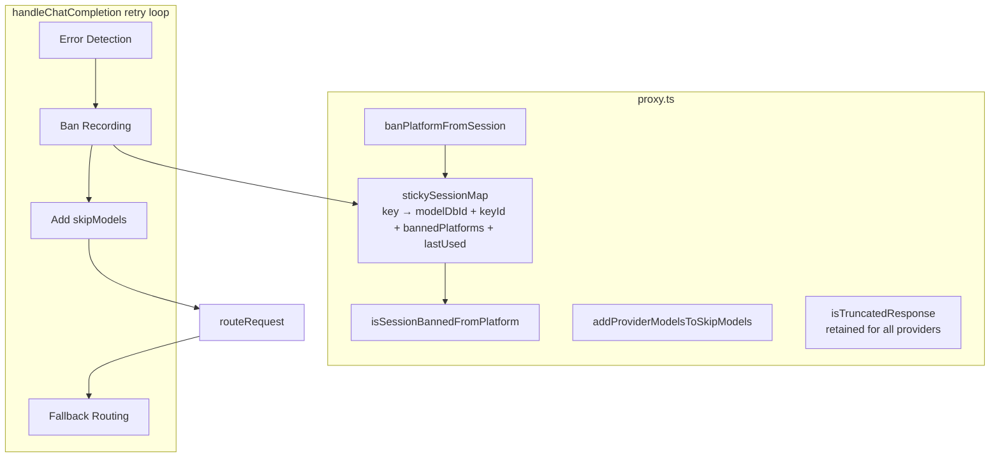
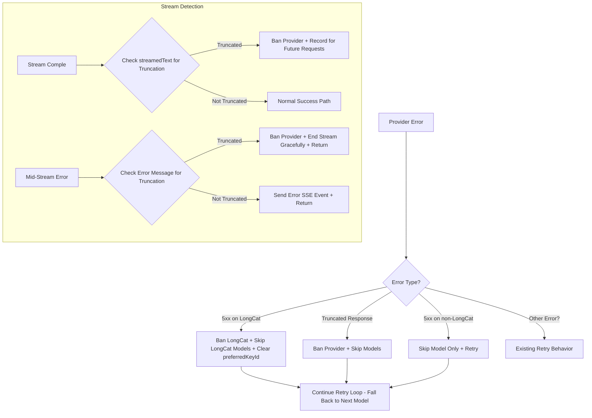
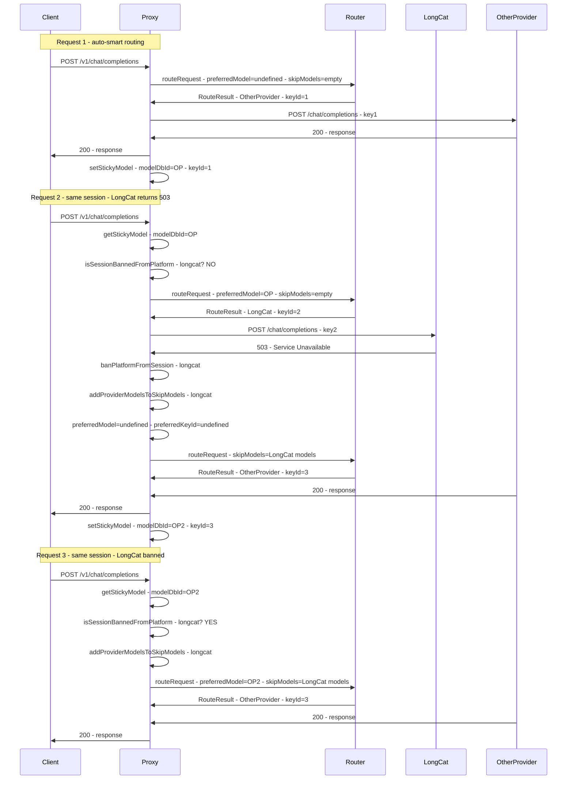

# Design: Provider 5xx Session Ban

## Architecture Overview

The ban mechanism extends the existing sticky session infrastructure in `proxy.ts`. The router (`router.ts`) requires **no changes** — the existing `skipModels` mechanism handles routing around banned providers. All ban detection and session management happens in the proxy layer.

**Current runtime behavior:**
- **LongCat providers**: Excluded immediately on any 5xx error or detected truncation via `banPlatformFromSession()`
- **Non-LongCat providers**: Skipped at the model level via `skipModels.add(route.modelDbId)` (no provider-wide ban)
- Truncation is detected by `isTruncatedResponse()` using keyword heuristics
- The `recordConsecutiveFailure()` and `consecutiveFailures` counter have been removed (they were dead code)



## Data Model Changes

### Sticky Session Map Value Type

Current value type at [`proxy.ts:16`](../server/src/routes/proxy.ts:16):
```typescript
{
  modelDbId: number;
  keyId?: number;
  bannedPlatforms?: Set<string>;
  lastUsed: number;
}
```

## New Functions

### 1. `banPlatformFromSession()` — [`proxy.ts`](../server/src/routes/proxy.ts)

Records a platform ban in the sticky session. Called immediately on 5xx errors for LongCat or any truncation detection.

```typescript
function banPlatformFromSession(
  messages: ChatMessage[],
  routingMode: RoutingMode,
  platform: string,
): void {
  const key = getSessionKey(messages, routingMode);
  if (!key) return;
  const entry = stickySessionMap.get(key);
  if (!entry) return;
  if (!entry.bannedPlatforms) entry.bannedPlatforms = new Set();
  entry.bannedPlatforms.add(platform);
  entry.lastUsed = Date.now(); // refresh TTL so the ban persists
  stickySessionMap.set(key, entry);
  console.log(`[Sticky] banned platform=${platform} for session=${key.slice(0, 8)} | bannedPlatforms=${Array.from(entry.bannedPlatforms).join(',')}`);
}
```

### 2. `addProviderModelsToSkipModels()` — [`proxy.ts`](../server/src/routes/proxy.ts)

Generic version of `addLongcatModelsToSkipModels()`. Queries the DB for all enabled models of a given provider and adds them to the `skipModels` set.

```typescript
function addProviderModelsToSkipModels(
  skipModels: Set<number>,
  provider: string,
): void {
  const db = getDb();
  const models = db.prepare(
    'SELECT id FROM models WHERE platform = ? AND enabled = 1'
  ).all(provider) as Array<{ id: number }>;
  for (const m of models) {
    skipModels.add(m.id);
  }
  console.log(`[Sticky] added ${models.length} ${provider} model(s) to skipModels: [${models.map(m => m.id).join(',')}]`);
}
```

## Component Changes

### 1. Sticky Session Map Type — [`proxy.ts:16`](../server/src/routes/proxy.ts:16)

```typescript
const stickySessionMap = new Map<string, {
  modelDbId: number;
  keyId?: number;
  bannedPlatforms?: Set<string>;
  lastUsed: number;
}>();
```

### 2. Exports Update — [`proxy.ts:146-157`](../server/src/routes/proxy.ts:146-157)

Add new functions to the exported block for testing:

```typescript
export {
  isSessionBannedFromPlatform,
  banPlatformFromSession,
  addProviderModelsToSkipModels,
  isTruncatedResponse,
  getSessionKey,
  getStickyModel,
  getStickyKey,
  setStickyModel,
  clearStickyModel,
  stickySessionMap,
};
```

### 3. Pre-routing Ban Check — [`proxy.ts:1138-1152`](../server/src/routes/proxy.ts:1138-1152)

Check for any banned platform, not just LongCat. Instead of hardcoding `'longcat'`, check the platform of the `preferredModel` dynamically:

```typescript
// Check if session is banned from the preferred model's platform
const skipModels = new Set<number>();
if (preferredModel) {
  const db = getDb();
  const prefRow = db.prepare('SELECT platform FROM models WHERE id = ?').get(preferredModel) as { platform: string } | undefined;
  if (prefRow && isSessionBannedFromPlatform(normalizedMessages, routingMode, prefRow.platform)) {
    addProviderModelsToSkipModels(skipModels, prefRow.platform);
    console.log(`[Sticky] skipping preferredModel=${preferredModel} (${prefRow.platform} banned for session)`);
    preferredModel = undefined;
    preferredKeyId = undefined;
  }
}
```

### 4. Error Handling in Retry Loop — [`proxy.ts:1378-1425`](../server/src/routes/proxy.ts:1378-1425)

Handle LongCat and non-LongCat errors differently:

```typescript
} catch (err: any) {
  const latency = Date.now() - start;
  logRequest(route.platform, route.modelId, 'error', estimatedInputTokens, 0, latency, null, err.message);

  // LongCat: immediate ban on 5xx or truncation
  if (route.platform === 'longcat') {
    const errStatus = getErrorStatus(err);
    if (errStatus && errStatus >= 500 && errStatus < 600) {
      console.warn(`[Proxy] LongCat 5xx error — banning longcat for session`);
      banPlatformFromSession(normalizedMessages, routingMode, 'longcat');
      addProviderModelsToSkipModels(skipModels, 'longcat');
      preferredModel = undefined;
      preferredKeyId = undefined;
    }
  } else {
    // Non-LongCat: model-level skip only (no provider-wide ban)
    const errStatus = getErrorStatus(err);
    if (errStatus && errStatus >= 500 && errStatus < 600) {
      console.warn(`[Proxy] 5xx error from ${route.platform} — skipping model ${route.modelDbId}`);
      skipModels.add(route.modelDbId);
    }
  }

  if (isRetryableError(err)) {
    const skipId = `${route.platform}:${route.modelId}:${route.keyId}`;
    skipKeys.add(skipId);
    if (shouldSkipModelOnRetry(err)) {
      skipModels.add(route.modelDbId);
    }
    if (isRateLimitError(err)) {
      setCooldown(route.platform, route.modelId, route.keyId, 120_000);
    }
    // Auth errors (401/403): clear the sticky key for this session
    if (isAuthError(err)) {
      console.warn(`[Proxy] auth error from ${route.displayName}/${route.modelId}, clearing sticky key for session`);
      clearStickyKey(normalizedMessages, routingMode);
      preferredKeyId = undefined;
    }
    lastError = err;
    console.warn(`[Proxy] retryable ${summarizeProviderError(err)} from ${route.displayName}/${route.modelId}, fallback (attempt ${attempt + 1}/${MAX_RETRIES})`);
    continue;
  }

  // Non-retryable error
  clearStickyModel(normalizedMessages, routingMode);
  res.status(502).json({ ... });
  return;
}
```

### 5. Generalized Truncation Detection — [`proxy.ts:1236-1242`](../server/src/routes/proxy.ts:1236-1242)

Apply truncation detection to all providers:

```typescript
const streamTextToCheck = responseStreamContext ? responseStreamContext.outputText : streamedText;
if (isTruncatedResponse(streamTextToCheck)) {
  console.warn(`[Proxy] Truncated stream content detected from ${route.platform} — banning ${route.platform} for session`);
  banPlatformFromSession(normalizedMessages, routingMode, route.platform);
  if (route.platform === 'longcat') {
    addProviderModelsToSkipModels(skipModels, 'longcat');
  }
}
```

### 6. Retain `isTruncatedResponse()` Function — [`proxy.ts:128-143`](../server/src/routes/proxy.ts:128-143)

The `isTruncatedResponse()` function is **retained** and used for all providers. No changes needed to the function itself — it checks response content for truncation patterns regardless of provider.

## Error Detection Flow



## Session Lifecycle



## Edge Cases

### EC-1: Provider Has Only One Model
When a provider has only one model and it gets banned, `addProviderModelsToSkipModels()` adds that single model to `skipModels`. The retry loop continues to the next provider. No special handling needed.

### EC-2: Provider Has Multiple Models
When a provider has multiple models (e.g., `longcat-2.0-preview` and `longcat-3.0`), `addProviderModelsToSkipModels()` adds ALL enabled model IDs for that provider to `skipModels`. This ensures the session is banned from ALL models of that provider, not just the one that failed.

### EC-3: All Providers Banned
If all providers become banned for a session, the retry loop exhausts all options. The `routeRequest()` call throws when no models are available, and the existing error handling returns a 502/429 to the client with "All fallback attempts failed". The sticky session entry remains but all providers are banned. When the session TTL expires (30 min), the entry is evicted and the session starts fresh.

### EC-4: Session Expiry Clears Everything
When a sticky session expires via TTL (30 min), the entire entry is deleted from `stickySessionMap`, including `bannedPlatforms`. This is natural — expired sessions are evicted entirely.

### EC-5: Non-Sticky Sessions
For non-sticky sessions (no first user message, or routing mode that doesn't produce a session key), no ban logic applies. The existing retry loop behavior is unchanged.

### EC-6: Concurrent Requests in Same Session
If two concurrent requests in the same session both receive 5xx errors from the same provider, the ban is recorded. This is correct behavior — the provider is clearly having issues. The `stickySessionMap` is a standard JavaScript `Map`, and Node.js is single-threaded, so there are no race conditions.

### EC-7: LongCat Immediate Ban vs Non-LongCat Model Skip
LongCat errors trigger `banPlatformFromSession()` which adds all LongCat models to `skipModels` and persists the ban for the session. Non-LongCat 5xx errors only add the specific failed model to `skipModels` — other models from the same provider remain available.

### EC-8: Truncation Detection
If any provider returns a truncated response, `isTruncatedResponse()` detects it and triggers `banPlatformFromSession()`. For LongCat, this also adds LongCat models to `skipModels`. For non-LongCat, only the specific model is affected (via the existing `shouldSkipModelOnRetry()` logic in the retry loop).

## Files to Modify

| File | Change |
|---|---|
| `server/src/routes/proxy.ts` | Main implementation — add new functions, update retry loop, implement differentiated LongCat/non-LongCat ban behavior |
| `server/src/__tests__/routes/provider-session-ban.test.ts` | Update tests to cover LongCat immediate ban and non-LongCat model-level skip |