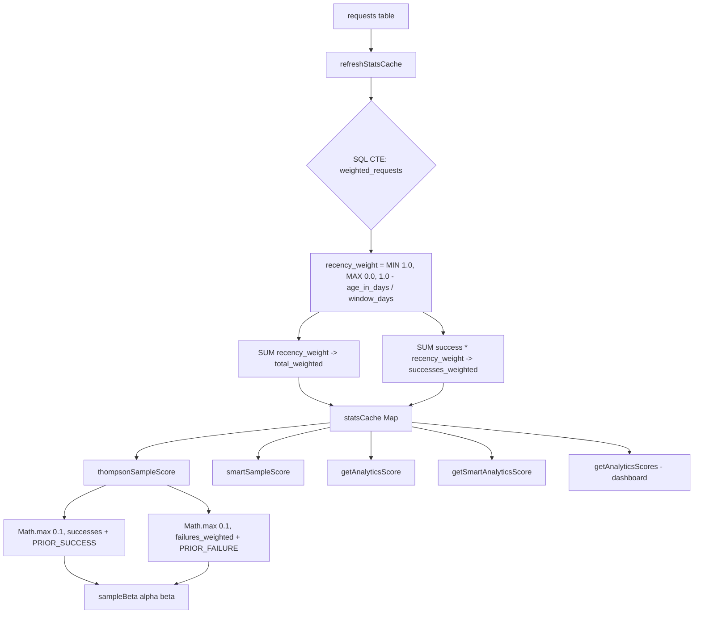
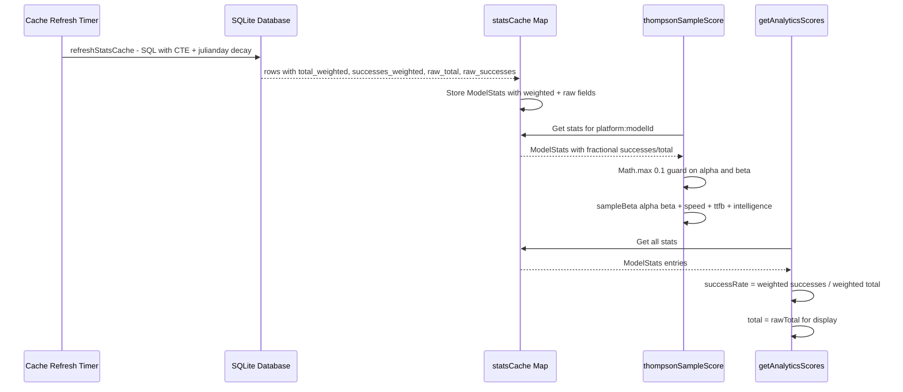

# Design: Recency-Biased Thompson Sampling (Time-Decay Aggregation)

## Architecture Overview

The change is localized to the stats aggregation pipeline in [`router.ts`](../../../server/src/services/router.ts). The core idea: replace flat `COUNT(*)` / `SUM(CASE ... 1 ELSE 0)` with weighted sums where each request's contribution is scaled by a linear time-decay factor based on its age within the 7-day analytics window.



---

## Component Changes

### 1. SQL Query in [`refreshStatsCache()`](../../../server/src/services/router.ts:174)

**Current query** (flat aggregation):
```sql
SELECT platform, model_id,
  COUNT(*) as total,
  SUM(CASE WHEN status = 'success' THEN 1 ELSE 0 END) as successes,
  ...
FROM requests
WHERE created_at >= ?
GROUP BY platform, model_id
```

**New query** (CTE with linear decay):
```sql
WITH weighted_requests AS (
  SELECT 
    platform, 
    model_id,
    status,
    latency_ms,
    output_tokens,
    ttfb_ms,
    MIN(1.0, MAX(0.0, 1.0 - (julianday('now') - julianday(created_at)) / ?)) as recency_weight
  FROM requests
  WHERE created_at >= ?
)
SELECT 
  platform, 
  model_id,
  SUM(recency_weight) as total_weighted,
  SUM(CASE WHEN status = 'success' THEN recency_weight ELSE 0 END) as successes_weighted,
  COUNT(*) as raw_total,
  SUM(CASE WHEN status = 'success' THEN 1 ELSE 0 END) as raw_successes,
  CASE
    WHEN SUM(CASE WHEN status = 'success' THEN latency_ms ELSE 0 END) > 0
    THEN SUM(CASE WHEN status = 'success' THEN output_tokens ELSE 0 END) * 1000.0
         / SUM(CASE WHEN status = 'success' THEN latency_ms ELSE 0 END)
    ELSE 0
  END as tok_per_sec,
  AVG(CASE WHEN status = 'success' AND ttfb_ms IS NOT NULL THEN ttfb_ms END) as avg_ttfb_ms
FROM weighted_requests
GROUP BY platform, model_id
```

**Key design decisions**:

| Decision | Rationale |
|----------|-----------|
| `MIN(1.0, MAX(0.0, ...))` double-bounding | Protects against system clock drift: clock shifting backward could make `julianday('now') < julianday(created_at)`, yielding weight > 1.0 |
| Window days passed as SQL parameter `?` | Avoids hardcoding `7.0` in SQL; derived from `ANALYTICS_WINDOW_MS` constant, keeping them coupled |
| `tok_per_sec` and `avg_ttfb_ms` remain unweighted | Speed/TTFB are quality metrics that don't typically change suddenly; weighting adds complexity without clear benefit. Future enhancement opportunity. |
| `raw_total` and `raw_successes` included | Dashboard transparency — users need to see actual request counts alongside weighted rates |

### 2. [`ModelStats`](../../../server/src/services/router.ts:153) Interface Extension

**Current**:
```typescript
interface ModelStats {
  successes: number;
  total: number;
  tokPerSec: number;
  avgTtfbMs: number | null;
}
```

**New**:
```typescript
interface ModelStats {
  successes: number;       // now: weighted sum (float) instead of integer count
  total: number;           // now: weighted sum (float) instead of integer count
  rawSuccesses: number;    // actual integer count of successful requests
  rawTotal: number;        // actual integer count of all requests
  tokPerSec: number;
  avgTtfbMs: number | null;
}
```

The `rawSuccesses` and `rawTotal` fields serve two purposes:
1. **Dashboard display**: Show actual request volumes to users (not confusing fractional totals)
2. **Debugging**: Allow comparison between flat and weighted success rates

### 3. Beta Parameter Safety Guards

**Current** (in [`thompsonSampleScore()`](../../../server/src/services/router.ts:264) and [`smartSampleScore()`](../../../server/src/services/router.ts:293)):
```typescript
const alpha = (stats?.successes ?? 0) + PRIOR_SUCCESS;
const beta  = ((stats?.total ?? 0) - (stats?.successes ?? 0)) + PRIOR_FAILURE;
```

**New**:
```typescript
const alpha = Math.max(0.1, (stats?.successes ?? 0)) + PRIOR_SUCCESS;
const beta  = Math.max(0.1, ((stats?.total ?? 0) - (stats?.successes ?? 0))) + PRIOR_FAILURE;
```

The `Math.max(0.1, ...)` guard ensures:
- Floating-point rounding cannot produce `alpha ≤ 0` or `beta ≤ 0` (which would crash [`sampleGamma()`](../../../server/src/services/router.ts:133))
- Even if weighted totals are very small (e.g., 0.002), the prior still dominates appropriately
- The `0.1` floor is small enough not to distort the prior meaningfully

**Also applied to** [`getAnalyticsScore()`](../../../server/src/services/router.ts:212) and [`getSmartAnalyticsScore()`](../../../server/src/services/router.ts:241) for the `bayesRate` computation:
```typescript
const bayesRate = (Math.max(0.1, successes) + PRIOR_SUCCESS) 
                / (Math.max(0.1, total) + PRIOR_SUCCESS + PRIOR_FAILURE);
```

### 4. Dashboard Display in [`getAnalyticsScores()`](../../../server/src/services/router.ts:314)

**Current**:
```typescript
result.push({
  ...
  successRate: stats.total > 0 ? stats.successes / stats.total : 0,
  total: stats.total,
  ...
});
```

**New**:
```typescript
result.push({
  ...
  successRate: stats.total > 0 ? stats.successes / stats.total : 0,  // weighted rate
  total: stats.rawTotal,           // show actual count, not weighted sum
  ...
});
```

The `successRate` now reflects the recency-biased rate (more responsive to recent trends), while `total` shows the actual number of requests for user comprehension.

### 5. Window Days Parameter Derivation

To keep the SQL decay denominator coupled with the `ANALYTICS_WINDOW_MS` constant:

```typescript
const ANALYTICS_WINDOW_DAYS = ANALYTICS_WINDOW_MS / (24 * 60 * 60 * 1000);  // 7.0
```

This constant is passed as the second SQL parameter in the CTE. If `ANALYTICS_WINDOW_MS` is ever changed, the decay slope automatically adjusts.

---

## Data Flow Diagram



---

## Weight Decay Visualization

The linear decay function over the 7-day window:

```
Weight
1.0 ─────┐
         │\
         │ \
0.5 ─────│──\────── at 3.5 days
         │   \
         │    \
0.0 ─────│─────\─── at 7.0 days
         0     3.5  7.0  Age (days)
```

- **Day 0 (just now)**: weight = 1.0 — full contribution
- **Day 1**: weight = 6/7 ≈ 0.857 — still highly influential  
- **Day 3.5**: weight = 0.5 — half contribution
- **Day 5**: weight = 2/7 ≈ 0.286 — marginal influence
- **Day 7**: weight = 0.0 — zero contribution (filtered by `WHERE created_at >= ?` anyway)

---

## Files Modified

| File | Change Type | Description |
|------|-------------|-------------|
| [`../../../server/src/services/router.ts`](../../../server/src/services/router.ts) | Modify | SQL query in `refreshStatsCache`, `ModelStats` interface, Beta parameter guards, dashboard display |
| [`../../../server/src/__tests__/services/router.test.ts`](../../../server/src/__tests__/services/router.test.ts) | Modify | Add test cases T-1 and T-2 for outage sensitivity and safe fractional evaluation |

---

## Out-of-Scope / Future Enhancements

1. **Weighted speed/TTFB metrics**: Currently `tok_per_sec` and `avg_ttfb_ms` remain unweighted. A future iteration could apply recency weighting to these as well, making the router responsive to recent speed degradation.
2. **Exponential decay**: The linear decay is simple and portable. An exponential decay (using `power()` which is available in SQLite core) would give sharper recent-vs-old contrast but is harder to reason about.
3. **Configurable decay slope**: The decay rate is currently tied to the window length. A separate configuration parameter could allow tuning the decay aggressiveness independently.