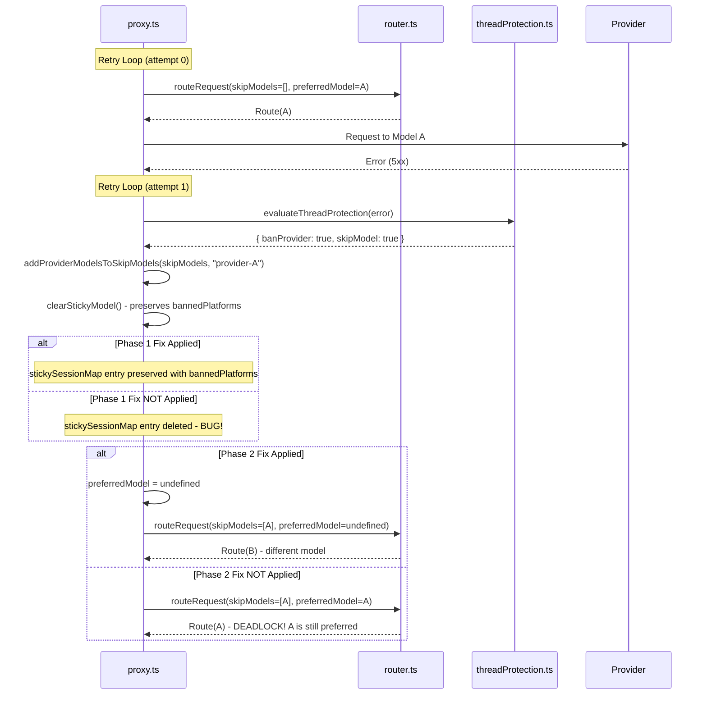

# Safeguard Bypasses - Design Document

## Overview

This document describes the design for fixing two critical bugs that allow banned providers to be retried despite thread protection safeguards.

## Phase 1: Preserve Ban History in Sticky Sessions

### Problem

The `clearStickyModel()` function deletes the entire sticky session entry, erasing the `bannedPlatforms` history. This causes the system to forget that a provider was banned when a non-retryable error occurs.

### Solution

1. **Make `modelDbId` optional in `stickySessionMap` type**

   Change the type definition to allow entries that only store ban history without a current model:

   ```typescript
   // Before
   const stickySessionMap = new Map<string, { 
     modelDbId: number; 
     keyId?: number; 
     bannedPlatforms?: Set<string>; 
     lastUsed: number 
   }>();

   // After
   const stickySessionMap = new Map<string, { 
     modelDbId?: number;  // Optional - allows entries with only ban history
     keyId?: number; 
     bannedPlatforms?: Set<string>; 
     lastUsed: number 
   }>();
   ```

2. **Modify `clearStickyModel()` to preserve `bannedPlatforms`**

   Instead of deleting the entry, clear only `modelDbId` and `keyId` while preserving `bannedPlatforms`:

   ```typescript
   function clearStickyModel(messages: ChatMessage[], routingMode: RoutingMode) {
     const key = getSessionKey(messages, routingMode);
     if (!key) return;
     const entry = stickySessionMap.get(key);
     if (!entry) return;
     
     // Preserve bannedPlatforms, clear only model/key
     entry.modelDbId = undefined;
     entry.keyId = undefined;
     entry.lastUsed = Date.now();
   }
   ```

### Files to Modify

- [`server/src/routes/proxy.ts`](server/src/routes/proxy.ts:18) - Line 18: `stickySessionMap` type definition
- [`server/src/routes/proxy.ts`](server/src/routes/proxy.ts:181) - Lines 181-186: `clearStickyModel` function

---

## Phase 2: Break the Preferred Model Retry Loop Deadlock

### Problem

When a model fails and is added to `skipModels`, the retry loop continues to prefer the same model because `preferredModel` is not cleared. The router's [`routeRequest()`](server/src/services/router.ts:674) function bypasses `skipModels` for the preferred model:

```typescript
if (skipModels?.has(entry.model_db_id) && entry.model_db_id !== preferredModelDbId) continue;
```

This creates a deadlock where the broken model is retried indefinitely.

### Solution

1. **Clear `preferredModel` when model is added to `skipModels`**

   In the retry catch block, when `shouldSkipModelOnRetry(err)` is true and the current route's model matches `preferredModel`, clear both `preferredModel` and `preferredKeyId`:

   ```typescript
   if (shouldSkipModelOnRetry(err)) {
     skipModels.add(route.modelDbId);
     
     // Clear preferred model if it matches the failed model
     if (preferredModel === route.modelDbId) {
       preferredModel = undefined;
       preferredKeyId = undefined;
     }
   }
   ```

2. **Add key exhaustion check in rate-limit error handler**

   When a rate-limit error occurs, check if the preferred model has any valid keys remaining. If not, clear `preferredModel` to allow fallback to other models:

   ```typescript
   if (isRateLimitError(err)) {
     setCooldown(route.platform, route.modelId, route.keyId, 120_000);
     
     // Check if preferred model has valid keys remaining
     if (preferredModel === route.modelDbId) {
       const hasValidKeysForPreferred = checkValidKeysRemaining(route);
       if (!hasValidKeysForPreferred) {
         preferredModel = undefined;
         preferredKeyId = undefined;
       }
     }
   }
   ```

   The `checkValidKeysRemaining` function should verify that at least one enabled, non-invalid key has capacity for the model.

### Files to Modify

- [`server/src/routes/proxy.ts`](server/src/routes/proxy.ts:1740) - Lines 1740-1747: Non-rate-limit error handling
- [`server/src/routes/proxy.ts`](server/src/routes/proxy.ts:1745) - Lines 1745-1747: Rate-limit error handling

---

## Data Flow



---

## Testing Strategy

### Unit Tests

Existing tests in [`provider-session-ban.test.ts`](server/src/__tests__/routes/provider-session-ban.test.ts) cover:
- `isSessionBannedFromPlatform` - Verifies ban persistence
- `banPlatformFromSession` - Verifies ban creation
- `addProviderModelsToSkipModels` - Verifies skip model population
- `resetAllConsecutiveFailures` - Verifies success resets
- `isTruncatedResponse` - Verifies truncation detection
- Integration tests for ban lifecycle

### New Test Scenarios

1. **Phase 1 Verification**: After `clearStickyModel()` is called, `isSessionBannedFromPlatform()` should still return `true` for previously banned platforms
2. **Phase 2 Verification**: When a model is added to `skipModels`, the retry loop should select a different model

### Verification Command

```bash
pnpm --filter server vitest run src/__tests__/routes/provider-session-ban.test.ts
```

---

## Risk Assessment

### Low Risk Changes

- Making `modelDbId` optional is backward compatible (existing entries always have `modelDbId`)
- Preserving `bannedPlatforms` only adds safety, no breaking changes

### Medium Risk Changes

- Clearing `preferredModel` in retry loop could change routing behavior for legitimate retries
- Key exhaustion check requires access to key validation logic

### Mitigation

- The changes only affect error paths, not successful request flows
- Existing tests should pass without modification
- New test scenarios verify the fix behavior