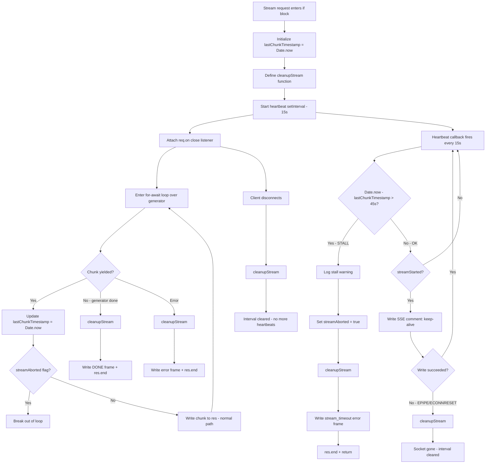

# Design: SSE Stream Heartbeats and Stall Protection

## Architecture

This feature adds a **heartbeat interval and stall detector** to the streaming execution path inside [`handleChatCompletion()`](server/src/routes/proxy.ts:1061). The modification is localized to the `if (stream)` block (lines 1279–1538) — no provider interface changes are needed.

## Stream Lifecycle with Heartbeat & Stall Protection



## Implementation Details

### 1. New Constants

Add alongside existing constants at the top of [`proxy.ts`](server/src/routes/proxy.ts:17), after `LONGCAT_STICKY_COOLDOWN_MS`:

```typescript
const KEEPALIVE_INTERVAL_MS = 15000; // Send a heartbeat comment every 15s of inactivity
const MAX_STREAM_STALL_MS = 45000;   // Abort the stream if stalled for 45s
```

### 2. Stream State Variables

Inside the `if (stream)` block (after line 1283, before the `try` block at line 1288), add:

```typescript
let lastChunkTimestamp = Date.now();
let heartbeatInterval: ReturnType<typeof setInterval> | null = null;
let streamAborted = false; // Set by stall handler to break the for-await loop
```

### 3. Cleanup Routine

Define `cleanupStream()` immediately after the state variables. This function is idempotent — safe to call multiple times from different paths (stall handler, client disconnect, success, error):

```typescript
const cleanupStream = () => {
  if (heartbeatInterval) {
    clearInterval(heartbeatInterval);
    heartbeatInterval = null;
  }
};
```

### 4. Heartbeat & Stall Monitor Interval

Set up the `setInterval` immediately after `cleanupStream`, before the `try` block:

```typescript
heartbeatInterval = setInterval(() => {
  const now = Date.now();

  if (now - lastChunkTimestamp > MAX_STREAM_STALL_MS) {
    // Stall detected — terminate the stream
    console.warn(`[Proxy] Stream stalled for ${now - lastChunkTimestamp}ms — aborting socket`);
    streamAborted = true;
    cleanupStream();

    const payload = { error: { message: 'Upstream stream stalled', type: 'stream_timeout' } };
    try {
      if (responseStreamContext) {
        writeResponseStreamEvent(res, {
          type: 'response.failed',
          response: {
            id: responseStreamContext.responseId,
            status: 'failed',
            error: payload.error,
          },
        });
      } else {
        res.write(`data: ${JSON.stringify(payload)}\n\n`);
        res.write('data: [DONE]\n\n');
      }
      res.end();
    } catch { /* Socket already gone */ }
  } else if (streamStarted) {
    // Write an SSE comment to keep the socket alive across intermediate proxies
    // Only write after SSE headers have been sent (streamStarted === true)
    try {
      res.write(': keep-alive\n\n');
    } catch {
      // Client disconnected — clean up
      cleanupStream();
    }
  }
}, KEEPALIVE_INTERVAL_MS);
```

**Key design decisions in the heartbeat callback:**

- **Stall check runs regardless of `streamStarted`**: Even before SSE headers are sent, if the upstream takes >45s to yield the first chunk, the stall detector terminates the connection. In this case, no error frame is written to `res` (headers haven't been sent yet), so the stall handler falls through to the outer retry logic via the `streamAborted` flag.
- **SSE comment only written when `streamStarted === true`**: Writing to `res` before SSE headers would produce malformed HTTP output. The heartbeat skips the write if headers haven't been sent yet.
- **`streamAborted` flag**: Setting this flag before `cleanupStream()` ensures the `for-await` loop will break on the next iteration, preventing further writes to an already-ended socket.

### 5. Client-Disconnect Listener

Attach immediately after the heartbeat interval setup:

```typescript
req.on('close', () => {
  cleanupStream();
});
```

This fires when the client closes the connection prematurely. The `cleanupStream()` call clears the interval, preventing wasted CPU cycles writing to a dead socket.

### 6. For-Await Loop Modification

Inside the `for await (const chunk of gen)` loop (line 1294), add two checks:

```typescript
for await (const chunk of gen) {
  // Update chunk timestamp to reset stall timer
  lastChunkTimestamp = Date.now();

  // If stall handler already terminated the stream, break out
  if (streamAborted) break;

  if (!streamStarted) {
    // ... existing header-setting logic ...
    streamStarted = true;
  }

  // ... existing chunk-writing logic ...
}
```

The `lastChunkTimestamp` update resets the stall timer on every chunk. The `streamAborted` check prevents writing to a socket that the stall handler has already closed.

### 7. Post-Loop Cleanup

After the `for await` loop completes successfully (before the existing success-path code), add:

```typescript
// Successful completion — clear heartbeat
cleanupStream();

// If stall handler already ended the response, skip the normal completion path
if (streamAborted) {
  logRequest(route.platform, route.modelId, 'error', estimatedInputTokens, totalOutputTokens, Date.now() - start, ttfbMs, 'stream_stalled');
  return;
}
```

This ensures:
1. The heartbeat interval is always cleared on success
2. If the stall handler already called `res.end()`, we don't try to write `[DONE]` again

### 8. Error-Path Cleanup

In the `catch (streamErr)` block (line 1392), add `cleanupStream()` at the top:

```typescript
} catch (streamErr: any) {
  cleanupStream();
  // ... existing error handling ...
}
```

## Interaction with Existing Code Paths

### Stall Before Headers Sent

If the upstream stalls for >45s before yielding the first chunk (i.e., `streamStarted === false`):

1. The stall handler sets `streamAborted = true` and calls `cleanupStream()`
2. The stall handler cannot write an error SSE frame (headers not sent yet), so it calls `res.end()` — this sends a bare HTTP 200 with no body, which is not ideal
3. The `for-await` loop sees `streamAborted` and breaks
4. The post-loop code sees `streamAborted` and returns

**Better approach**: Instead of calling `res.end()` in the stall handler when `streamStarted === false`, throw an error that falls through to the outer retry logic. This allows the proxy to attempt a fallback provider:

```typescript
if (now - lastChunkTimestamp > MAX_STREAM_STALL_MS) {
  console.warn(`[Proxy] Stream stalled for ${now - lastChunkTimestamp}ms — aborting socket`);
  streamAborted = true;
  cleanupStream();

  if (streamStarted) {
    // Mid-stream stall — write error frame and end
    const payload = { error: { message: 'Upstream stream stalled', type: 'stream_timeout' } };
    try {
      if (responseStreamContext) {
        writeResponseStreamEvent(res, {
          type: 'response.failed',
          response: {
            id: responseStreamContext.responseId,
            status: 'failed',
            error: payload.error,
          },
        });
      } else {
        res.write(`data: ${JSON.stringify(payload)}\n\n`);
        res.write('data: [DONE]\n\n');
      }
      res.end();
    } catch { /* Socket already gone */ }
  }
  // If !streamStarted, the for-await loop will break,
  // and the post-loop check will return without calling res.end()
  // The outer catch block will handle this as a retryable error
}
```

Wait — this needs more thought. If `streamStarted === false` and the stall handler doesn't call `res.end()`, the `for-await` loop breaks, the post-loop code returns, and the outer `catch` block is NOT reached (no error was thrown). The request handler simply returns, leaving the response hanging.

**Final approach**: When `streamStarted === false` on stall detection, throw a retryable error so the outer retry loop can attempt a fallback provider:

```typescript
if (now - lastChunkTimestamp > MAX_STREAM_STALL_MS) {
  console.warn(`[Proxy] Stream stalled for ${now - lastChunkTimestamp}ms — aborting socket`);
  streamAborted = true;
  cleanupStream();

  if (streamStarted) {
    // Mid-stream stall — cannot retry, write error frame and end
    const payload = { error: { message: 'Upstream stream stalled', type: 'stream_timeout' } };
    try {
      if (responseStreamContext) {
        writeResponseStreamEvent(res, {
          type: 'response.failed',
          response: {
            id: responseStreamContext.responseId,
            status: 'failed',
            error: payload.error,
          },
        });
      } else {
        res.write(`data: ${JSON.stringify(payload)}\n\n`);
        res.write('data: [DONE]\n\n');
      }
      res.end();
    } catch { /* Socket already gone */ }
  } else {
    // Pre-stream stall — no headers sent yet, response is still retryable
    // Throw an error to fall through to the outer retry/502 handler
    throw Object.assign(
      new Error(`Upstream provider stalled before yielding any data from ${route.displayName}`),
      { status: 504 },
    );
  }
}
```

This is the best approach because:
- **Pre-stream stall**: No headers sent → response is still mutable → throw to retry with another provider
- **Mid-stream stall**: Headers already sent → cannot retry → write error frame and close

### Mid-Stream Stall — No Retry

Once `streamStarted === true` and SSE headers have been sent, the HTTP response status and headers are committed. The proxy cannot retry with another provider because the client is already consuming the SSE stream. The stall handler must:
1. Write a structured error frame
2. Write `[DONE]`
3. Call `res.end()`
4. Return from the handler

### Interaction with Existing Mid-Stream Error Handling

The existing `catch (streamErr)` block (lines 1392–1535) handles mid-stream errors with provider-specific logic (LongCat bans, truncation detection, etc.). The stall handler is a **separate path** that does NOT go through the `catch` block. This is intentional:

- Stall detection is not a provider error — it's a timeout condition
- The stall handler already writes the error frame and closes the socket
- The `for-await` loop breaks via `streamAborted` flag, not via a thrown error
- The post-loop code checks `streamAborted` and returns early, skipping the normal completion path

### Interaction with Responses API Streams

When `responseStreamContext` is defined (Responses API mode), the stall handler uses [`writeResponseStreamEvent()`](server/src/routes/proxy.ts:798) to emit a `response.failed` event instead of writing a raw `data:` SSE line. This matches the existing error-handling pattern in the `catch (streamErr)` block (lines 1518–1526).

## Edge Cases

| Edge Case | Behavior |
|---|---|
| Heartbeat fires before `streamStarted` | Stall check runs; SSE comment write is skipped; no malformed output |
| Stall detected before `streamStarted` | Throw 504 error → outer retry loop attempts fallback provider |
| Stall detected after `streamStarted` | Write `stream_timeout` error frame → `res.end()` → return |
| Client disconnects during heartbeat write | `try/catch` on `res.write()` catches EPIPE → `cleanupStream()` |
| Client disconnects between heartbeat intervals | `req.on('close')` fires → `cleanupStream()` |
| `cleanupStream()` called multiple times | Idempotent — checks `heartbeatInterval !== null` before clearing |
| Stall handler and chunk arrive simultaneously | `streamAborted` flag prevents double-write; `cleanupStream()` sets `heartbeatInterval = null` preventing double-fire |
| Generator throws error after stall handler ran | `streamAborted` is true → `for-await` loop already broken → catch block not reached |
| Very fast stream (chunks every <1s) | Heartbeat fires but `lastChunkTimestamp` is always fresh → stall check passes; SSE comment written but harmless |

## Files Requiring Modification

| # | File | Change | Lines Affected |
|---|---|---|---|
| 1 | [`server/src/routes/proxy.ts`](server/src/routes/proxy.ts:17) | Add `KEEPALIVE_INTERVAL_MS` and `MAX_STREAM_STALL_MS` constants | After line 18 |
| 2 | [`server/src/routes/proxy.ts`](server/src/routes/proxy.ts:1283) | Add `lastChunkTimestamp`, `heartbeatInterval`, `streamAborted`, `cleanupStream()` | After line 1287, before `try` at 1288 |
| 3 | [`server/src/routes/proxy.ts`](server/src/routes/proxy.ts:1288) | Add heartbeat `setInterval` + `req.on('close')` | Before `try` block |
| 4 | [`server/src/routes/proxy.ts`](server/src/routes/proxy.ts:1294) | Add `lastChunkTimestamp` update + `streamAborted` check inside `for await` loop | Inside loop body |
| 5 | [`server/src/routes/proxy.ts`](server/src/routes/proxy.ts:1318) | Add `cleanupStream()` + `streamAborted` check after loop | After `for await` loop |
| 6 | [`server/src/routes/proxy.ts`](server/src/routes/proxy.ts:1392) | Add `cleanupStream()` at top of `catch (streamErr)` | Line 1392 |
| 7 | [`server/src/__tests__/routes/proxy-tools.test.ts`](server/src/__tests__/routes/proxy-tools.test.ts) | Add unit tests for heartbeat, stall, and disconnect scenarios | New test section |