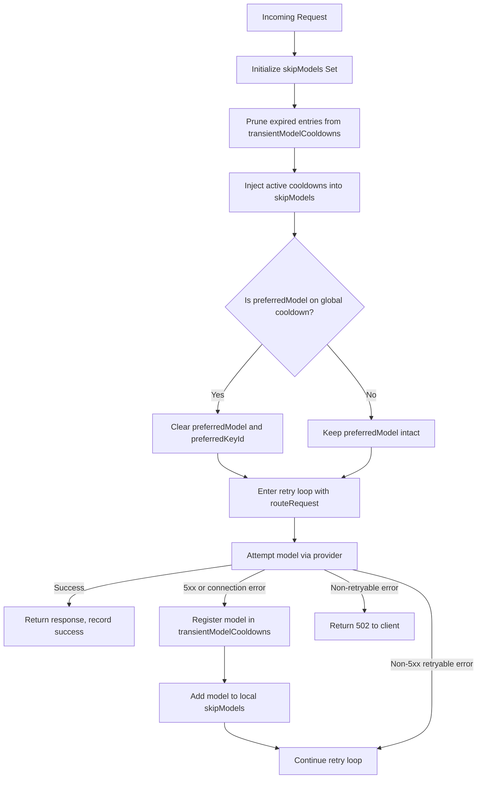

# Design: Shared Temporary Cooldowns for Concurrent Failure Mitigation

## Architecture Overview

This feature introduces a module-level in-memory circuit breaker that shares transient failure state across all concurrent requests. The design follows the existing pattern established by [`stickySessionMap`](server/src/routes/proxy.ts:16) and other module-level Maps in [`proxy.ts`](server/src/routes/proxy.ts).



## Data Structure

### `transientModelCooldowns` Map

Declared at module level in [`proxy.ts`](server/src/routes/proxy.ts) alongside existing shared maps:

```typescript
// Location: Near line 16-23 with other module-level maps
const transientModelCooldowns = new Map<number, number>(); // modelDbId -> expiryTimestamp
const TRANSIENT_COOLDOWN_MS = 15000; // 15 seconds
```

**Design rationale**:
- Uses `modelDbId` (numeric DB primary key) as the key, consistent with how [`skipModels`](server/src/routes/proxy.ts:1179) and [`routeRequest()`](server/src/routes/proxy.ts:1248) already identify models
- Stores `expiryTimestamp` (absolute `Date.now() + TRANSIENT_COOLDOWN_MS`) rather than a relative duration, enabling simple `Date.now() > expiry` comparison for pruning
- Module-level `Map` is safe in Node.js single-threaded event loop — no mutex needed
- No unbounded growth risk: expired entries are pruned on every request's pre-routing check

## Integration Points

### 1. Pre-Routing Cooldown Injection

**Location**: Inside [`handleChatCompletion()`](server/src/routes/proxy.ts:1061), after the existing `skipModels` initialization at [line 1179](server/src/routes/proxy.ts:1179) and before the retry loop at [line 1245](server/src/routes/proxy.ts:1245).

The current code initializes `skipModels` with session-banned platform models. The transient cooldown injection merges into this same set:

```typescript
// Existing: const skipModels = new Set<number>(); (line 1179)
// ... existing session ban logic fills skipModels ...

// NEW: Inject global transient cooldowns
const now = Date.now();
for (const [modelDbId, expiry] of transientModelCooldowns) {
  if (now > expiry) {
    transientModelCooldowns.delete(modelDbId);
  } else {
    skipModels.add(modelDbId);
    console.log(`[Proxy] Global cooldown active — skipping modelDbId=${modelDbId}`);
  }
}
```

**Pruning strategy**: Lazy pruning on every request is efficient because:
- The Map is small (typically 0-3 entries during normal operation)
- Iteration + deletion of expired entries is O(n) where n is the number of cooled-down models, not total models
- No background timer or cleanup interval needed

### 2. Sticky Session Override

**Location**: After cooldown injection, before the existing [`preferredModel`](server/src/routes/proxy.ts:1195) platform-ban check.

If `preferredModel` is set (sticky session or explicit model request) and that model is on global cooldown, clear it:

```typescript
// NEW: Global cooldown overrides sticky preference
if (preferredModel !== undefined && transientModelCooldowns.has(preferredModel)) {
  const expiry = transientModelCooldowns.get(preferredModel)!;
  if (Date.now() <= expiry) {
    console.log(`[Proxy] Global cooldown overrides sticky — clearing preferredModel=${preferredModel}`);
    preferredModel = undefined;
    preferredKeyId = undefined;
  }
}
```

**Note**: This check uses `transientModelCooldowns.has()` directly rather than checking `skipModels`, because `skipModels` may contain models added for other reasons (session bans). We only want to override sticky when the specific preferred model has a transient cooldown.

**Explicit model requests**: When `requestedModel` is set (user explicitly specified a model), `preferredModel` is populated from DB lookup at [line 1142-1160](server/src/routes/proxy.ts:1142). If that model is on global cooldown, we should still clear `preferredModel` — the user's explicit request cannot be fulfilled while the model is degraded, and falling back is better than hanging.

### 3. Cooldown Registration on Failure

**Location**: Inside the retry loop's `catch` block at [line 1570](server/src/routes/proxy.ts:1570), within the existing `5xx` detection logic at [line 1578-1608](server/src/routes/proxy.ts:1578).

The cooldown registration targets only `5xx` errors and connection failures (status undefined/timeout). It does NOT trigger for:
- `429` rate limit errors (these are key-specific, not model-wide)
- `401/403` auth errors (these are key-specific)
- `400/404/422` client errors (these may be request-specific, not provider-wide)

```typescript
// Inside the catch block, after existing 5xx detection (line 1578-1608)
const errStatus = getErrorStatus(err);

// Register global cooldown for 5xx or connection failures
if ((errStatus !== undefined && errStatus >= 500 && errStatus < 600) || errStatus === undefined) {
  if (isRetryableError(err)) {
    console.warn(`[Proxy] Transient failure on modelDbId=${route.modelDbId} — activating ${TRANSIENT_COOLDOWN_MS / 1000}s global cooldown`);
    transientModelCooldowns.set(route.modelDbId, Date.now() + TRANSIENT_COOLDOWN_MS);
    // Also add to local skipModels for this request's retry loop
    skipModels.add(route.modelDbId);
  }
}
```

**Interaction with existing model-skip logic**: The existing code at [lines 1579-1608](server/src/routes/proxy.ts:1579) already adds failing models to `skipModels` for the current request. The global cooldown registration is additive — it sets the shared map entry AND adds to local `skipModels`. This means:
- The current request continues to skip the model in subsequent retries (existing behavior preserved)
- Future requests also skip the model for the next 15 seconds (new behavior)

### 4. Mid-Stream Error Handling

**Location**: Inside the streaming error handler at [line 1392](server/src/routes/proxy.ts:1392), within the `5xx` detection at [line 1398](server/src/routes/proxy.ts:1398).

Mid-stream `5xx` errors should also register global cooldowns, since they indicate the same transient provider degradation:

```typescript
// Inside the streamStarted error block, after existing 5xx detection (line 1398-1427)
if (streamErrStatus && isBanEligibleStatus(streamErrStatus)) {
  // ... existing skipModels.add(route.modelDbId) logic ...
  
  // NEW: Register global cooldown for mid-stream 5xx
  console.warn(`[Proxy] Mid-stream 5xx from ${route.platform} — activating global cooldown for modelDbId=${route.modelDbId}`);
  transientModelCooldowns.set(route.modelDbId, Date.now() + TRANSIENT_COOLDOWN_MS);
}
```

## Error Classification Matrix

| Error Type | Status | Local skipModels | Global Cooldown | Sticky Override |
|---|---|---|---|---|
| 5xx server error | 500/502/503/504 | ✅ Yes | ✅ Yes | ✅ Yes |
| Connection failure | undefined/timeout | ✅ Yes | ✅ Yes | ✅ Yes |
| Rate limit | 429 | ✅ Key-only | ❌ No | ❌ No |
| Auth error | 401/403 | ✅ Key-only | ❌ No | ❌ No |
| Client error | 400/404/422 | ✅ Model-only | ❌ No | ❌ No |
| Truncated response | N/A | ✅ Model-only | ❌ No | ❌ No |

**Rationale for excluding rate limits**: A `429` on one key doesn't mean all keys for that model are rate-limited. The existing per-key cooldown via [`setCooldown()`](server/src/routes/proxy.ts:7) handles this correctly.

**Rationale for excluding auth errors**: A `401/403` on one key doesn't mean the model itself is degraded. The existing sticky-key clearing logic handles this.

## Test Strategy

### Unit Tests

A new test file `server/src/__tests__/routes/transient-cooldown.test.ts` should cover:

1. **Cooldown injection**: Verify that active cooldowns are added to `skipModels` and expired entries are pruned
2. **Cooldown registration**: Verify that `5xx` errors register a cooldown but `429`/`401`/`400` errors do not
3. **Sticky override**: Verify that `preferredModel` is cleared when on global cooldown
4. **Auto-recovery**: Verify that expired cooldowns are removed during pruning and models become routable again

### Integration Test Scenario

The concurrent outage isolation scenario described in the spec (T-1) requires:
- Two sequential requests where the first triggers a `503` on Model X
- The second request arrives within the 15-second window and should skip Model X

This can be tested by:
1. Directly setting `transientModelCooldowns.set(modelDbId, Date.now() + 15000)` 
2. Calling the pre-routing logic and verifying `skipModels` contains the modelDbId
3. Waiting 16 seconds and verifying the entry is pruned

## Export for Testing

The `transientModelCooldowns` Map and `TRANSIENT_COOLDOWN_MS` constant must be exported for test access, following the existing pattern at [line 170-182](server/src/routes/proxy.ts:170):

```typescript
export {
  // ... existing exports ...
  transientModelCooldowns,
  TRANSIENT_COOLDOWN_MS,
};
```

## Risks and Mitigations

| Risk | Mitigation |
|---|---|
| All models on cooldown simultaneously | `routeRequest()` already throws "All models exhausted" → HTTP 503/429 to client. No special handling needed. |
| Sticky session pinned to cooled-down model | Global cooldown overrides `preferredModel` — session falls back to free routing immediately. |
| Map memory growth | Lazy pruning on every request keeps the Map small. Worst case: N entries where N = number of models, each a `number→number` pair (~16 bytes). |
| Cooldown too aggressive for brief blips | 15-second window is short enough that a single failed request only blocks the model briefly. If the model recovers, the next request after expiry will route to it normally. |
| Cooldown not aggressive enough for sustained outages | The Thompson Sampling router's success-recording mechanism (`recordSuccess`) will naturally deprioritize models that fail repeatedly. The 15-second cooldown is a complement, not a replacement. |