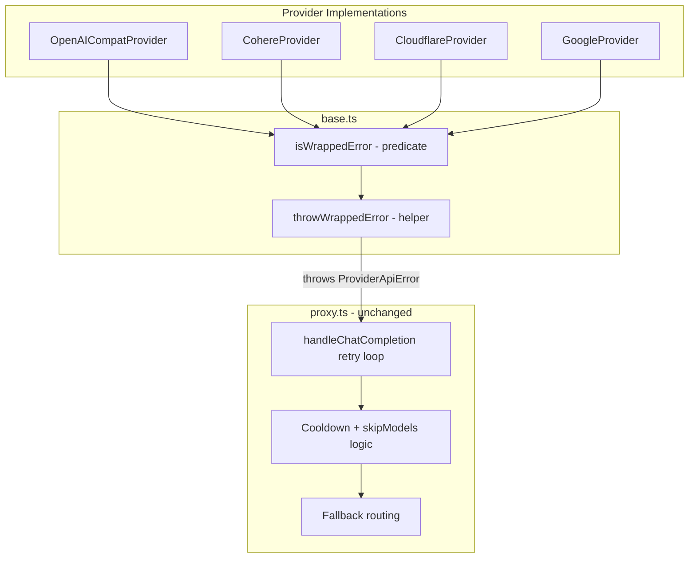
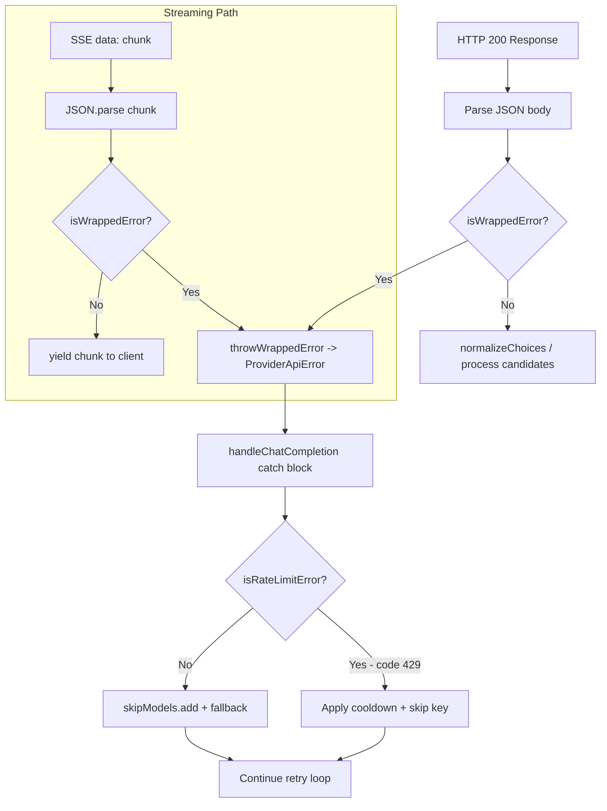

# Design: Wrapped Error Payloads on HTTP 200 Responses

## Architecture Overview

The solution adds a two-step detection mechanism to the provider layer: a reusable `isWrappedError()` predicate on `BaseProvider`, and a `throwWrappedError()` helper that constructs and throws a properly typed `ProviderApiError`. Each provider's `chatCompletion()` and `streamChatCompletion()` methods call these helpers immediately after parsing the JSON body (or the first SSE chunk), before any downstream normalization or field access occurs.

The retry loop in `handleChatCompletion()` (in `proxy.ts`) already catches `ProviderApiError` objects and applies cooldown, skip-model, and fallback logic. No changes to `proxy.ts` are needed — the thrown error naturally flows into the existing error handling path.



## New Methods on BaseProvider

### 1. `isWrappedError()` — `server/src/providers/base.ts`

A protected predicate that checks whether a parsed JSON body contains a root-level `error` field indicating a wrapped error response. The check is intentionally narrow — it only looks for a root-level `error` key with a non-null value that is either a string or an object. This avoids false positives on valid responses where the word "error" might appear in text content.

```typescript
protected isWrappedError(body: unknown): boolean {
  return (
    body !== null &&
    typeof body === 'object' &&
    !Array.isArray(body) &&
    'error' in (body as Record<string, unknown>) &&
    (body as Record<string, unknown>).error !== null &&
    (typeof (body as Record<string, unknown>).error === 'string' ||
     typeof (body as Record<string, unknown>).error === 'object')
  );
}
```

**Design rationale**: The `!Array.isArray(body)` guard prevents false matches on array responses. The check for `'error' in body` uses the `in` operator to detect the key presence at the root level only — not nested inside `choices[0].message.content`. The value check (`string | object`) covers both common formats: `{"error": "rate limit exceeded"}` and `{"error": {"message": "...", "code": 429}}`.

### 2. `throwWrappedError()` — `server/src/providers/base.ts`

A protected helper that constructs and throws a `ProviderApiError` from a detected wrapped error payload. It reuses the existing `extractErrorMessage()` logic (which already handles `error.message`, `errors[0].message`, and top-level `message`).

```typescript
protected throwWrappedError(body: unknown): void {
  const errPayload = (body as Record<string, unknown>).error;
  const message = this.extractErrorMessage(body, 'Unknown wrapped error');
  const error = new Error(
    `${this.name} API error (wrapped in 200): ${message}`
  ) as ProviderApiError;
  error.status =
    typeof errPayload === 'object' && errPayload !== null && 'code' in (errPayload as Record<string, unknown>)
      ? Number((errPayload as Record<string, unknown>).code)
      : 200;
  error.provider = this.name;
  error.responseBody = body;
  throw error;
}
```

**Design rationale**: The `extractErrorMessage()` method is currently `private` on `BaseProvider`. It needs to be changed to `protected` so `throwWrappedError()` can call it. The `status` field defaults to 200 (the actual HTTP status) when no `code` is present in the error payload, but uses the provider's error code (e.g., 429) when available — this allows `isRateLimitError()` in `proxy.ts` to detect wrapped rate-limit errors and apply cooldown.

## Component Changes

### 3. OpenAICompatProvider — `server/src/providers/openai-compat.ts`

#### `chatCompletion()` method (line 70-73)

Insert wrapped-error check between JSON parsing and `normalizeChoices()`:

```typescript
const data = await res.json() as ChatCompletionResponse;

if (this.isWrappedError(data)) {
  this.throwWrappedError(data);
}

normalizeChoices(data);
data._routed_via = { platform: this.platform, model: modelId };
return data;
```

#### `streamChatCompletion()` method (line 112-131)

After parsing each SSE chunk, check for wrapped error before yielding. A wrapped error in streaming typically arrives as the first (and only) chunk:

```typescript
try {
  const parsed = JSON.parse(data) as ChatCompletionChunk;
  if (this.isWrappedError(parsed)) {
    this.throwWrappedError(parsed);
  }
  yield parsed;
} catch {
  // Skip malformed chunks
}
```

**Note**: The `catch` block already skips malformed chunks. The `throwWrappedError()` call throws before `yield`, so the generator terminates immediately. The `try/catch` around `JSON.parse` does NOT catch the `ProviderApiError` thrown by `throwWrappedError()` because that throw happens after successful parsing — it propagates out of the generator to the consumer in `proxy.ts`.

### 4. CohereProvider — `server/src/providers/cohere.ts`

#### `chatCompletion()` method (line 49-51)

Same pattern as OpenAICompat:

```typescript
const data = await res.json() as ChatCompletionResponse;

if (this.isWrappedError(data)) {
  this.throwWrappedError(data);
}

data._routed_via = { platform: 'cohere', model: modelId };
return data;
```

#### `streamChatCompletion()` method (line 104-115)

Same SSE guard as OpenAICompat:

```typescript
try {
  const parsed = JSON.parse(data) as ChatCompletionChunk;
  if (this.isWrappedError(parsed)) {
    this.throwWrappedError(parsed);
  }
  yield parsed;
} catch {
  // Skip malformed chunks
}
```

### 5. CloudflareProvider — `server/src/providers/cloudflare.ts`

#### `chatCompletion()` method (line 62-64)

Same pattern:

```typescript
const data = await res.json() as ChatCompletionResponse;

if (this.isWrappedError(data)) {
  this.throwWrappedError(data);
}

data._routed_via = { platform: 'cloudflare', model: modelId };
return data;
```

#### `streamChatCompletion()` method (line 113-124)

Same SSE guard:

```typescript
try {
  const parsed = JSON.parse(data) as ChatCompletionChunk;
  if (this.isWrappedError(parsed)) {
    this.throwWrappedError(parsed);
  }
  yield parsed;
} catch {
  // Skip malformed chunks
}
```

### 6. GoogleProvider — `server/src/providers/google.ts`

#### `chatCompletion()` method (line 246-274)

Google uses a different response format (`GeminiResponse` with `candidates`), but the same root-level `error` check applies. Insert between JSON parsing and candidate access:

```typescript
const data = await res.json() as GeminiResponse;

if (this.isWrappedError(data)) {
  this.throwWrappedError(data);
}

const candidate = data.candidates?.[0];
```

#### `streamChatCompletion()` method (line 352-357)

The Gemini stream parser already has a `try/catch` around `JSON.parse`. Add the wrapped-error check after successful parsing:

```typescript
let chunk: GeminiResponse;
try {
  chunk = JSON.parse(raw) as GeminiResponse;
} catch {
  continue;
}

if (this.isWrappedError(chunk)) {
  this.throwWrappedError(chunk);
}

const candidate = chunk.candidates?.[0];
```

### 7. BaseProvider visibility change — `server/src/providers/base.ts`

Change `extractErrorMessage()` from `private` to `protected` so `throwWrappedError()` can call it:

```typescript
// Change from:
private extractErrorMessage(body: unknown, fallback: string): string { ... }
// Change to:
protected extractErrorMessage(body: unknown, fallback: string): string { ... }
```

## Error Detection Flow



## Wrapped Error Formats

The detection handles these common wrapped error formats:

### Format 1: Object with message and code (OpenAI-standard)
```json
{
  "error": {
    "message": "The model is currently overloaded.",
    "type": "rate_limit_error",
    "code": 429
  }
}
```
Result: `ProviderApiError` with `status=429`, `message="The model is currently overloaded."`

### Format 2: String-only error
```json
{
  "error": "Rate limit exceeded"
}
```
Result: `ProviderApiError` with `status=200`, `message="Rate limit exceeded"`

### Format 3: Object without code (Google/Gemini style)
```json
{
  "error": {
    "code": 400,
    "message": "Request contains an invalid argument.",
    "status": "INVALID_ARGUMENT"
  }
}
```
Result: `ProviderApiError` with `status=400`, `message="Request contains an invalid argument."`

### Valid response (NOT flagged)
```json
{
  "id": "chatcmpl-abc123",
  "choices": [{
    "message": {
      "content": "The error in your code is on line 5."
    }
  }]
}
```
Result: `isWrappedError()` returns `false` — no root-level `error` key. Passes through normally.

## Edge Cases

### EC-1: Error value is `null`
`{"error": null}` — `isWrappedError()` returns `false` because the `error !== null` check fails. This is correct: a null error field is not an error indication.

### EC-2: Error value is a number
`{"error": 404}` — `isWrappedError()` returns `false` because `typeof error === 'number'` does not match the `string | object` check. This is correct: numeric error codes are not standard wrapped error formats.

### EC-3: Error value is an array
`{"error": ["something"]}` — `isWrappedError()` returns `true` because `typeof [] === 'object'`. The `throwWrappedError()` helper will use `extractErrorMessage()` which does not handle array errors specifically — it will fall through to the fallback message "Unknown wrapped error". This is acceptable because array-format errors are extremely rare and not part of any known provider's error format.

### EC-4: Streaming wrapped error
If a provider sends HTTP 200 with SSE and the first chunk is `data: {"error": {"message": "overloaded", "code": 429}}`, the stream parser will parse it, detect the wrapped error via `isWrappedError()`, and throw `ProviderApiError` from the generator. The consumer in `proxy.ts` will see this as an error from the async generator's `next()` call, which propagates to the catch block in the retry loop.

### EC-5: Multiple SSE chunks with error
If the error chunk appears mid-stream (after some valid chunks have already been yielded to the client), the generator throws and the stream terminates. The client receives a partial response followed by stream termination. This is the best possible behavior — we cannot retroactively undo already-yielded chunks, but we prevent further processing of the error payload.

### EC-6: Wrapped 429 error triggers cooldown
When a wrapped error has `code: 429`, the thrown `ProviderApiError` has `status: 429`. The `isRateLimitError()` helper in `proxy.ts` checks for status 429, so the existing cooldown logic applies automatically. No special handling needed.

### EC-7: Google Gemini error with `code: 400`
A Gemini wrapped error with `code: 400` results in `ProviderApiError.status = 400`. The `isRetryableError()` helper in `proxy.ts` does not consider 400 as retryable, so the retry loop will treat it as a non-retryable client error and return 502. This is correct behavior — a 400-level error indicates a bad request that retrying won't fix.

## Files to Modify

| File | Change |
|---|---|
| `server/src/providers/base.ts` | Add `isWrappedError()` and `throwWrappedError()` methods; change `extractErrorMessage()` from `private` to `protected` |
| `server/src/providers/openai-compat.ts` | Add wrapped-error checks in `chatCompletion()` and `streamChatCompletion()` |
| `server/src/providers/cohere.ts` | Add wrapped-error checks in `chatCompletion()` and `streamChatCompletion()` |
| `server/src/providers/cloudflare.ts` | Add wrapped-error checks in `chatCompletion()` and `streamChatCompletion()` |
| `server/src/providers/google.ts` | Add wrapped-error checks in `chatCompletion()` and `streamChatCompletion()` |